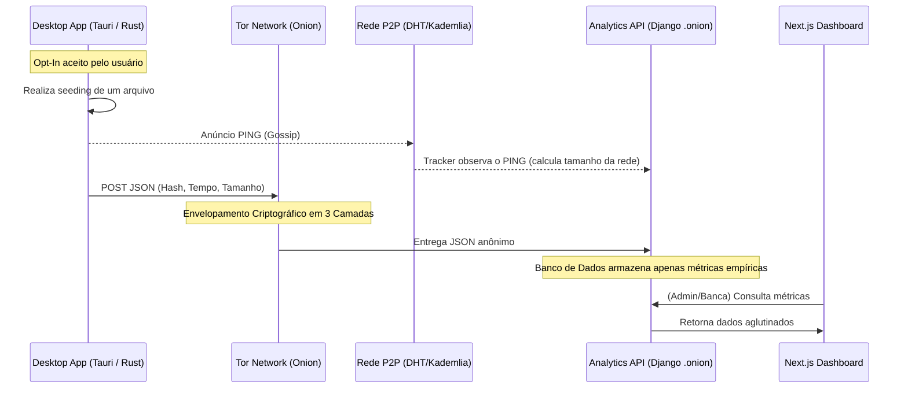

# Planejamento de Arquitetura: Telemetria Anônima e Analytics Descentralizado

> [!IMPORTANT]
> **Princípio Central (Core do TCC):** Conciliar a coleta de dados empíricos para análise estatística (Analytics) sem comprometer o anonimato, a descentralização e a privacidade dos indivíduos na rede P2P (AlLibrary). Nenhuma métrica coletada deve ser capaz de identificar um usuário, seu IP, ou o conteúdo exato do que ele está consumindo.

## 1. Visão Geral e Justificativa

Em sistemas tradicionais, o Analytics é intrusivo (coletando IPs, fingerprints de navegadores e contas de usuário). No contexto de uma aplicação com foco em liberdade, conhecimento descentralizado e redes *cypherpunk*, essa abordagem é inaceitável.

No entanto, para comprovar matematicamente o êxito do TCC (eficiência da distribuição de arquivos, tempo de resposta, latência e robustez da rede Kademlia), **precisamos de dados empíricos**. 

Este documento detalha o planejamento arquitetural para coletar essas métricas aplicando os mais altos padrões éticos e técnicos de ofuscação, utilizando roteamento *Onion* e princípios de *Zero-Knowledge*.

---

## 2. Os 4 Pilares da Telemetria Não-Invasiva

### 2.1. Telemetria Roteada via Tor (O Método Monero/Zcash)
Como o Desktop App já opera com um daemon do Tor embutido, a aplicação em Rust **nunca fará uma requisição HTTP limpa (Clearnet)** para o nosso backend Django. 
- O servidor Django (Analytics) será exposto estritamente como um **Tor Hidden Service** (endereço `.onion`).
- O envio de eventos de métrica (POST requests) ocorrerá inteiramente envelopado na rede Tor.
- **Vantagem Absoluta:** O servidor Django é fisicamente e criptograficamente incapaz de descobrir o IP de origem do pacote. Ele recebe apenas um "ping fantasma" contendo um JSON matemático.

### 2.2. Agregação Passiva via Kademlia/Gossip (Observador Passivo)
Em vez de depender exclusivamente do que os clientes reportam, o nosso servidor **Tracker Rust** funcionará como um nó passivo na DHT (Kademlia).
- No protocolo Gossip/Kademlia, os nós anunciam periodicamente sua existência para manter as tabelas de roteamento (Routing Tables) vivas.
- O Tracker vai simplesmente **"escutar"** esses anúncios e usar estatística para calcular o tamanho estimado da rede (ex: `total_nodes` e `active_nodes`), registrando essa métrica periodicamente no banco sem interrogar clientes específicos.

### 2.3. Criptografia de Conteúdo (Zero-Knowledge)
Para medir a eficiência de distribuição de conhecimento (arquivos PDF, EPUB, etc.) sem monitorar o que as pessoas estão lendo:
- A telemetria **nunca** enviará o nome do arquivo.
- O dado enviado será exclusivamente o **Hash SHA-256** do arquivo (ex: `8f43b35...`).
- Apenas a aplicação Frontend (ou chaves de tradução que os usuários possuam localmente) saberão a que arquivo aquele Hash se refere, garantindo que o Analytics observe apenas o volume de dados e o tempo, sem quebrar o anonimato de leitura.

### 2.4. Telemetria *Opt-In* Estrita (O Padrão Ouro da Ética)
Na interface em SolidJS (Tauri) do Desktop App, o usuário será recebido com um modal transparente e honrado na primeira inicialização:
> *"Para ajudar na pesquisa acadêmica (TCC) a entender a eficiência da rede, você aceita compartilhar métricas puramente matemáticas de tempo e performance? O seu IP será ofuscado via Tor e nenhum dado pessoal ou título de arquivo será enviado."*
- O estado padrão é **Desativado**.
- Se aceito, uma flag local habilita o módulo de envio em Rust. Se recusado, o módulo é morto.

---

## 3. Diagrama de Fluxo Arquitetural

---

## 4. Roadmap de Implementação (Passo a Passo)

A construção desta arquitetura será dividida em **4 Fases** paralelas para manter a organização entre os repositórios:

### Fase 1: Interface de Opt-In (`DesktopApp_AlLibrary`)
- [ ] Criar o modal / página inicial explicativa de Privacidade vs Telemetria.
- [ ] Criar configuração no `Tauri State` salvando a preferência `telemetry_enabled: boolean`.
- [ ] Repassar essa configuração para o motor em Rust.

### Fase 2: O Motor de Telemetria (`TrackerRust_AlLibrary` & Client Rust)
- [ ] Implementar um observador passivo da DHT Kademlia no Tracker para contar nós ativos de hora em hora.
- [ ] Adicionar lógica ao Node P2P local (client) para registrar o `start_time` e `end_time` de cada seeding.
- [ ] Instanciar um cliente HTTP(S) em Rust roteado forçadamente através do *Tor Proxy* interno.
- [ ] Disparar a rotina de POST apenas se `telemetry_enabled == true`.

### Fase 3: A API de Retenção (`AnalyticsDjangoApp_AlLibrary`)
- [ ] (Feito) Criar os modelos base (`SeedingMetrics` e `NodeMetrics`).
- [ ] Implementar os *Serializers* do DRF para validar os JSONs recebidos.
- [ ] Criar a `APIView` para receber o POST assíncrono.
- [ ] Configurar o servidor Nginx/Gunicorn ou o próprio host para expor a aplicação Django em um serviço `HiddenServiceDir` (gerando o endereço `.onion`).
- [ ] Criar endpoints GET para agregar dados estatísticos (ex: `Média de nós online por dia`, `Distribuição de tempo de download`).

### Fase 4: O Painel Visual (`AnalyticsNextApp_AlLibrary`)
- [ ] Conectar o Axios ao endpoint de leitura do Django.
- [ ] Criar os primeiros Cards de KPIs (Métricas-Chave): "Nós Ativos Agora", "Tempo Médio de Seeding Global".
- [ ] Montar o Gráfico de Linhas (Recharts) mostrando a evolução do tamanho da rede P2P nos últimos dias.
- [ ] Montar o Gráfico de Dispersão (Scatter) relacionando "Tamanho do Arquivo" vs "Tempo de Seeding".

> **Conclusão:** Seguindo este plano, o TCC terá o melhor dos dois mundos: defesa irrefutável de dados empíricos para a banca acadêmica, sem trair nem por um segundo os princípios de liberdade e anonimato que fundamentam a AlLibrary.
