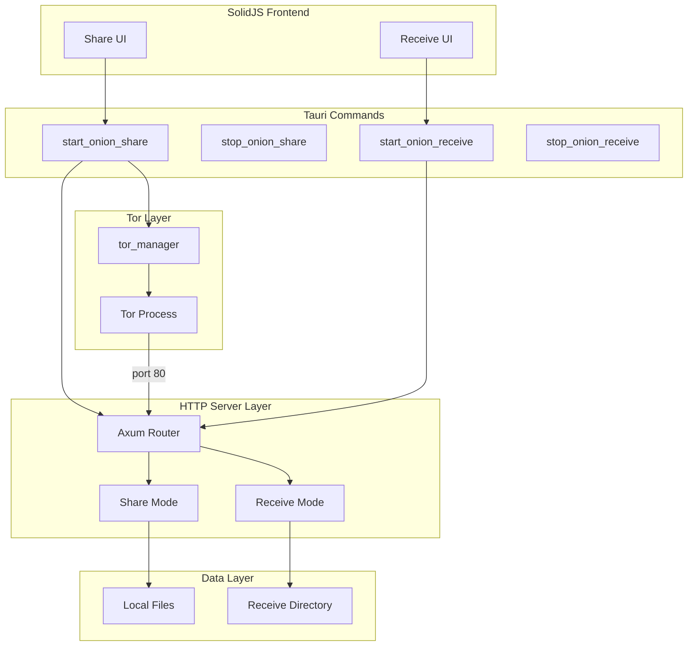
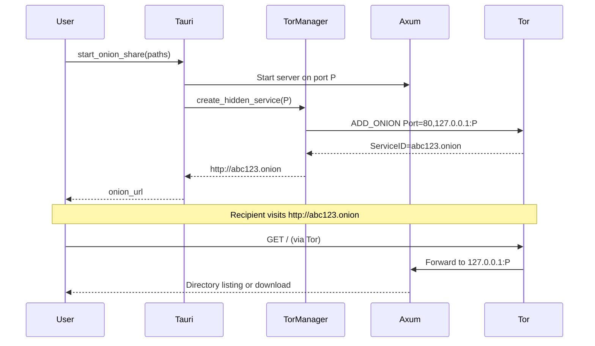
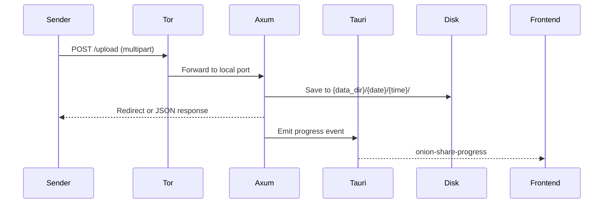

# Architecture Overview

## High-Level Architecture



## Data Flow: Share Mode



## Data Flow: Receive Mode



## Component Mapping: OnionShare Python → Rust

| OnionShare Python | Rust Module / Crate |
|-------------------|---------------------|
| `onion.py` (Tor control) | `tor_manager.rs` (existing) | 
| `onionshare.py` (orchestrator) | `onion_share.rs` (new) |
| `web/web.py` (Flask) | `axum` + custom routes |
| `web/share_mode.py` | `share_mode.rs` or `share_routes.rs` |
| `web/receive_mode.py` | `receive_mode.rs` or `receive_routes.rs` |
| `web/send_base_mode.py` | Shared utilities in `share_common.rs` |
| `common.py` (port, password, etc.) | `utils.rs` or `common.rs` |
| `mode_settings.py` | `Settings` struct or `AppState` |
| `ZipWriter` | `zip` crate |
| `Waitress` | `axum::serve` with `tokio` |

## Integration with Existing AlLibrary

### tor_manager.rs

AlLibrary already implements:

- **Tor lifecycle**: `start()`, `stop()`, `status()`
- **Hidden service creation**: `create_hidden_service(local_port)` → `{id}.onion`
- **Control protocol**: Cookie auth, `ADD_ONION NEW:ED25519-V3`
- **Bridges**: `enable_bridges()`

Location: `DesktopApp_AlLibrary/src-tauri/src/core/p2p/tor_manager.rs`

### Option: Extend vs Replace

| Approach | Pros | Cons |
|----------|------|------|
| **Extend tor_manager** | No new Tor crates; proven control protocol | Stays with Tor binary; no pure-Rust Tor |
| **Replace with Arti** | Pure Rust; no Tor binary | Larger deps; Arti HS maturity |

**Recommendation**: Extend `tor_manager` for Phase 1. Add Axum HTTP server that binds to a port returned by `pick_free_port()`, then call `create_hidden_service(port)`.

## Module Structure (Proposed)

```
src-tauri/src/
├── core/
│   └── p2p/
│       ├── tor_manager.rs      # Existing
│       └── onion_share/        # New
│           ├── mod.rs
│           ├── share.rs        # Share mode routes
│           ├── receive.rs      # Receive mode routes
│           ├── common.rs       # Security headers, utils
│           └── state.rs        # AppState, shutdown
├── commands/
│   ├── tor.rs                  # Existing
│   └── onion_share.rs          # New: start_onion_share, etc.
```

## Port Selection

- **OnionShare**: Uses port range 17600–17650
- **AlLibrary tor_manager**: Uses `pick_free_port()` (any available port)
- **Alignment**: Consider using 17600–17650 for onion share/receive to avoid conflicts with other services. Document in `common.rs`:

```rust
const ONION_SHARE_PORT_MIN: u16 = 17600;
const ONION_SHARE_PORT_MAX: u16 = 17650;
```

## Host Binding

- **Default**: Bind to `127.0.0.1` (localhost only; Tor forwards to it)
- **Whonix**: OnionShare binds to `0.0.0.0` when `/usr/share/anon-ws-base-files/workstation` exists
- **Config**: Add env var or config: `ONION_SHARE_BIND_HOST` (default `127.0.0.1`)
