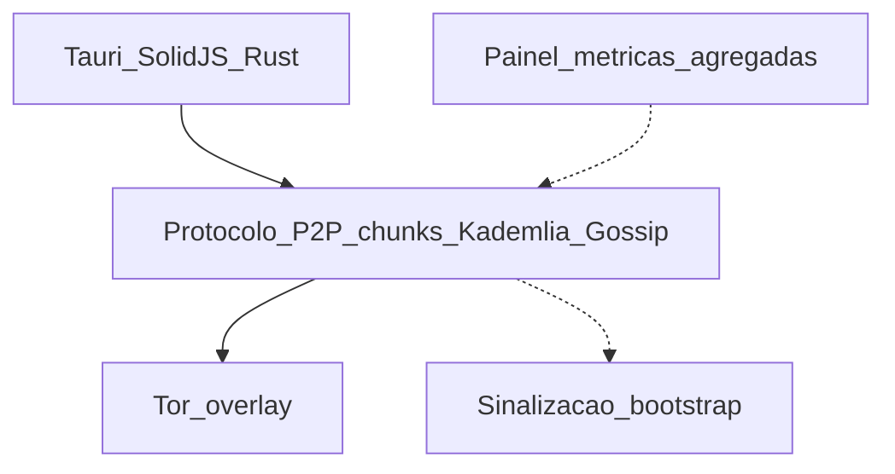

# Roteiro de apresentação — AlLibrary (Report 4)

Documento alinhado integralmente ao [Report 4 - Documento de Projeto - Computação.docx.md](../../Report%204%20-%20Documento%20de%20Projeto%20-%20Computação.docx.md). Todos os tópicos do Report 4 estão mapeados abaixo; o **percurso de 10 minutos** (Slides 1–10) sintetiza o essencial para a banca; os **apêndices e slides 11–18** permitem montar deck completo ou consulta durante perguntas.

---

## Mapa de cobertura — Report 4

| Seção Report 4 | Onde aparece neste roteiro |
| :--- | :--- |
| Identificação (equipe, título, orientadores, data) | Metadados; Slide 1 |
| Lista de siglas | Seção [Lista de siglas](#lista-de-siglas); Slide opcional 11 |
| 1 — Introdução do trabalho | Slides 1–3; [Apêndice §1](#apêndice-1--introdução-do-trabalho) |
| 2 — Trabalhos correlatos (2.1 Chord/Pastry; 2.2 IPFS/OnionShare) | Slide 5; Slides opc. 12–13; [Apêndice §2](#apêndice-2--trabalhos-correlatos) |
| 3 — O que será feito | Slide 4; [Apêndice §3](#apêndice-3--o-que-será-feito) |
| 4 — O que não será feito | Slide 6; [Apêndice §4](#apêndice-4--o-que-não-será-feito) |
| 5 — Benefícios | Slide 7; [Apêndice §5](#apêndice-5--benefícios) |
| 6 — Metas TCC 2 (6.1–6.4) | Slide 8; [Apêndice §6](#apêndice-6--metas-para-o-tcc-2) |
| 7 — Recursos utilizados + Tabela 1 | Slide 9; [Apêndice §7](#apêndice-7--recursos-utilizados) |
| Referências | Slide opcional 18; [Apêndice referências](#apêndice-referências) |

---

## Metadados

| Campo | Conteúdo |
| :--- | :--- |
| **Documento base** | Report 4 — Documento de Projeto (Computação) |
| **Título** | AlLibrary: Plataforma Descentralizada para Preservação e Democratização do Acesso ao Conhecimento |
| **Líder** | Tales Augusto Sartório Furlan (212170) |
| **Equipe** | Eduardo Augusto Prestes Júnior (252148); Arthur Alves Letissio (210685) |
| **Orientador** | Marcos Fabio Jardini |
| **Co-orientador** | Lucas Nunes Monteiro |
| **Data de entrega (Report 4)** | 18/05/2026 |
| **Duração apresentação** | 10 minutos (Slides 1–10); apêndices fora do cronômetro |
| **Público** | Banca / defesa parcial do TCC |
| **Narrativa técnica** | Híbrida: P2P próprio + Tor + Kademlia/Gossip; IPFS/OnionShare como correlatos |

> Use **AlLibrary** na fala; o Report 4 também grafia **ALLibrary** — mesmo projeto.

---

## Lista de siglas

Siglas do Report 4 (slide de apoio ou rodapé):

| Sigla | Significado |
| :--- | :--- |
| CAS | Content-Addressable Storage |
| CDN | Content Delivery Network |
| DHT | Distributed Hash Table |
| DNS | Domain name system |
| DRM | Digital Rights Management |
| I2P | Invisible Internet Project |
| IEEE | Institute of Electrical and Electronic Engineers |
| ILS | Integrated Library System |
| IPFS | Interplanetary File System |
| P2P | Peer-to-peer |
| P50 / P95 | 50th / 95th percentile |
| SaaS | Software as a Service |
| SLA | Service Level Agreement |
| SSO | Single sign-on |
| SO | Sistema Operacional |

---

## Macros — visão dos 10 minutos

| Ato | Tempo | Slides | Objetivo |
| :--- | :--- | :--- | :--- |
| **A1 — Abertura** | 0:00–1:00 | 1 | Identificação + proposta em uma frase |
| **A2 — Problema, objetivos e método** | 1:00–3:00 | 2–3 | §1 completo (síntese) |
| **A3 — Proposta e correlatos** | 3:00–5:30 | 4–5 | §3 + §2 (síntese) |
| **A4 — Escopo e benefícios** | 5:30–7:45 | 6–7 | §4 + §5 (síntese) |
| **A5 — Validação, recursos e fechamento** | 7:45–10:00 | 8–10 | §6 + §7 + encerramento |

### Cronômetro acumulado

| Slide | Título | Início | Fim | Duração |
| :---: | :--- | :---: | :---: | :---: |
| 1 | Título e identificação | 0:00 | 1:00 | 1:00 |
| 2 | Problema e contexto | 1:00 | 2:00 | 1:00 |
| 3 | Objetivos, contribuição e metodologia | 2:00 | 3:00 | 1:00 |
| 4 | Solução (o que será feito) | 3:00 | 4:30 | 1:30 |
| 5 | Correlatos e posicionamento | 4:30 | 5:30 | 1:00 |
| 6 | Escopo: será / não será | 5:30 | 6:45 | 1:15 |
| 7 | Benefícios | 6:45 | 7:45 | 1:00 |
| 8 | Metas TCC II (§6) | 7:45 | 9:00 | 1:15 |
| 9 | Recursos e stack (§7) | 9:00 | 9:40 | 0:40 |
| 10 | Fechamento | 9:40 | 10:00 | 0:20 |

### Se passar de 10 min

1. Slide 2: omitir Kuznetsova e Encyclopaedia Britannica na fala.
2. Slide 5: não detalhar Chord/Pastry; só tabela AlLibrary/IPFS/OnionShare.
3. Slide 7: um benefício social + um técnico.
4. **Não cortar:** Slides 4 e 8.

---

# Percurso principal — 10 slides (banca)

## Slide 1 — Título e identificação (0:00–1:00)

**No slide**

- **Título:** AlLibrary: Plataforma Descentralizada para Preservação e Democratização do Acesso ao Conhecimento
- **Equipe:** Tales Furlan (líder) · Eduardo Prestes · Arthur Letissio
- **Orientação:** Marcos Fabio Jardini · Lucas Nunes Monteiro
- Documento de Projeto — TCC · Computação · Entrega 18/05/2026

**Tópicos Report 4 cobertos:** Identificação; premissa P2P + PDF/EPUB; app desktop; Tor.

**Fala sugerida**

Apresentamos o AlLibrary, TCC em computação sob orientação do professor Jardini e co-orientação do professor Monteiro. Trata-se de uma plataforma digital descentralizada em arquitetura peer-to-peer, focada em PDF e EPUB para integridade histórico-cultural. Entregamos um aplicativo desktop para visualizar, compartilhar arquivos e acompanhar o status da rede. A camada P2P opera sobre a rede de sobreposição Tor, reforçando anonimato dos pares.

**Transição**

O problema que motiva essa arquitetura está na centralização informacional.

---

## Slide 2 — Problema e contexto (1:00–2:00)

**No slide**

- Informação fixada em livros, mas **censura** e monopólio de canais (Gardner; Elmimouni)
- Digitalização: controle em camadas — bloqueio, visibilidade, atenção (Castells; Kuznetsova)
- Globalização digital: vieses algorítmicos, câmaras de eco, **bolha de filtros** (Pariser)
- Decisões técnicas, jurídicas e econômicas condicionam relevância (Encyclopaedia Britannica)
- **Problema:** centralização → manipulação, acesso limitado, narrativa única (Popescu)

**Fala sugerida**

Estados e elites historicamente controlaram o acesso ao saber. Na era digital, o controle se reorganizou: bloqueios convivem com regulação indireta da visibilidade e com personalização algorítmica. Pariser descreve a bolha de filtros; Castells, a sociedade em rede. O problema central do trabalho é a concentração de dados: vulnerabilidade à manipulação, acesso democrático limitado e silenciamento de narrativas periféricas em debates de revisão histórica.

**Transição**

A resposta passa por objetivos claros, contribuição e metodologia.

---

## Slide 3 — Objetivos, contribuição e metodologia (2:00–3:00)

**No slide**

- **Objetivo geral:** desenvolver AlLibrary descentralizada; preservar acervo; reduzir dependência de fontes únicas
- **Específicos:** (1) estado da arte redes/correlatos (2) especificar arquitetura (3) PoC compartilhamento — disponibilidade e anticensura
- **Contribuição:** sociedade — acesso democrático; computação — descentralização + privacidade + preservação digital
- **Metodologia:** pesquisa aplicada em redes; revisão bibliográfica + modelagem + protótipo iterativo
- **Monografia (8 capítulos):** intro · correlatos · segurança/preservação · P2P/Tor · implementação · testes · resultados · bibliografia

**Fala sugerida**

O objetivo geral é a plataforma descentralizada para documentos histórico-culturais. Os específicos amarram revisão bibliográfica, especificação arquitetural e prova de conceito. Para a sociedade, ampliamos acesso ao conhecimento; para computação, articulamos um problema aplicado atual. A metodologia combina fundamentação, requisitos, implementação e validação técnica. A monografia está organizada em oito capítulos, dos quais este documento de projeto antecipa escopo e metas do TCC II.

**Transição**

A seguir, a solução técnica e o que será entregue.

---

## Slide 4 — Solução: o que será feito (3:00–4:30)

**No slide**

- **Público:** historiadores, pesquisadores, estudantes, leitores — sem hospedagem central única
- **Prioridades:** resiliência, privacidade, confiabilidade, anonimato
- **Rede:** P2P sobre **Tor** (overlay); não isolado da Internet convencional
- **Protocolo:** localizar recursos, anunciar acervo, transferir PDF/EPUB; **gossip** para catálogo (Fig. 1 — Abaskohi)
- **Chunks:** paralelismo, reconstrução, verificação de integridade
- **Desktop** + **SQLite** local; **sinalização** (bootstrap) + **painel** agregado (saúde, redundância, tráfego — sem identificar usuários)
- **Validação:** 10–15 nós; latência de busca; taxa de sucesso de fragmentos; resiliência ao churn

**Fala sugerida**

O AlLibrary é rede de compartilhamento P2P sobre Tor como plano de comunicação — diferencial frente a P2P sem anonimato explícito. O protocolo descobre e transfere documentos sem infraestrutura central de catálogo; metadados propagam-se por gossip entre nós. Arquivos são particionados em chunks com verificação de integridade. O usuário usa um desktop que gerencia acervo local em SQLite. Para experimentos, há serviço de sinalização para o primeiro contato entre nós e painel de análise agregada. Validaremos com dez a quinze nós em rede controlada, medindo busca, download de fragmentos e churn.

**Transição**

Fundamentamos e comparamos com o estado da arte.

---

## Slide 5 — Correlatos e posicionamento (4:30–5:30)

**No slide**

- **P2P/DHT** vs cliente-servidor (ponto único de falha)
- **Chord:** anel, finger table, O(log n) (Stoica)
- **Pastry:** 128 bits, localidade, churn (Rowstron; Druschel)
- **IPFS Desktop:** Kubo, Merkle DAG, content-addressing, DHT — correlato
- **OnionShare:** serviço onion, sessões — correlato de anonimato
- **AlLibrary:** protocolo acadêmico PDF/EPUB + Tor; Kademlia no desenho

| | AlLibrary | IPFS | OnionShare |
| :--- | :--- | :--- | :--- |
| Propósito | Acervo histórico-acadêmico | Web distribuída | Compartilhamento pontual |
| Anonimato | Tor na arquitetura | Opcional/indireto | Circuitos onion |
| Persistência | Réplicas entre pares | Rede global | Sessão do remetente |

**Fala sugerida**

Diferente do cliente-servidor, correlatos usam P2P e DHT. Chord e Pastry são base teórica de busca escalável; no projeto, Kademlia inspira o esquema operacional. IPFS fragmenta por hash e usa Merkle DAG — inspiramos-nos no endereçamento por conteúdo, sem replicar o ecossistema global. OnionShare demonstra Tor para compartilhamento temporário; nós buscamos acervo replicado de longo prazo. O núcleo do TCC permanece protocolo próprio sobre Tor.

**Transição**

Delimitamos explicitamente o que não entra no escopo.

---

## Slide 6 — Escopo: será / não será (5:30–6:45)

**No slide**

**Será:** desktop P2P PDF/EPUB · chunks · Tor · SQLite · tracker/sinalização controlada · painel análise agregado · testes 10–15 nós · dashboard TCC II (Django/Next) só para experimentos

**Não será:**

- SaaS/SLA, ILS, portais institucionais fechados
- IPFS/libp2p completo, pinning comercial, tokens, reputação distribuída
- Navegador Tor completo; provas formais contra adversário global
- Moderação institucional, DRM, denúncias globais, filtros editoriais
- AZW, recomendação big data, mobile, multitenant público, CDN, SSO/Kubernetes em escala
- Maturidade SRE/Smart Cities; substituir BitTorrent/IPFS gateways/OnionShare de mercado

**Fala sugerida**

O TCC é protótipo acadêmico: não competimos com SaaS nem assumimos custódia jurídica. Tor integra-se aos cenários planejados, sem prometer segurança de navegador hardened. Responsabilidade legal do conteúdo é dos publicadores. O tracker é bootstrap experimental. O painel web do TCC II é observabilidade agregada, não produto multitenant — alinhado ao que o Report 4 exclui e ao que a seção 6.3 prevê.

**Transição**

Os benefícios esperados articulam impacto social e técnico.

---

## Slide 7 — Benefícios (6:45–7:45)

**No slide**

- Contexto: plataformas centralizadas curadoria/moderação opaca (Pariser; Castells)
- **Posicionamento:** local-first; não substitui curadores; pluralidade informacional

**Sociais:** metadados no dispositivo; menos telemetria/SaaS obrigatório; Tor/SOCKS opcional; continuidade em restrições de rede; acesso para estudantes/pesquisadores/campo (PDF/EPUB)

**Técnicos:** Tauri v2 + privilégio mínimo; SQLite sem DB externo; rustls + Tor; validação PDF/EPUB; content-addressing e hash; cache local-first; download paralelo; Rust/SolidJS/Vite leve; sem ponto único de falha; Kademlia + Gossip

- **Distinção:** integridade dos bytes ≠ verdade editorial

**Fala sugerida**

O AlLibrary recoloca controle operacional na comunidade de pares, sem prometer substituir instituições. Socialmente, prioriza privacidade local e circulação quando um gatekeeper cai. Tecnicamente, Tauri isola o núcleo Rust, SQLite reduz superfície de ataque, chunks com hash garantem cópia fiel — não a veracidade do texto. A rede permanece acessível enquanto houver pares ativos.

**Transição**

No TCC II fechamos o ciclo experimental com metas mensuráveis.

---

## Slide 8 — Metas para o TCC II (7:45–9:00)

**No slide**

**6.1 Escalabilidade e roteamento**

- 10–15 nós; registrar SO, horário, churn, banda
- Kademlia/DHT sob churn; O(log n) — lookup vs. tamanho da rede
- Logs: join/leave, falhas, timeouts

**6.2 Métricas sob carga**

- Variar: tamanho arquivo; nº de peers; churn na transferência
- Taxa de sucesso; p50/p95; throughput; retries; latência DHT; propagação gossip
- Tabelas, figuras, discussão vs. objetivos

**6.3 Observabilidade:** dados agregados/anônimos; dashboard Django + Next.js

**6.4 Fechamento:** resultados vs. hipóteses/objetivos; monografia; defesa

**Fala sugerida**

O TCC II valida o protocolo sob carga com rede controlada e evidências auditáveis. Medimos sucesso de reconstrução de PDF/EPUB, percentis de tempo e impacto do churn. A camada de analytics respeita privacidade. Correlacionamos resultados às hipóteses e entregamos monografia e apresentação à banca.

**Transição**

A implementação apoia-se na stack da seção 7 do Report 4.

---

## Slide 9 — Recursos utilizados (9:00–9:40)

**No slide**

- **Ambiente:** Windows 11 · Ubuntu 24 · VS Code/Cursor · Git/GitHub
- **Cliente:** Tauri v2 (capabilities, sandbox) · Rust/Cargo · Tokio
- **Front:** SolidJS · TypeScript · Vite
- **Dados:** SQLite (ACID, metadados locais)
- **Rede:** Tor · SOCKS (9050/9150) · tokio-socks · UdpSocket · reqwest · axum · serde
- **Infra:** Docker — tracker Rust; Onion Services (NAT/firewalls)
- **Correlato externo:** OnionShare (testes/demos)

**Fala sugerida**

Desenvolvemos em desktop Windows e Linux, com Tauri unindo webview e Rust nativo. Tokio organiza rede assíncrona; Tor entra via SOCKS e onion services no núcleo. Docker garante reprodutibilidade do tracker. A Tabela 1 do Report 4 detalha cada tecnologia — consulte o apêndice §7 se a banca perguntar item a item.

**Transição**

Encerro com a contribuição e abro para perguntas.

---

## Slide 10 — Fechamento (9:40–10:00)

**No slide**

- **Problema:** centralização e controle informacional
- **Solução:** AlLibrary — desktop, P2P, chunks, Tor, gossip, SQLite
- **Escopo:** protótipo TCC; correlatos IPFS/OnionShare; validação 10–15 nós
- **Próximos passos:** TCC II — experimentos, dashboard agregado, monografia
- Obrigado — perguntas?

**Fala sugerida**

Recapitulamos: problema de concentração informacional; resposta técnica descentralizada e anônima para acervo PDF/EPUB; escopo delimitado e mensurável. Agradecemos à banca.

**Transição**

— Fim dos 10 minutos —

---

# Apêndices — cobertura integral do Report 4

Use como roteiro estendido, handout ou slides 11–18.

## Apêndice 1 — Introdução do trabalho

| Tópico Report 4 | Conteúdo para slide/nota |
| :--- | :--- |
| Plataforma ALLibrary/AlLibrary P2P (Patel, 2025) | Arquitetura peer-to-peer |
| PDF e EPUB | Integridade histórico-cultural |
| Acesso democrático via rede distribuída | Reduz perda, indisponibilidade, manipulação |
| App desktop | Visualizar arquivos e status da rede |
| Tor | Anonimato dos pares; overlay seguro |
| Censura século XX (Gardner; Elmimouni) | Monopólio canais oficiais |
| Sociedade em rede (Castells); personalização (Kuznetsova) | Camadas de controle informacional |
| Bolha de filtros (Pariser) | Distorção e apagamento cultural |
| Encyclopaedia Britannica | Decisões técnico-jurídico-econômicas sobre relevância |
| Problema centralização (Popescu) | Narrativas periféricas silenciadas |
| Objetivo geral e três específicos | Ver Slide 3 |
| Contribuição sociedade e computação | Ver Slide 3 |
| Metodologia aplicada | Revisão + modelagem + iterativo |
| Estrutura 8 capítulos monografia | Intro; correlatos; segurança; P2P/Tor; impl.; testes; resultados; biblio. |

---

## Apêndice 2 — Trabalhos correlatos

### 2.1 Arquiteturas de transmissão

**Chord (2.1.1)**

- DHT pioneira; topologia em anel lógico
- Aritmética de módulo; IDs circulares
- Finger table; progressão geométrica
- Busca O(log n); escalabilidade; sem licenciamento (Stoica et al., 2001)

**Pastry (2.1.2)**

- P2P larga escala; localidade de rede
- IDs 128 bits; encaminhamento por prefixos
- Minimiza latência física; auto configuração; resiliência ao churn (Rowstron; Druschel, 2001)

### 2.2 Softwares semelhantes

**IPFS Desktop (2.2.1)**

- [ipfs.tech](https://ipfs.tech/); nó Kubo
- Blocos por hash; Merkle DAG; content-addressing
- DHT + troca entre pares; software livre
- Custos: armazenamento/banda local; pinning em nuvem opcional

**OnionShare (2.2.2)**

- [onionshare.org](https://onionshare.org/)
- PC do remetente como serviço onion; sem provedor central
- Circuitos em cebola; privacidade e circunvenção de bloqueios
- Sessões temporárias vs. replicação global IPFS; custo = conexão + latência Tor

**Posicionamento AlLibrary:** overlay networks; topologia, confiança, chunking e anonimato variam — ver Slide 5.

---

## Apêndice 3 — O que será feito

- Solução descentralizada PDF/EPUB para histórico/acadêmico
- Escopo: resiliência, privacidade, confiabilidade, anonimato
- Rede P2P sobre Tor (overlay); camada P2P acima do Tor, coexistente com Internet
- Protocolo: localizar, anunciar, transferir; sem descoberta centralizada
- Gossip para catálogos/metadados (Figura 1 — adaptado Abaskohi, 2024)
- Chunks: tráfego otimizado, paralelismo, reconstrução, integridade
- App desktop = estação P2P; publicar/obter; SQLite local
- Tor em sinalização e transferências quando aplicável
- Serviço de sinalização (encontro inicial, ambiente controlado)
- Painel: saúde da rede, disponibilidade, redundância, volume de tráfego — sem identificar participantes
- Testes estresse: 10–15 nós; latência busca; taxa sucesso download fragmentos; churn

---

## Apêndice 4 — O que não será feito

| Categoria | Exclusões (Report 4) |
| :--- | :--- |
| **Produto/mercado** | SaaS completo; SLA; suporte 24/7; custódia jurídica; conformidade ILS/portais fechados |
| **IPFS/ecossistema** | IPFS/libp2p universal; pinning comercial; marketplaces; tokens; reputação distribuída |
| **Privacidade formal** | Anonimato nível navegador Tor; segurança contra adversário global; equivalência Signal/hardening |
| **Governança conteúdo** | Moderação institucional integral; DRM; denúncias globais; filtros licenciamento editorial |
| **Formatos/plataformas** | Suporte exaustivo AZW, pipelines editoras; recomendação big data; mobile nativo |
| **Infra escala** | Multitenant público; CDN própria; SSO SAML/OpenID; Kubernetes para milhões de usuários |
| **Maturidade SW** | SRE contínuo; auditorias formais repetidas; Smart Cities |
| **Substitutos mercado** | Recriar OnionShare, BitTorrent universal, gateways IPFS — usar integração dirigida |

---

## Apêndice 5 — Benefícios

**Enquadramento (§5 intro):** plataformas centralizadas; biblioteca como espaço plural; local-first descentralista; não substitui curadores; articulação sócio-técnica.

### Benefícios sociais — Privacidade

- Metadados e hábitos no dispositivo (local-first)
- Menos telemetria centralizada de leitura
- Tor/proxy SOCKS — reduzir correlação identidade-conteúdo (Tor Project, 2024)
- Continuidade em restrições de rede/informação seletiva

### Benefícios sociais — Facilidade de acesso

- Estudantes, pesquisadores em campo, baixa conectividade, sem assinatura comercial
- Replicação cooperativa; sem gatekeeper único
- PDF/EPUB — reuso em leitores e fluxos acadêmicos

### Benefícios técnicos — Segurança

- Tauri v2: Rust isolado da UI; privilégio mínimo
- SQLite embutido: sem DB externo
- rustls + Tor: menos exposição de IP
- Validação estrita PDF/EPUB

### Benefícios técnicos — Integridade

- Content-addressing; chunks com hashes
- Verificação por fragmento; cópia idêntica ao anunciado
- Integridade técnica vs. verdade factual

### Benefícios técnicos — Desempenho

- Cache local-first
- Download paralelo multi-peer
- Stack Rust + SolidJS + Vite enxuta

### Benefícios técnicos — Resiliência

- Sem ponto único de falha
- Kademlia + Gossip para localização e disseminação
- Protocolo P2P customizado para documentos acadêmicos; overlay otimizada para fluxo de informação

---

## Apêndice 6 — Metas para o TCC 2

### 6.1 Validação de escalabilidade e roteamento

- Rede estável; 10–15 nós convidados/coordenados
- Registrar: SO, horário, churn programado, limites de banda
- Kademlia/DHT: integridade da tabela; rotas sob churn
- Relacionar a O(log n): lookup médio vs. tamanho da rede (gráficos)
- Logs estruturados: join/leave, falhas de rota, timeouts; reprodutibilidade parcial

### 6.2 Métricas de desempenho sob carga

- Estresse: sucesso download e reconstrução PDF/EPUB
- Variáveis: tamanho; nº peers; churn durante transferência
- Grandezas: taxa sucesso (%); tempo conclusão p50/p95; throughput MB/s; retries; timeouts; corrupção por bloco; latência DHT; tempo propagação gossip
- Consolidar: tabelas, figuras (tempos, sucesso vs. carga, churn); discussão vs. objetivo

### 6.3 Ecossistema de analytics e observabilidade

- Visualizar saúde e desempenho agregado
- Privacidade: anonimizado/agregado; sem telemetria sensível por padrão
- Dashboard web: **Django + Next.js**

### 6.4 Fechamento acadêmico do TCC II

- Correlacionar resultados a objetivos e hipóteses
- Finalizar monografia e preparar apresentação à banca

---

## Apêndice 7 — Recursos utilizados

### Ambiente e ferramentas

- SO: Windows 11, Linux Ubuntu 24; máquinas de uso geral
- Editor: Visual Studio Code / Cursor; Rust e TypeScript
- Git + GitHub: versionamento, colaboração, releases

### Cliente e núcleo

- **Tauri v2:** webview + Rust; comandos/capabilities; sandbox; permissões explícitas
- **Rust + Cargo:** desempenho, memória segura, I/O e concorrência
- **Tokio:** rede, timers, canais assíncronos
- **SolidJS + TypeScript + Vite:** UI reativa; ESM, HMR; build Rollup

### Dados e rede

- **SQLite:** metadados e acervo; ACID; sem servidor dedicado
- **Tor:** roteamento em camadas; SOCKS local (9050 sistema / 9150 Tor Browser)
- **tokio-socks:** TCP via SOCKS5 (Tor)
- **UdpSocket:** datagramas P2P de baixo overhead
- **reqwest:** cliente HTTP(S)
- **axum:** servidor HTTP local (REST/painel)
- **serde:** JSON, TOML, MessagePack — disco, IPC, rede

### Infraestrutura

- **Docker:** tracker/sinalização em Rust; reprodutibilidade; Tor/CI/serviços auxiliares
- **Onion Services:** P2P resiliente; NAT/firewalls sem IP público
- Integração assíncrona no núcleo; padrões do ecossistema Tor para transferência

### Tabela 1 — Tecnologia e função (Report 4)

| Tecnologia | Função no AlLibrary |
| :--- | :--- |
| SO Windows/Linux | Desenvolvimento, teste, execução local |
| Hardware | Build, frontend, nós |
| Cursor/VS Code | IDE, depuração Rust/TS |
| Git + GitHub | Versionamento e documentação |
| Tauri v2 | Shell desktop, IPC, permissões |
| Rust + Cargo | Núcleo, rede, performance |
| Tokio | Runtime assíncrono |
| SolidJS | UI reativa |
| TypeScript | Tipagem front-end |
| Vite | Dev server e build produção |
| SQLite | Metadados locais |
| Tor | Onion routing; SOCKS |
| tokio-socks | SOCKS5 + Tokio |
| UdpSocket | UDP P2P |
| reqwest | Cliente HTTP(S) |
| axum | Servidor HTTP local |
| serde | Serialização |
| Docker | Containers tracker/Tor/CI |
| OnionShare | Ferramenta externa correlata |

---

## Apêndice referências

Principais referências do Report 4 (slide backup):

- Patel (2025) — P2P · Gardner (2024) · Elmimouni (2025) · Castells (1999) · Kuznetsova (2023) · Pariser (2011) · Encyclopaedia Britannica (2024) · Popescu (2024)
- Stoica et al. (Chord) · Rowstron; Druschel (Pastry) · Maymounkov; Mazières (Kademlia)
- Abaskohi (2024) — Gossip Protocol · IPFS · OnionShare · Tor Project (2024) · Tauri v2

*(Lista completa na seção Referências do Report 4.)*

---

# Slides opcionais 11–18 (deck completo — fora dos 10 min)

| Slide | Título | Seção Report 4 |
| :---: | :--- | :--- |
| 11 | Lista de siglas | Siglas |
| 12 | Chord e Pastry (DHT) | §2.1 |
| 13 | IPFS e OnionShare | §2.2 |
| 14 | Figura 1 — Gossip sobre rede física | §3 |
| 15 | O que não será feito (detalhado) | §4 |
| 16 | Benefícios — quadro completo | §5 |
| 17 | Metas TCC II — 6.1 a 6.4 | §6 |
| 18 | Tabela 1 — Tecnologias | §7 + Referências |

Cada slide opcional: reutilizar bullets do apêndice correspondente; fala de 45–90 s cada.

---

## Versão falada completa (10 min — ensaio)

Meta **~1.500 palavras · 9:30–10:00**.

Bom dia/tarde. Somos o grupo do AlLibrary, TCC em computação com orientação do professor Jardini e co-orientação do professor Monteiro. Apresentamos uma plataforma descentralizada peer-to-peer para PDF e EPUB, com aplicativo desktop e rede de sobreposição Tor para anonimato dos pares, voltada à preservação histórico-cultural e ao acesso democrático sem fonte única centralizada.

O problema é a centralização de dados e de decisões sobre informação. Historicamente, censura e monopólio de canais restringiram o saber. Na era digital, Castells e Kuznetsova descrevem camadas de controle; Pariser, a bolha de filtros. Concentração facilita manipulação, perda de acervo e narrativas únicas, silenciando perspectivas periféricas.

Objetivo geral: desenvolver o AlLibrary descentralizado. Específicos: estado da arte, arquitetura e prova de conceito com disponibilidade e resistência à censura. Contribuímos para sociedade e para computação articulando descentralização, privacidade e preservação. Metodologia aplicada: revisão, modelagem e protótipo iterativo. A monografia terá oito capítulos.

A solução é P2P sobre Tor: protocolo para localizar, anunciar e transferir documentos; gossip para catálogos; chunks com hash; desktop com SQLite; sinalização e painel agregado em ambiente experimental; validação com dez a quinze nós.

Correlatos: Chord e Pastry fundamentam DHT; IPFS inspira content-addressing; OnionShare, anonimato por onion. Não clonamos IPFS global — núcleo é protocolo acadêmico sobre Tor.

Fora do escopo: SaaS, IPFS completo, moderação global, mobile em escala, segurança formal de navegador Tor. Tracker é bootstrap; dashboard Django/Next só para métricas do TCC II.

Benefícios: local-first, menos gatekeeper, integridade por hash — sem julgar verdade editorial.

TCC II: métricas de sucesso, p50/p95, DHT, gossip, churn; fechamento na monografia.

Stack: Tauri, Rust, SolidJS, SQLite, Tor, Docker para tracker.

Obrigado — perguntas.

---

## Notas para a banca

| Pergunta | Resposta |
| :--- | :--- |
| Por que não IPFS direto? | Correlato; TCC foca protocolo PDF/EPUB + Tor em rede fechada reproduzível. |
| Tracker centraliza? | Bootstrap inicial controlado; conteúdo circula entre pares. |
| Conteúdo ilegal? | Responsabilidade dos publicadores; sem moderação institucional no escopo. |
| Tor lento? | Trade-off; TCC II mede latência e throughput. |
| PDF “verdadeiro”? | Só integridade de bytes. |
| Por que Chord/Pastry se usam Kademlia? | Fundamentação teórica; desenho operacional inspirado em Kademlia. |
| Dashboard vs. §4? | Painel agregado privado para experimentos, não multitenant público. |

---

## Checklist pré-apresentação

- [ ] Todos os itens do [mapa de cobertura](#mapa-de-cobertura--report-4) revisados
- [ ] Slide 4: diagrama + menção Fig. 1 (gossip)
- [ ] Slide 5: Chord, Pastry, IPFS, OnionShare
- [ ] Slide 6: exclusões §4 alinhadas ao §6.3 (dashboard)
- [ ] Slide 8: subseções 6.1–6.4
- [ ] Slide 9 ou apêndice: Tabela 1 completa
- [ ] Siglas (slide 11) se banca pedir glossário
- [ ] Ensaio 9:30–10:00
- [ ] Deck estendido 11–18 preparado para perguntas

---

*Elaborado com base integral no [Report 4 - Documento de Projeto - Computação.docx.md](../../Report%204%20-%20Documento%20de%20Projeto%20-%20Computação.docx.md).*
