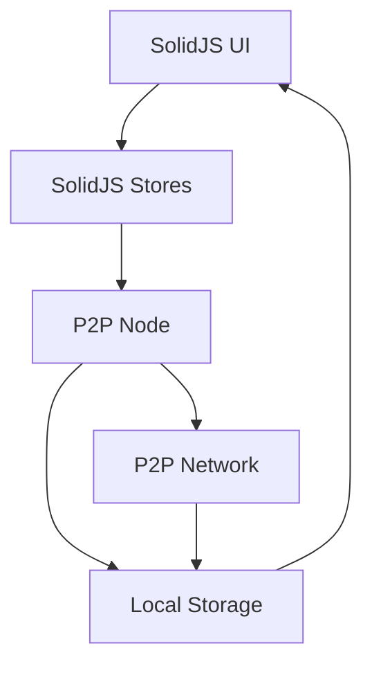

# AlLibrary Technical Specification

## 1. System Architecture

### 1.1 Core Components

- **Desktop Application (Tauri + SolidJS)**

  - Tauri v2 for desktop application framework
  - SolidJS for UI components
  - Built-in stores for state management
  - Solid-headless for accessible UI components

- **P2P Node (Rust)**

  - libp2p for P2P networking
  - Custom protocol for PDF/EPUB sharing
  - DHT for peer discovery
  - Content-addressed storage (IPFS)
  - Local SQLite for metadata and state

### 1.2 Data Flow



## 2. Local Storage Schema

### 2.1 Core Tables

```sql
-- Documents Table (Local copies)
CREATE TABLE documents (
    id TEXT PRIMARY KEY,
    title TEXT NOT NULL,
    description TEXT,
    content_hash TEXT NOT NULL,
    file_type TEXT NOT NULL,
    size INTEGER NOT NULL,
    created_at TIMESTAMP NOT NULL,
    updated_at TIMESTAMP NOT NULL,
    metadata JSON,
    local_path TEXT,
    is_shared BOOLEAN DEFAULT false
);

-- Collections Table (Local organization)
CREATE TABLE collections (
    id TEXT PRIMARY KEY,
    name TEXT NOT NULL,
    description TEXT,
    created_at TIMESTAMP NOT NULL,
    updated_at TIMESTAMP NOT NULL
);

-- Document Collections Table
CREATE TABLE document_collections (
    document_id TEXT NOT NULL,
    collection_id TEXT NOT NULL,
    PRIMARY KEY (document_id, collection_id),
    FOREIGN KEY (document_id) REFERENCES documents(id),
    FOREIGN KEY (collection_id) REFERENCES collections(id)
);

-- Tags Table
CREATE TABLE tags (
    id TEXT PRIMARY KEY,
    name TEXT NOT NULL UNIQUE
);

-- Document Tags Table
CREATE TABLE document_tags (
    document_id TEXT NOT NULL,
    tag_id TEXT NOT NULL,
    PRIMARY KEY (document_id, tag_id),
    FOREIGN KEY (document_id) REFERENCES documents(id),
    FOREIGN KEY (tag_id) REFERENCES tags(id)
);

-- Network Peers Table (Known peers)
CREATE TABLE peers (
    id TEXT PRIMARY KEY,
    address TEXT NOT NULL,
    last_seen TIMESTAMP NOT NULL,
    status TEXT NOT NULL,
    reputation INTEGER DEFAULT 0,
    metadata JSON
);

-- Download Queue Table
CREATE TABLE download_queue (
    id TEXT PRIMARY KEY,
    content_hash TEXT NOT NULL,
    status TEXT NOT NULL,
    priority INTEGER NOT NULL,
    progress REAL NOT NULL,
    created_at TIMESTAMP NOT NULL,
    updated_at TIMESTAMP NOT NULL
);
```

## 3. P2P Protocol Specification

### 3.1 Core Protocol Messages

```rust
// Protocol Messages
pub enum ProtocolMessage {
    // Discovery
    FindPeers { query: String },
    PeerList { peers: Vec<PeerInfo> },

    // Content
    ContentQuery { hash: String },
    ContentAvailable { hash: String, size: u64 },
    ContentRequest { hash: String, offset: u64, length: u64 },
    ContentResponse { hash: String, data: Vec<u8> },

    // Search
    SearchRequest { query: SearchQuery },
    SearchResponse { results: Vec<SearchResult> },

    // Health
    HealthCheck,
    HealthResponse { status: NetworkStatus }
}

// P2P Node Implementation
pub struct P2PNode {
    // Node Operations
    pub async fn start(&self) -> Result<()>;
    pub async fn stop(&self) -> Result<()>;

    // Content Operations
    pub async fn publish(&self, content: &[u8]) -> Result<String>; // Returns content hash
    pub async fn fetch(&self, hash: &str) -> Result<Vec<u8>>;
    pub async fn search(&self, query: SearchQuery) -> Result<Vec<SearchResult>>;

    // Network Operations
    pub async fn connect(&self, peer_id: &str) -> Result<()>;
    pub async fn disconnect(&self, peer_id: &str) -> Result<()>;
    pub async fn get_peers(&self) -> Result<Vec<Peer>>;

    // Local Operations
    pub async fn add_local_document(&self, path: &str) -> Result<Document>;
    pub async fn share_document(&self, doc_id: &str) -> Result<()>;
    pub async fn unshare_document(&self, doc_id: &str) -> Result<()>;
}
```

### 3.2 SolidJS Frontend APIs

```typescript
// Document Store
interface DocumentStore {
  documents: Record<string, Document>;
  collections: Record<string, Collection>;
  tags: Record<string, Tag>;

  // Actions
  addLocalDocument: (file: File) => Promise<void>;
  shareDocument: (id: string) => Promise<void>;
  unshareDocument: (id: string) => Promise<void>;
  getDocument: (id: string) => Promise<Document>;
}

// Network Store
interface NetworkStore {
  peers: Record<string, Peer>;
  status: NetworkStatus;
  bandwidth: BandwidthStats;

  // Actions
  connect: (peerId: string) => Promise<void>;
  disconnect: (peerId: string) => Promise<void>;
  search: (query: SearchQuery) => Promise<SearchResult[]>;
}

// Download Store
interface DownloadStore {
  queue: Record<string, DownloadItem>;
  active: string[];
  completed: string[];

  // Actions
  downloadContent: (hash: string, priority: Priority) => Promise<void>;
  cancelDownload: (hash: string) => Promise<void>;
  updatePriority: (hash: string, priority: Priority) => Promise<void>;
}
```

## 4. Component Architecture

### 4.1 SolidJS Components

```typescript
// Layout Components
interface LayoutProps {
  children: JSX.Element;
  sidebar?: JSX.Element;
}

// Document Components
interface DocumentViewerProps {
  document: Document;
  onClose: () => void;
}

// Network Components
interface NetworkStatusProps {
  status: NetworkStatus;
  onRefresh: () => void;
}

// Download Components
interface DownloadQueueProps {
  items: DownloadItem[];
  onPriorityChange: (id: string, priority: Priority) => void;
}
```

## 5. Security Considerations

### 5.1 Content Verification

- Implement content hashing using SHA-256
- Verify content integrity before storage
- Maintain content verification history

### 5.2 Network Security

- Implement peer authentication
- Use encrypted communication channels
- Validate peer reputation
- Implement DHT security measures

### 5.3 Data Protection

- Encrypt sensitive metadata
- Implement secure storage for credentials
- Regular security audits

## 6. Performance Optimization

### 6.1 Caching Strategy

- Implement LRU cache for frequently accessed content
- Cache metadata and search results
- Use IndexedDB for offline storage

### 6.2 Network Optimization

- Implement connection pooling
- Use content routing optimization
- Implement bandwidth throttling
- Use DHT for efficient peer discovery

### 6.3 UI Performance

- Use fine-grained reactivity (SolidJS)
- Implement virtual scrolling for large lists
- Use lazy loading for images and content

## 7. Testing Strategy

### 7.1 Unit Tests

- Rust unit tests
- SolidJS component testing
- P2P protocol testing

### 7.2 Integration Tests

- End-to-end testing with Playwright
- Network simulation testing
- Performance testing

### 7.3 User Testing

- Usability testing
- Accessibility testing
- Performance monitoring

## 8. Development Workflow

### 8.1 Setup Requirements

- Rust 1.70+
- Node.js 16+
- SQLite 3
- Git

### 8.2 Development Environment

```bash
# Required environment variables
RUST_LOG=debug
DATABASE_PATH=./data/library.db
IPFS_PATH=./data/ipfs
```

### 8.3 Build Process

```bash
# Development
cargo tauri dev

# Production build
cargo tauri build

# Testing
cargo test
```

## 9. Deployment Strategy

### 9.1 Release Process

1. Version bump
2. Changelog update
3. Build artifacts
4. Release notes
5. Distribution

### 9.2 Update Mechanism

- Implement auto-update system
- Version compatibility checks
- Rollback capability

## Next Steps

1. **Setup Development Environment**

   - Initialize project repository
   - Set up Rust and Tauri
   - Install dependencies

2. **P2P Implementation**

   - Implement libp2p integration
   - Set up DHT for peer discovery
   - Implement content addressing

3. **Core Features Development**

   - Implement basic UI components
   - Set up P2P networking
   - Implement document processing

4. **Testing Infrastructure**
   - Set up testing framework
   - Create initial test suite
   - Implement CI/CD pipeline
