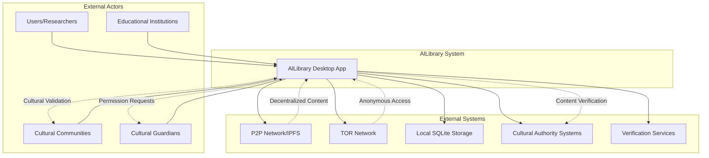
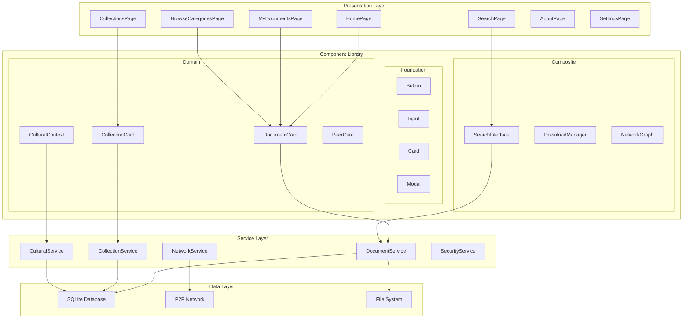
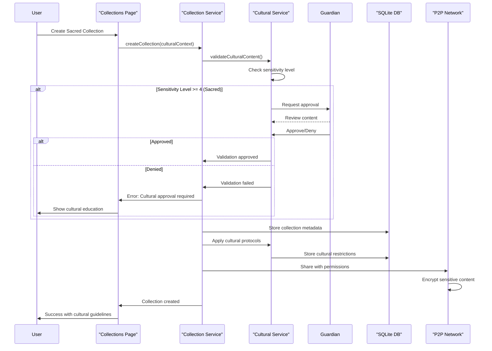
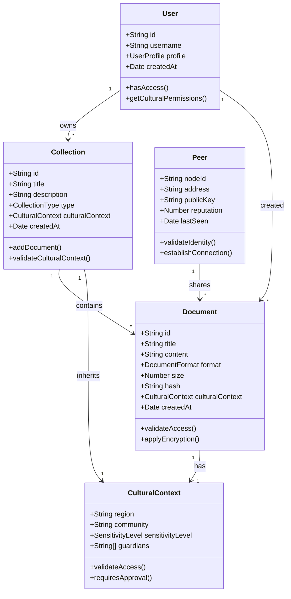
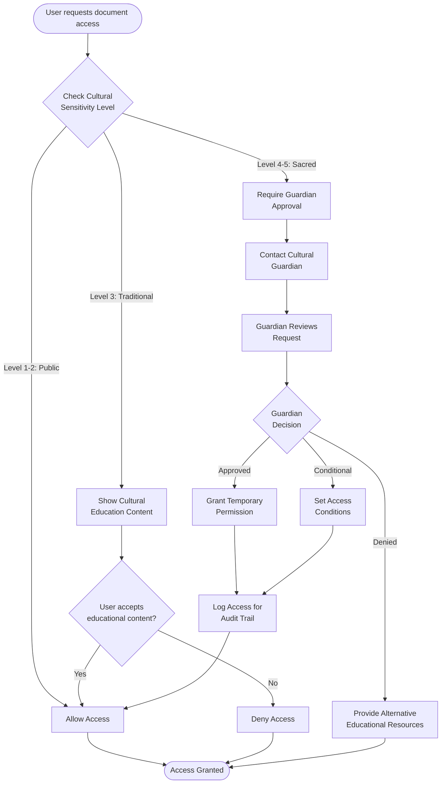
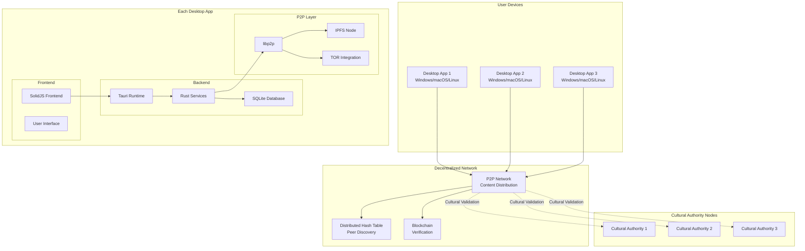
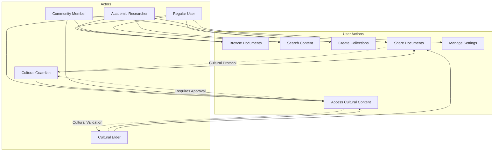
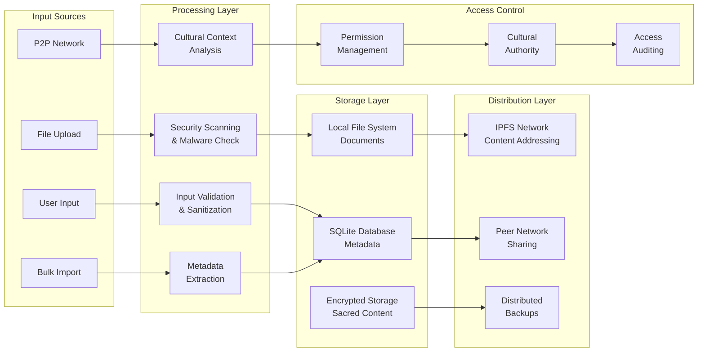
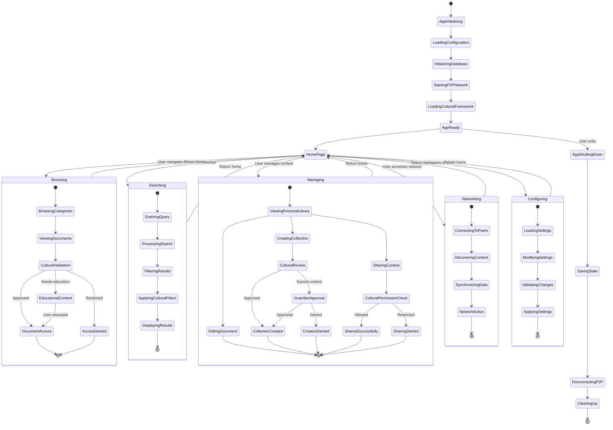

# AlLibrary System Architecture Diagrams

## 🏗️ System Overview

This document contains the comprehensive software engineering diagrams for the AlLibrary system, following SOLID principles, cultural sensitivity requirements, and anti-censorship architecture.

---

## 🌐 System Context Diagram

---

## 🧩 Component Architecture Diagram

---

## 🔄 Cultural Validation Sequence Diagram

---

## 🗂️ Core Data Model Class Diagram

---

## 🛡️ Cultural Access Control Activity Diagram

---

## 🌐 Decentralized Deployment Diagram

---

## 👥 Use Case Diagram

---

## 🌊 Data Flow Diagram

---

## 🔄 Application State Machine

---

## 🌐 Complete System Integration Architecture

```mermaid
graph TB
    subgraph "AlLibrary Core System"
        subgraph "Desktop Application"
            UI[SolidJS Frontend]
            BL[Business Logic]
            API[Tauri API Layer]
            DB[SQLite Database]
        end

        subgraph "P2P Network Layer"
            LibP2P[libp2p Protocol]
            IPFS[IPFS Content Storage]
            DHT[Distributed Hash Table]
        end

        subgraph "Security & Privacy"
            Encryption[End-to-End Encryption]
            TOR[TOR Integration]
            VPN[VPN Support]
            LocalAuth[Local Authentication]
        end
    end

    subgraph "Cultural Authority Network"
        subgraph "Indigenous Communities"
            IC1[Community 1<br/>Traditional Knowledge]
            IC2[Community 2<br/>Sacred Content]
            IC3[Community 3<br/>Cultural Protocols]
        end

        subgraph "Academic Institutions"
            AI1[University 1<br/>Research Repository]
            AI2[University 2<br/>Cultural Studies]
            AI3[Library System<br/>Academic Content]
        end

        subgraph "Cultural Organizations"
            CO1[Museum Network<br/>Cultural Heritage]
            CO2[UNESCO<br/>World Heritage]
            CO3[National Archives<br/>Historical Records]
        end
    end

    subgraph "External Systems"
        subgraph "Verification Services"
            VS1[Digital Signature<br/>Verification]
            VS2[Content Authenticity<br/>Blockchain]
            VS3[Reputation System<br/>Community Trust]
        end

        subgraph "Anti-Censorship Network"
            ACN1[Mirror Networks<br/>Content Backup]
            ACN2[Distributed CDN<br/>Access Points]
            ACN3[Emergency Networks<br/>Crisis Access]
        end
    end

    %% Core System Connections
    UI --> BL
    BL --> API
    API --> DB
    API --> LibP2P
    LibP2P --> IPFS
    LibP2P --> DHT

    %% Security Integration
    BL --> Encryption
    LibP2P --> TOR
    API --> LocalAuth
    TOR --> VPN

    %% Cultural Authority Integration
    BL -.->|Cultural Validation| IC1
    BL -.->|Sacred Content Approval| IC2
    BL -.->|Protocol Compliance| IC3
    BL -.->|Academic Verification| AI1
    BL -.->|Research Collaboration| AI2
    BL -.->|Library Integration| AI3
    BL -.->|Heritage Preservation| CO1
    BL -.->|Standards Compliance| CO2
    BL -.->|Historical Verification| CO3

    %% External Systems Integration
    IPFS --> VS1
    DHT --> VS2
    LibP2P --> VS3
    TOR --> ACN1
    IPFS --> ACN2
    LibP2P --> ACN3
```

---

_System Architecture Excellence: These diagrams represent AlLibrary's commitment to decentralized, culturally-respectful, anti-censorship knowledge sharing through technical excellence and community governance._
