# AlLibrary Page Relationship & Navigation Diagrams

## 🗺️ Overview

This document illustrates how all AlLibrary pages interconnect, showing navigation flows, data sharing, and cultural integration across the entire application ecosystem.

---

## 🌐 Complete AlLibrary Page Relationship Diagram

```mermaid
graph TB
    subgraph "Core Navigation Hub"
        HP[HomePage<br/>📱 Main Dashboard]
    end

    subgraph "Content Discovery"
        SP[SearchPage<br/>🔍 Global Search]
        SCP[SearchNetworkPage<br/>🌐 P2P Search]
        BCP[BrowseCategoriesPage<br/>📂 Category Navigation]
        TP[TrendingPage<br/>📈 Popular Content]
        NAP[NewArrivalsPage<br/>🆕 Fresh Content]
    end

    subgraph "Content Management"
        MDP[MyDocumentsPage<br/>📄 Personal Library]
        CP[CollectionsPage<br/>📚 Organized Groups]
        FP[FavoritesPage<br/>⭐ Bookmarked Items]
        RP[RecentPage<br/>🕒 Recent Activity]
    end

    subgraph "Content Detail"
        DDP[DocumentDetailPage<br/>📖 Document Viewer]
    end

    subgraph "Cultural & Community"
        CCP[CulturalContextsPage<br/>🌍 Cultural Framework]
        PNP[PeerNetworkPage<br/>🤝 Community Network]
    end

    subgraph "System & Info"
        SETP[SettingsPage<br/>⚙️ Configuration]
        AP[AboutPage<br/>ℹ️ Project Information]
    end

    %% Primary Navigation from HomePage
    HP --> SP
    HP --> MDP
    HP --> CP
    HP --> BCP
    HP --> PNP
    HP --> SETP

    %% Search & Discovery Flow
    SP --> DDP
    SCP --> DDP
    BCP --> SP
    BCP --> DDP
    TP --> DDP
    NAP --> DDP

    %% Content Management Flow
    MDP --> DDP
    MDP --> CP
    CP --> DDP
    FP --> DDP
    RP --> DDP
    RP --> MDP

    %% Cultural Integration
    CCP --> BCP
    CCP --> DDP
    CCP --> CP

    %% Network & Community
    PNP --> SCP
    PNP --> CCP
    PNP --> MDP

    %% Settings Integration
    SETP --> HP
    SETP --> CCP
    SETP --> PNP

    %% Information & About
    AP --> CCP
    AP --> SETP

    %% Cross-Page Relationships
    SP -.->|"Search in Collections"| CP
    MDP -.->|"Add to Collections"| CP
    DDP -.->|"Add to Favorites"| FP
    DDP -.->|"Share via Network"| PNP
    BCP -.->|"Cultural Context"| CCP

    %% Cultural Validation Flows
    DDP -.->|"Cultural Validation"| CCP
    CP -.->|"Cultural Approval"| CCP
    MDP -.->|"Cultural Assignment"| CCP
```

---

## 🏗️ Complete Technical Architecture Flow

---

## 🌊 Complete Data Flow Architecture

---

## 🔄 Navigation Flow Patterns

### 📱 **Primary Navigation Flows**

### 🌍 **Cultural Integration Flows**

### 🔍 **Search & Discovery Integration**

---

## 📊 **Page Interdependency Matrix**

| Page                 | HomePage | SearchPage | MyDocuments | Collections | BrowseCategories | DocumentDetail | Cultural | PeerNetwork | Settings | About  |
| -------------------- | -------- | ---------- | ----------- | ----------- | ---------------- | -------------- | -------- | ----------- | -------- | ------ |
| **HomePage**         | -        | High       | High        | High        | Medium           | Low            | Medium   | Medium      | High     | Low    |
| **SearchPage**       | Medium   | -          | Medium      | High        | High             | High           | High     | Medium      | Low      | Low    |
| **MyDocuments**      | High     | Medium     | -           | High        | Medium           | High           | High     | Medium      | Medium   | Low    |
| **Collections**      | High     | High       | High        | -           | Medium           | High           | High     | Medium      | Medium   | Low    |
| **BrowseCategories** | Medium   | High       | Medium      | Medium      | -                | High           | High     | Low         | Low      | Low    |
| **DocumentDetail**   | Low      | High       | High        | High        | High             | -              | High     | Medium      | Low      | Low    |
| **Cultural**         | Medium   | High       | High        | High        | High             | High           | -        | High        | High     | Medium |
| **PeerNetwork**      | Medium   | Medium     | Medium      | Medium      | Low              | Medium         | High     | -           | High     | Low    |
| **Settings**         | High     | Low        | Medium      | Medium      | Low              | Low            | High     | High        | -        | Medium |
| **About**            | Low      | Low        | Low         | Low         | Low              | Low            | Medium   | Low         | Medium   | -      |

**Legend:**

- **High**: Direct navigation and frequent data sharing
- **Medium**: Indirect relationship with some data sharing
- **Low**: Minimal or rare interaction

---

_Navigation Excellence: These diagrams ensure seamless user experience while maintaining cultural sensitivity and anti-censorship principles throughout the AlLibrary ecosystem._
