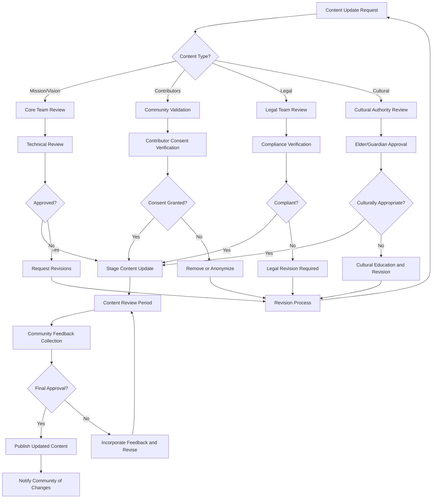
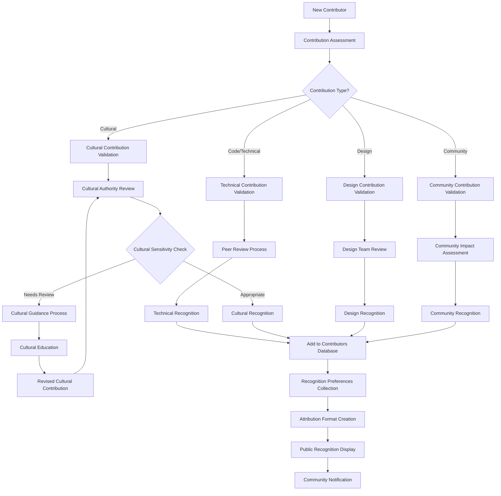
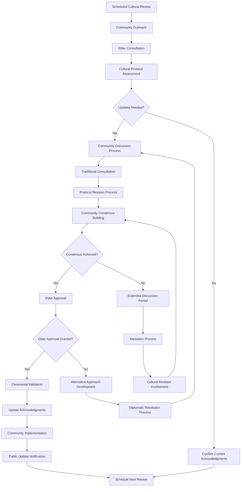

# AboutPage - Business Rules

## 🎯 Business Objectives

### Primary Goals

1. **Mission Communication** - Clearly articulate AlLibrary's vision of decentralized, culturally-respectful knowledge sharing
2. **Community Recognition** - Honor all contributors, cultural communities, and supporters of the project
3. **Transparency** - Provide complete transparency about development, funding, governance, and decision-making
4. **Cultural Acknowledgment** - Respectfully acknowledge indigenous and traditional knowledge contributions
5. **Legal Compliance** - Display all necessary licensing, attributions, and legal disclosures

### Success Metrics

- **Mission Understanding**: >95% of users understand AlLibrary's anti-censorship and cultural respect mission
- **Community Engagement**: 100% of contributors and cultural partners feel properly acknowledged
- **Trust Building**: >90% user trust score through transparency and open governance
- **Cultural Appropriateness**: Zero cultural appropriation concerns in acknowledgments
- **Legal Compliance**: 100% compliance with all applicable licensing and attribution requirements

## 📋 Functional Requirements

### Mission & Vision Display

```typescript
interface MissionRequirements {
  // Core mission statement
  missionStatement: {
    primaryMission: "Decentralized, culturally-respectful global knowledge sharing";
    antiCensorshipCommitment: "Resistance to information control and manipulation";
    culturalRespectPledge: "Sacred commitment to traditional knowledge protocols";
    communityEmpowerment: "Democratic governance and community-driven development";
    accessibilityCommitment: "Universal access regardless of geography or resources";
  };

  // Vision components
  visionElements: {
    technicalVision: "Peer-to-peer, blockchain-secured, offline-capable library system";
    culturalVision: "Bridge between traditional knowledge and modern information sharing";
    socialVision: "Global community united by respect for diverse knowledge traditions";
    educationalVision: "Platform for cross-cultural learning and understanding";
    politicalVision: "Information sovereignty and resistance to digital colonialism";
  };

  // Core values
  coreValues: {
    culturalSovereignty: "Communities control their own cultural knowledge";
    informationIntegrity: "Combat misinformation while preserving diverse perspectives";
    openSource: "Transparent, community-auditable code and governance";
    inclusivity: "Accessible to all communities regardless of technical resources";
    sustainability: "Long-term preservation without corporate or state dependencies";
  };
}
```

### Community & Contributor Recognition

```typescript
interface CommunityRecognitionRequirements {
  // Development team recognition
  developmentTeam: {
    coreContributors: "Founding developers and major contributors";
    culturalAdvisors: "Cultural communities and traditional knowledge keepers";
    technicalExperts: "Specialized technical contributors and reviewers";
    designContributors: "UI/UX designers and accessibility experts";
    communityModerators: "Community managers and cultural sensitivity moderators";
  };

  // Cultural community acknowledgments
  culturalCommunities: {
    indigenousPartners: "Indigenous communities contributing traditional knowledge protocols";
    culturalGuardians: "Elders and cultural authorities providing guidance";
    traditionalKnowledgeKeepers: "Community members sharing cultural wisdom";
    culturalEducators: "Teachers and guides facilitating cross-cultural understanding";
    protocolAdvisors: "Communities defining appropriate cultural interaction protocols";
  };

  // Supporting organizations
  supportingOrganizations: {
    fundingOrganizations: "Grants, donations, and financial support sources";
    technicalPartners: "Infrastructure, hosting, and technical service providers";
    educationalInstitutions: "Universities and schools supporting development";
    culturalInstitutions: "Museums, libraries, and cultural organizations";
    activistOrganizations: "Digital rights and anti-censorship advocacy groups";
  };
}
```

### Legal & Licensing Information

```typescript
interface LegalRequirements {
  // Software licensing
  softwareLicensing: {
    primaryLicense: "GNU AGPLv3 for core application code";
    componentLicenses: "Individual licenses for third-party components";
    culturalProtocolLicense: "Special licensing for cultural protocol implementations";
    documentLicenses: "Respect for individual document licensing and copyright";
    contributorLicenseAgreement: "CLA requirements for code and cultural contributions";
  };

  // Copyright and attribution
  copyrightAttribution: {
    codeAttribution: "Proper attribution for all code contributors";
    culturalAttribution: "Respectful attribution of cultural knowledge and protocols";
    designAttribution: "Recognition of UI/UX design contributions";
    contentAttribution: "Proper citation of educational and reference content";
    translationAttribution: "Recognition of translation and localization contributors";
  };

  // Privacy and data protection
  privacyCompliance: {
    dataProtectionNotices: "GDPR, CCPA, and other privacy regulation compliance";
    culturalDataProtection: "Special protections for traditional knowledge";
    userDataRights: "Clear explanation of user data rights and controls";
    crossBorderDataTransfer: "Compliance with international data transfer regulations";
    childrenPrivacyProtection: "COPPA and similar child protection compliance";
  };
}
```

### Technical Information & Transparency

```typescript
interface TechnicalTransparencyRequirements {
  // Technology stack disclosure
  technologyStack: {
    frontendFramework: "SolidJS framework and component library details";
    backendFramework: "Rust + Tauri desktop application architecture";
    databaseSystem: "SQLite local storage with P2P synchronization";
    networkingProtocol: "libp2p and IPFS content addressing";
    securityFramework: "Encryption, authentication, and security measures";
  };

  // Development process transparency
  developmentProcess: {
    versionControl: "Git repository locations and branching strategy";
    issueTracking: "Bug reports, feature requests, and development roadmap";
    codeReview: "Peer review process and quality assurance procedures";
    culturalReview: "Cultural sensitivity review and approval processes";
    communityGovernance: "Decision-making processes and community input mechanisms";
  };

  // Security and audit information
  securityAuditing: {
    securityAudits: "Third-party security audits and penetration testing";
    vulnerabilityDisclosure: "Responsible disclosure process for security issues";
    cryptographicImplementation: "Details of encryption and security implementations";
    culturalSecurityMeasures: "Special security measures for traditional knowledge";
    complianceAudits: "Cultural protocol compliance and community auditing";
  };
}
```

### Support & Contact Information

```typescript
interface SupportContactRequirements {
  // Technical support
  technicalSupport: {
    userSupport: "Help desk for technical issues and user questions";
    developerSupport: "Resources for developers wanting to contribute";
    documentationLinks: "Comprehensive user and developer documentation";
    troubleshootingGuides: "Self-service problem resolution resources";
    featureRequests: "Process for requesting new features and improvements";
  };

  // Cultural support and guidance
  culturalSupport: {
    culturalGuidance: "Access to cultural advisors and education resources";
    traditionalKnowledgeSupport: "Assistance with traditional knowledge protocols";
    communityConnection: "Pathways to connect with cultural communities";
    conflictResolution: "Mediation for cultural sensitivity conflicts";
    educationalResources: "Cultural competency and awareness training";
  };

  // Emergency and crisis support
  emergencySupport: {
    securityIncidents: "Emergency contact for security breaches or vulnerabilities";
    culturalCrisis: "Rapid response for cultural sensitivity incidents";
    legalIssues: "Legal support and guidance for complex situations";
    communityDisputes: "Mediation and resolution for community conflicts";
    censorshipEvents: "Response coordination for censorship attempts";
  };
}
```

## 🗄️ Data Architecture

### About Page Content Management

```sql
-- About page content and versioning
CREATE TABLE about_content (
    id TEXT PRIMARY KEY,
    content_type TEXT NOT NULL, -- 'mission', 'contributors', 'legal', 'technical'
    section_key TEXT NOT NULL,

    -- Content data
    title TEXT NOT NULL,
    content TEXT NOT NULL,
    content_format TEXT DEFAULT 'markdown',

    -- Versioning
    version INTEGER NOT NULL DEFAULT 1,
    is_current BOOLEAN DEFAULT TRUE,

    -- Cultural validation
    requires_cultural_review BOOLEAN DEFAULT FALSE,
    cultural_review_status TEXT DEFAULT 'approved',
    cultural_reviewer_id TEXT,

    -- Approval and governance
    approved_by TEXT,
    approval_date TIMESTAMP,
    governance_decision_id TEXT,

    -- Metadata
    display_order INTEGER DEFAULT 0,
    last_updated TIMESTAMP DEFAULT CURRENT_TIMESTAMP,
    created_at TIMESTAMP DEFAULT CURRENT_TIMESTAMP
);

-- Contributor recognition database
CREATE TABLE contributors (
    id TEXT PRIMARY KEY,
    contributor_type TEXT NOT NULL, -- 'developer', 'cultural_advisor', 'designer', 'translator'

    -- Basic information
    name TEXT NOT NULL,
    preferred_name TEXT,
    cultural_affiliation TEXT,
    pronouns TEXT,

    -- Contribution details
    contributions TEXT[], -- JSON array of contribution types
    contribution_period_start DATE,
    contribution_period_end DATE,

    -- Recognition preferences
    public_recognition BOOLEAN DEFAULT TRUE,
    preferred_attribution TEXT,
    cultural_recognition_protocols TEXT, -- JSON with cultural requirements

    -- Contact and links
    website_url TEXT,
    social_links TEXT[], -- JSON array of social media links
    professional_links TEXT[], -- JSON array of professional profiles

    -- Cultural considerations
    cultural_sensitivity_level INTEGER DEFAULT 1,
    traditional_knowledge_contributor BOOLEAN DEFAULT FALSE,
    elder_or_guardian BOOLEAN DEFAULT FALSE,

    created_at TIMESTAMP DEFAULT CURRENT_TIMESTAMP,
    updated_at TIMESTAMP DEFAULT CURRENT_TIMESTAMP
);

-- License and legal information tracking
CREATE TABLE legal_information (
    id TEXT PRIMARY KEY,
    information_type TEXT NOT NULL, -- 'license', 'copyright', 'privacy', 'compliance'

    -- Legal content
    title TEXT NOT NULL,
    description TEXT NOT NULL,
    legal_text TEXT NOT NULL,

    -- Jurisdiction and applicability
    applicable_jurisdictions TEXT[], -- JSON array of countries/regions
    effective_date DATE NOT NULL,
    expiration_date DATE,

    -- Updates and versioning
    version TEXT NOT NULL,
    supersedes_version TEXT,

    -- Cultural legal considerations
    cultural_legal_requirements TEXT, -- JSON with cultural-specific legal needs
    traditional_knowledge_protections TEXT, -- JSON with TK-specific protections

    -- Compliance tracking
    compliance_verified BOOLEAN DEFAULT FALSE,
    compliance_verifier TEXT,
    last_compliance_check TIMESTAMP,

    created_at TIMESTAMP DEFAULT CURRENT_TIMESTAMP,
    updated_at TIMESTAMP DEFAULT CURRENT_TIMESTAMP
);

-- Organization and partner acknowledgments
CREATE TABLE supporting_organizations (
    id TEXT PRIMARY KEY,
    organization_type TEXT NOT NULL, -- 'funding', 'technical', 'cultural', 'educational'

    -- Organization details
    name TEXT NOT NULL,
    description TEXT,
    website_url TEXT,
    logo_url TEXT,

    -- Support details
    support_type TEXT[], -- JSON array of support types
    support_period_start DATE,
    support_period_end DATE,
    ongoing_support BOOLEAN DEFAULT FALSE,

    -- Recognition preferences
    public_acknowledgment BOOLEAN DEFAULT TRUE,
    preferred_recognition_text TEXT,
    recognition_requirements TEXT, -- JSON with specific requirements

    -- Cultural considerations
    cultural_organization BOOLEAN DEFAULT FALSE,
    indigenous_organization BOOLEAN DEFAULT FALSE,
    traditional_knowledge_institution BOOLEAN DEFAULT FALSE,

    -- Contact information
    primary_contact_name TEXT,
    primary_contact_email TEXT,

    created_at TIMESTAMP DEFAULT CURRENT_TIMESTAMP,
    updated_at TIMESTAMP DEFAULT CURRENT_TIMESTAMP
);
```

### Cultural Acknowledgment Protocols

```sql
-- Cultural acknowledgment and protocol tracking
CREATE TABLE cultural_acknowledgments (
    id TEXT PRIMARY KEY,
    acknowledgment_type TEXT NOT NULL, -- 'land', 'knowledge', 'protocol', 'ceremony'

    -- Cultural context
    cultural_origin TEXT NOT NULL,
    specific_community TEXT,
    traditional_territory TEXT,

    -- Acknowledgment content
    acknowledgment_text TEXT NOT NULL,
    cultural_language_text TEXT,
    pronunciation_guide TEXT,

    -- Protocol requirements
    display_requirements TEXT, -- JSON with display protocol requirements
    ceremonial_requirements TEXT, -- JSON with ceremonial aspects
    seasonal_considerations TEXT, -- JSON with timing and seasonal factors

    -- Approval and validation
    community_approved BOOLEAN DEFAULT FALSE,
    elder_approved BOOLEAN DEFAULT FALSE,
    approving_authority_name TEXT,
    approval_ceremony_completed BOOLEAN DEFAULT FALSE,

    -- Usage guidelines
    usage_context TEXT[], -- JSON array of appropriate usage contexts
    prohibited_uses TEXT[], -- JSON array of prohibited uses
    modification_restrictions TEXT,

    -- Maintenance and updates
    requires_periodic_review BOOLEAN DEFAULT TRUE,
    review_frequency_months INTEGER DEFAULT 12,
    last_community_review TIMESTAMP,
    next_scheduled_review TIMESTAMP,

    created_at TIMESTAMP DEFAULT CURRENT_TIMESTAMP,
    updated_at TIMESTAMP DEFAULT CURRENT_TIMESTAMP
);

-- Traditional knowledge attribution
CREATE TABLE traditional_knowledge_attributions (
    id TEXT PRIMARY KEY,
    knowledge_type TEXT NOT NULL, -- 'protocol', 'wisdom', 'practice', 'ceremony'

    -- Knowledge details
    knowledge_title TEXT NOT NULL,
    knowledge_description TEXT NOT NULL,
    cultural_context TEXT NOT NULL,

    -- Attribution requirements
    source_community TEXT NOT NULL,
    knowledge_keeper_name TEXT,
    attribution_requirements TEXT NOT NULL, -- JSON with specific attribution needs

    -- Usage permissions
    permitted_uses TEXT[], -- JSON array of permitted uses
    restricted_uses TEXT[], -- JSON array of restricted uses
    commercial_use_allowed BOOLEAN DEFAULT FALSE,
    modification_allowed BOOLEAN DEFAULT FALSE,

    -- Cultural protocols
    access_protocols TEXT, -- JSON with access requirements
    sharing_protocols TEXT, -- JSON with sharing restrictions
    ceremonial_aspects TEXT, -- JSON with ceremonial considerations

    -- Ongoing relationship
    ongoing_community_relationship BOOLEAN DEFAULT TRUE,
    benefit_sharing_agreement TEXT,
    community_review_schedule TEXT,

    created_at TIMESTAMP DEFAULT CURRENT_TIMESTAMP,
    updated_at TIMESTAMP DEFAULT CURRENT_TIMESTAMP
);
```

## 🔄 Core Business Workflows

### About Page Content Management Workflow



### Contributor Recognition Workflow



### Cultural Acknowledgment Maintenance Workflow



## 🛡️ Cultural Sensitivity & Legal Compliance

### Cultural Sensitivity Requirements

```typescript
interface CulturalSensitivityRequirements {
  // Acknowledgment protocols
  acknowledgmentProtocols: {
    landAcknowledgment: "Respectful recognition of traditional territories";
    knowledgeAttribution: "Proper attribution of traditional knowledge contributions";
    communityRecognition: "Celebration of cultural community partnerships";
    elderHonoring: "Special recognition of elder and guardian contributions";
    protocolRespect: "Adherence to cultural protocols in all acknowledgments";
  };

  // Cultural accuracy validation
  culturalAccuracy: {
    communityVerification: "All cultural content verified by source communities";
    elderApproval: "Cultural acknowledgments approved by appropriate authorities";
    linguisticAccuracy: "Correct pronunciation and spelling of cultural terms";
    contextualAppropriateness: "Cultural content presented in appropriate context";
    ongoingValidation: "Regular review and validation of cultural acknowledgments";
  };

  // Traditional knowledge protection
  traditionalKnowledgeProtection: {
    accessControls: "Appropriate access restrictions for sacred information";
    usageGuidelines: "Clear guidelines for respectful use of traditional knowledge";
    commercialRestrictions: "Prohibition of commercial exploitation without consent";
    modificationProtections: "Protection against unauthorized modification";
    perpetualRespect: "Ongoing commitment to respectful relationship maintenance";
  };
}
```

### Legal Compliance Framework

```typescript
interface LegalComplianceRequirements {
  // Software licensing compliance
  softwareLicensing: {
    licenseCompatibility: "Ensure all component licenses are compatible with AGPLv3";
    attributionRequirements: "Proper attribution for all third-party components";
    copyleftCompliance: "Full compliance with copyleft license requirements";
    distributionRequirements: "Source code availability for all distributed versions";
    patentProtections: "Protection against patent litigation and trolling";
  };

  // Privacy regulation compliance
  privacyCompliance: {
    gdprCompliance: "Full GDPR compliance for European users";
    ccpaCompliance: "California Consumer Privacy Act compliance";
    coppaCompliance: "Child Online Privacy Protection Act compliance";
    internationalPrivacy: "Compliance with various international privacy laws";
    culturalPrivacy: "Special protections for cultural and traditional knowledge";
  };

  // Content and intellectual property
  intellectualProperty: {
    copyrightRespect: "Respect for document copyrights and licensing";
    fairUseGuidelines: "Clear fair use guidelines for educational content";
    trademarkCompliance: "Proper handling of trademarks and service marks";
    traditionalKnowledgeRights: "Recognition and protection of traditional knowledge rights";
    communityIntellectualProperty: "Respect for community-owned intellectual property";
  };
}
```

## 📊 Performance & Quality Standards

### About Page Performance Requirements

- **Content Load Time**: <1 second for all About page sections
- **Image Loading**: <2 seconds for contributor photos and organization logos
- **Cultural Content Rendering**: <1 second for cultural acknowledgments
- **Search Functionality**: <500ms for searching contributors or content
- **Mobile Responsiveness**: Perfect rendering on all device sizes

### Cultural Accuracy Quality Metrics

- **Community Approval**: 100% community approval for all cultural acknowledgments
- **Elder Verification**: 100% elder verification for traditional knowledge attributions
- **Linguistic Accuracy**: 100% accuracy in cultural terms and pronunciations
- **Protocol Compliance**: 100% adherence to cultural protocols and requirements
- **Ongoing Validation**: Regular review and validation maintaining 100% accuracy

### Legal Compliance Quality Standards

- **License Compliance**: 100% compliance with all software licenses
- **Attribution Accuracy**: 100% accurate attribution for all contributors and components
- **Privacy Compliance**: 100% compliance with applicable privacy regulations
- **Intellectual Property Respect**: Zero intellectual property violations
- **Documentation Currency**: All legal documentation updated within 30 days of changes

## 🎯 Success Criteria & Validation

### Mission Communication Success

1. **Clarity**: Users clearly understand AlLibrary's anti-censorship and cultural respect mission
2. **Inspiration**: About page content inspires users to participate in the community
3. **Trust**: Users feel confident in the project's transparency and governance
4. **Cultural Resonance**: Cultural communities feel respected and properly represented
5. **Call to Action**: Clear pathways for users to contribute and get involved

### Community Recognition Success

1. **Completeness**: All contributors feel properly recognized and appreciated
2. **Accuracy**: All contributor information is accurate and up-to-date
3. **Cultural Appropriateness**: All cultural contributors are recognized according to their protocols
4. **Inclusivity**: Recognition system includes all types of valuable contributions
5. **Ongoing Engagement**: Recognition system encourages continued participation

### Legal and Cultural Compliance Success

1. **Legal Safety**: Zero legal compliance issues or violations
2. **Cultural Respect**: Zero cultural appropriation or insensitivity incidents
3. **Community Satisfaction**: All cultural communities satisfied with their representation
4. **Transparency**: All governance, funding, and decision-making processes are transparent
5. **Accessibility**: All information is accessible to users with diverse abilities and technical access

---

_About Excellence: Transparent, culturally respectful, and legally compliant presentation of AlLibrary's mission, community, and commitment to democratic knowledge sharing._
