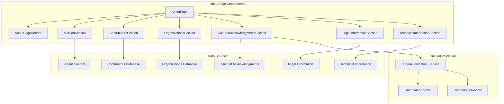
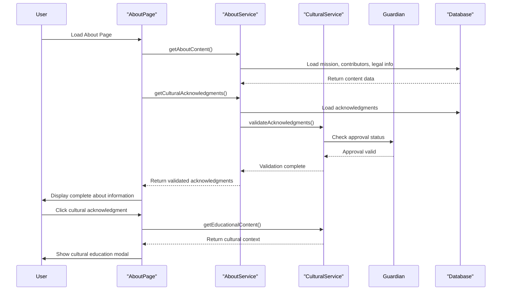
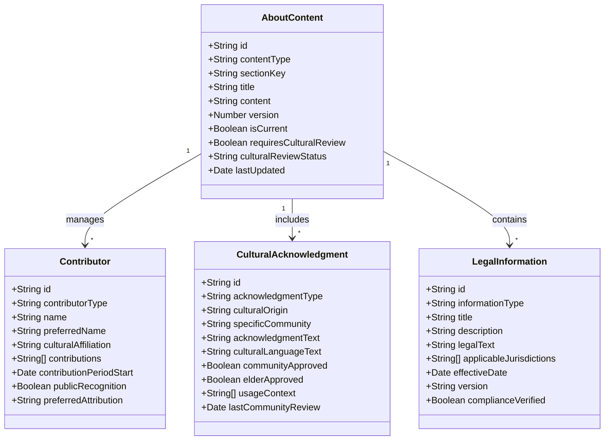
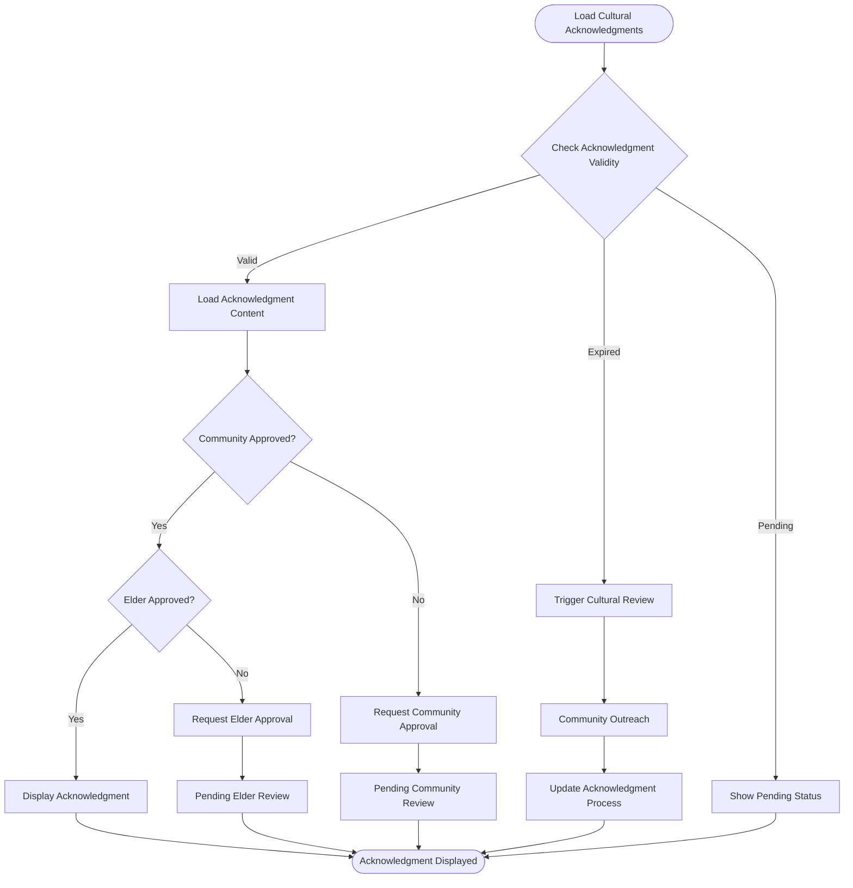
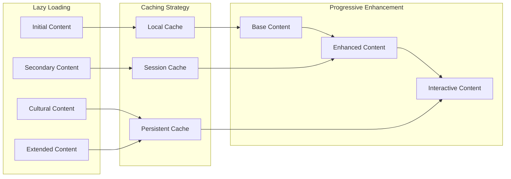
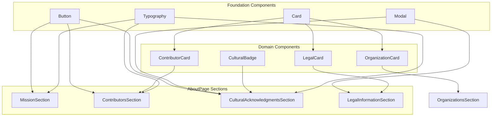
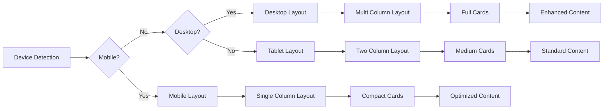

# AboutPage - Software Engineering Diagrams

## 🏗️ Component Architecture

### AboutPage Component Structure

---

## 🔄 AboutPage Data Flow

### Cultural Acknowledgment Workflow

---

## 📊 AboutPage Data Model

### Content Management Schema

---

## 🛡️ Cultural Integration

### Cultural Acknowledgment Validation Flow

---

## ⚡ Performance Architecture

### Content Loading Strategy

---

## 🔍 Component Reusability

### Shared Component Usage

---

## 📱 Responsive Design Strategy

### Device Adaptation Flow

---

_AboutPage Excellence: These diagrams ensure comprehensive project information display while maintaining cultural sensitivity and technical performance standards._
