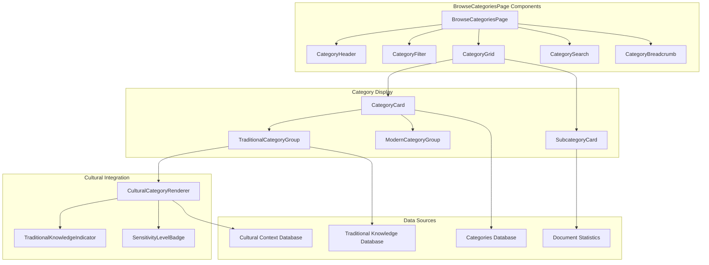
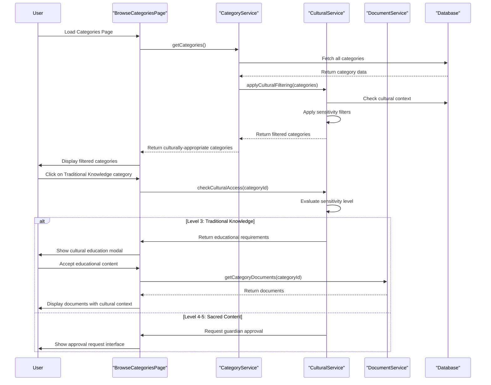
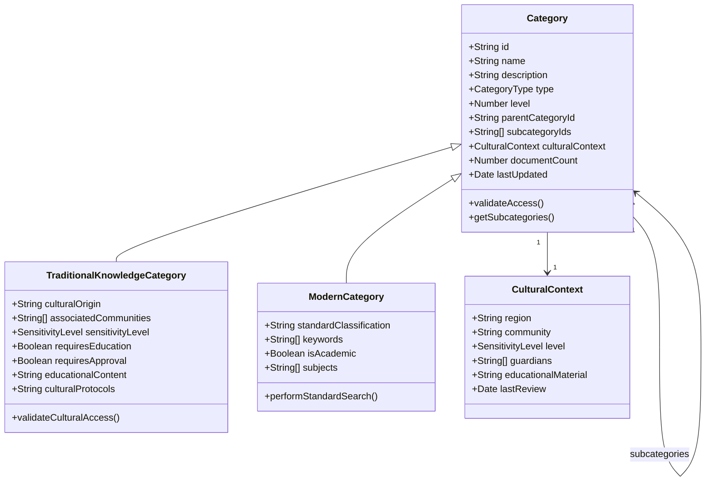
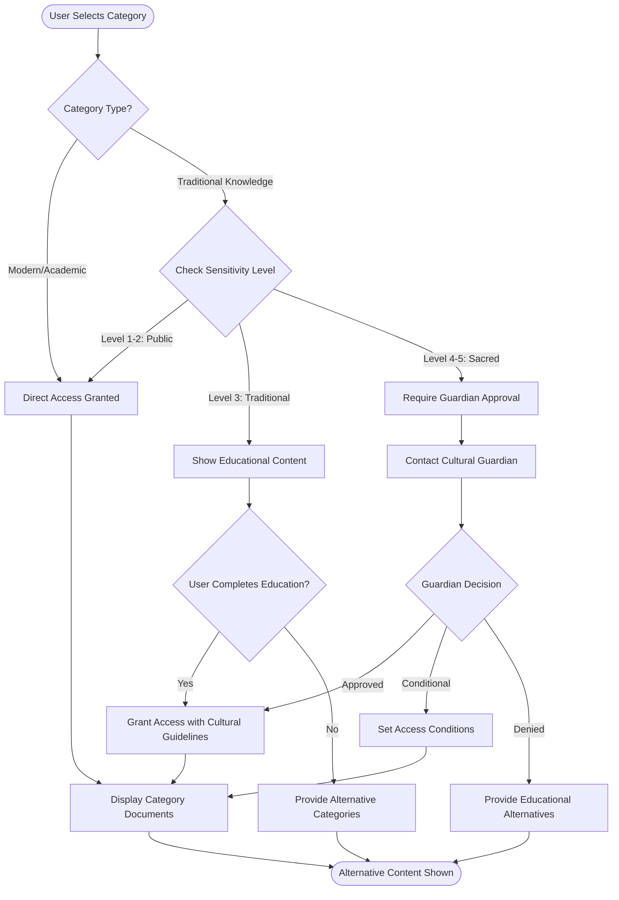
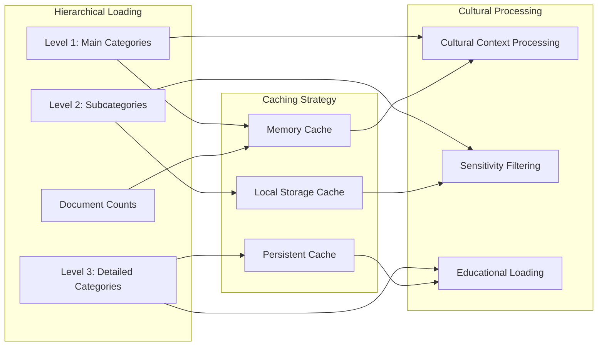
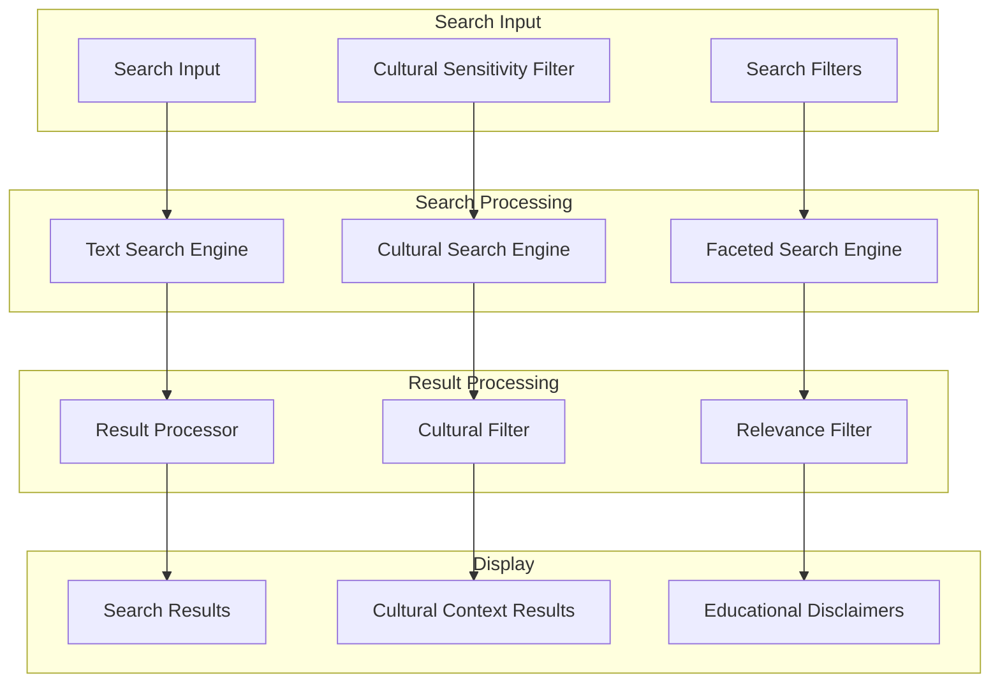

# BrowseCategoriesPage - Software Engineering Diagrams

## 🏗️ Component Architecture

### BrowseCategoriesPage Component Structure

---

## 🔄 Category Navigation Flow

### Cultural-Aware Category Browsing

---

## 📊 Category Data Model

### Cultural Category Schema

---

## 🛡️ Cultural Navigation Activity

### Traditional Knowledge Access Flow

---

## ⚡ Performance Architecture

### Category Loading Strategy

---

## 🔍 Search Integration

### Category Search Architecture

---

_BrowseCategoriesPage Excellence: Seamless category navigation with integrated cultural sensitivity and educational enhancement._
