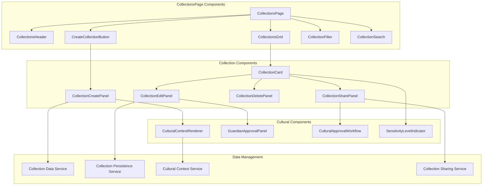
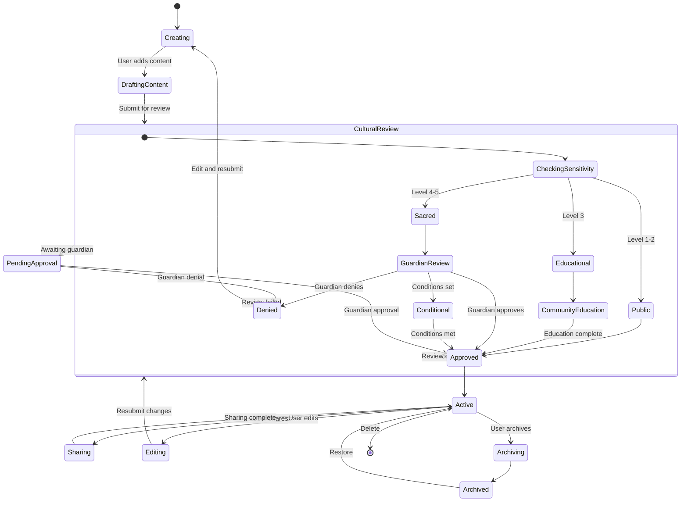
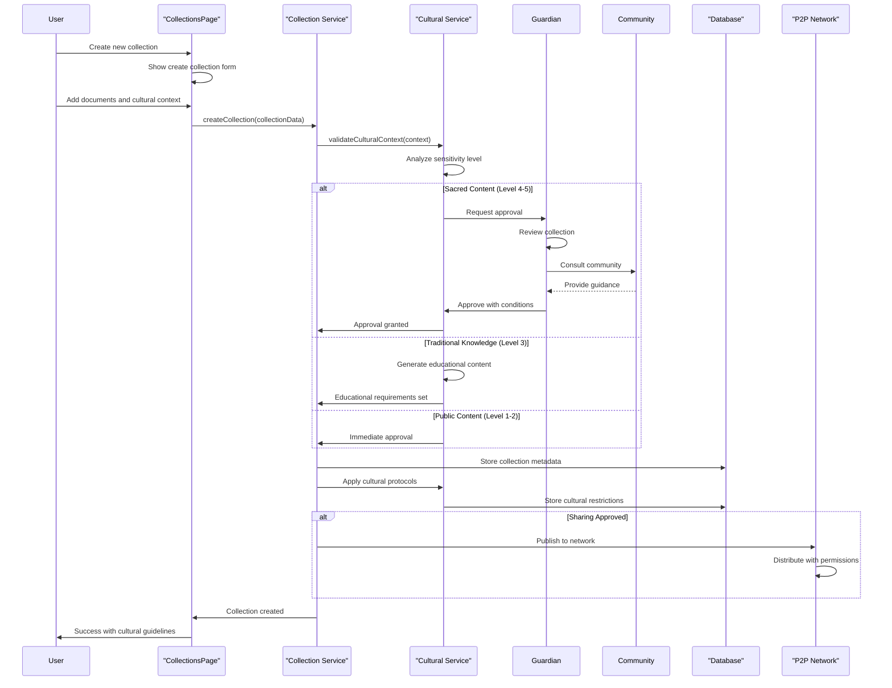
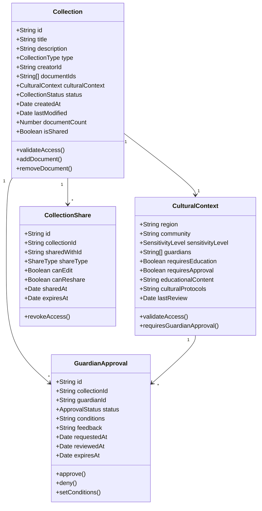
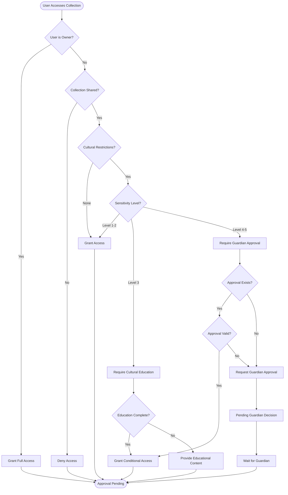
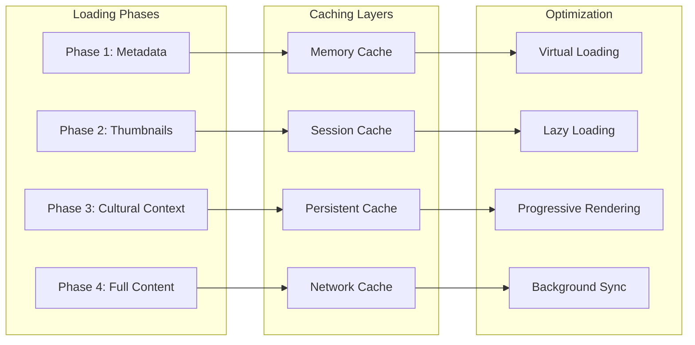

# CollectionsPage - Software Engineering Diagrams

## 🏗️ Component Architecture

### CollectionsPage Component Structure

---

## 🔄 Collection Lifecycle State Machine

### Cultural Collection Workflow

---

## 🔄 Collection Creation Sequence

### Sacred Collection Approval Process

---

## 📊 Collection Data Model

### Cultural Collection Schema

---

## 🛡️ Cultural Access Control Activity

### Collection Access Validation

---

## ⚡ Performance Optimization

### Collection Loading Strategy

---

_CollectionsPage Excellence: Comprehensive collection management with integrated cultural governance and community approval workflows._
