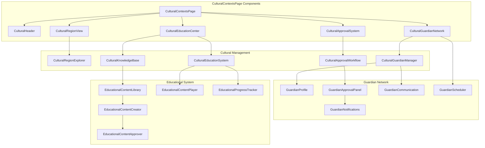
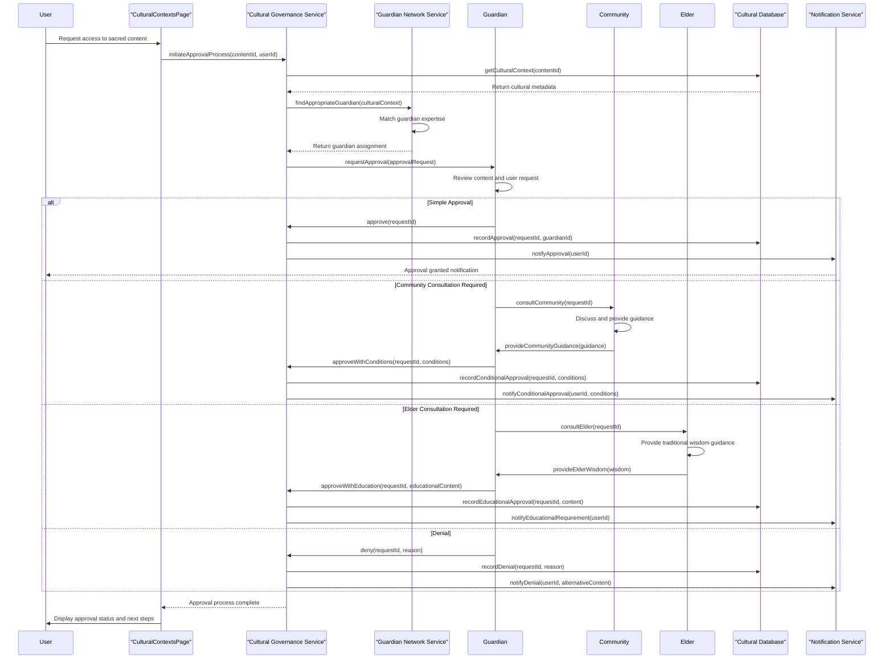
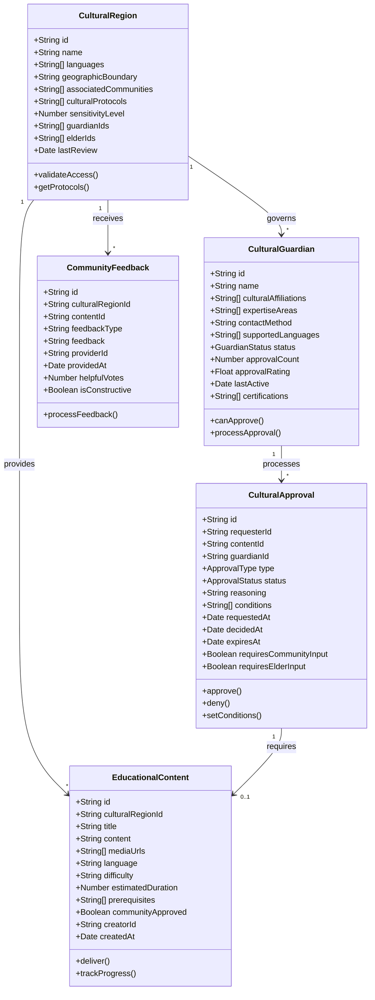
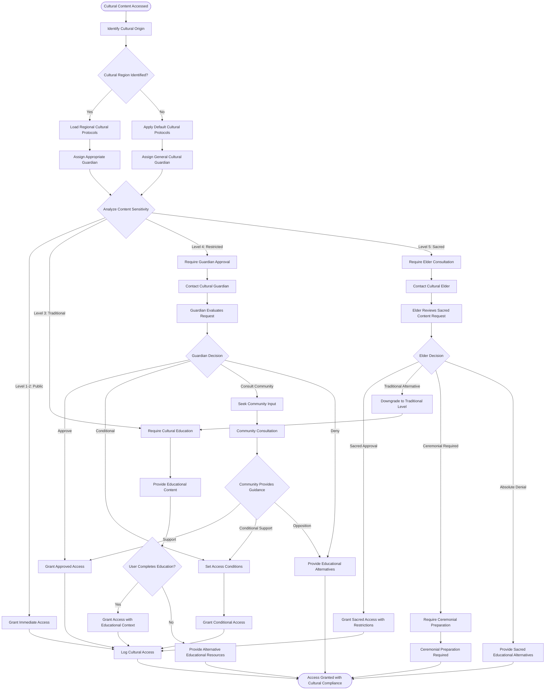
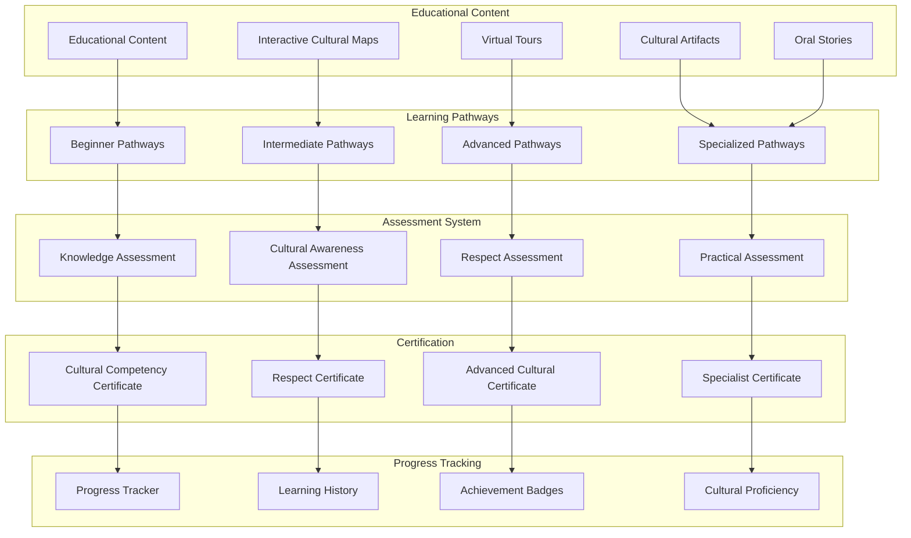
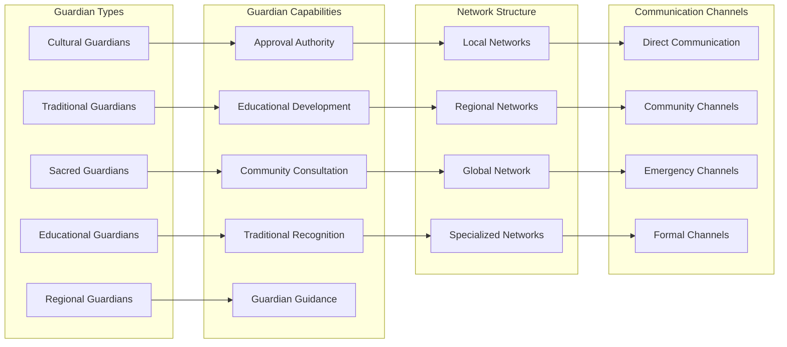

# CulturalContextsPage - Software Engineering Diagrams

## 🏗️ Component Architecture

### CulturalContextsPage Component Structure

---

## 🔄 Cultural Governance Flow

### Guardian Approval Workflow

---

## 📊 Cultural Governance Data Model

### Cultural Authority Schema

---

## 🛡️ Cultural Protection Activity

### Multi-Level Cultural Validation

---

## 📚 Educational System Architecture

### Cultural Education Framework

---

## 🌐 Guardian Network Management

### Distributed Guardian System

---

_CulturalContextsPage Excellence: Comprehensive cultural governance system with multi-level approval workflows, educational integration, and distributed guardian network management._
