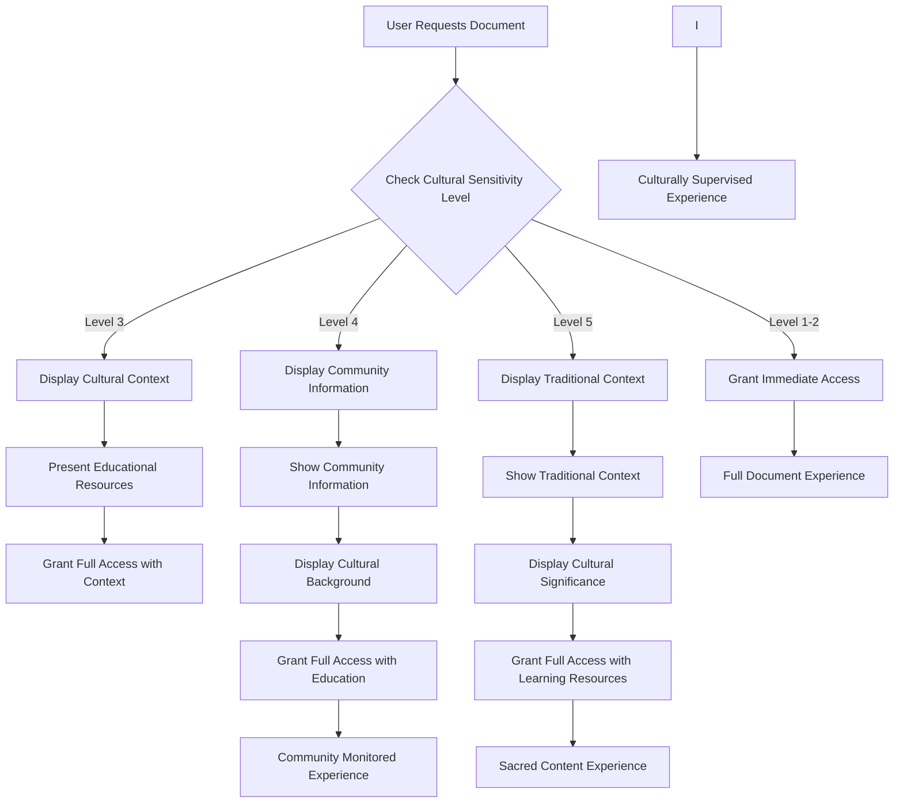
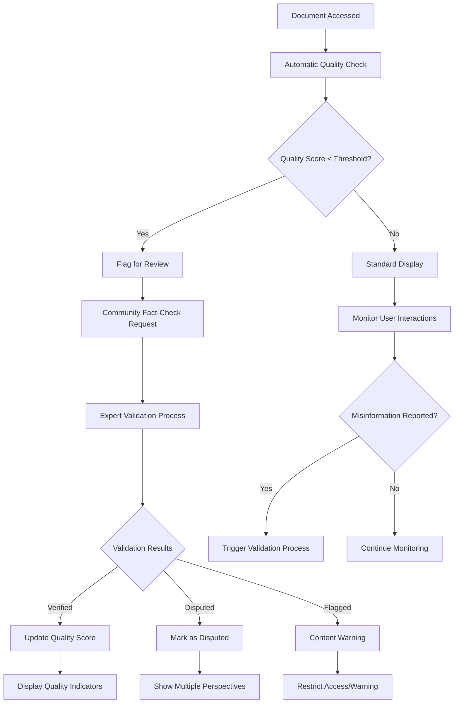
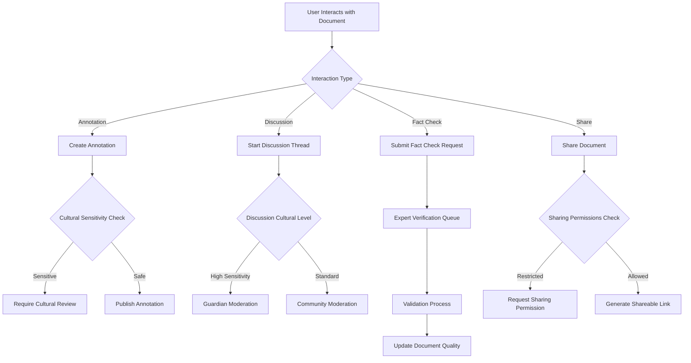

# DocumentDetailPage - Business Rules

## 🎯 Business Objectives

### Primary Goals

1. **Comprehensive Document Experience** - Provide rich, immersive document viewing with all necessary context
2. **Cultural Protocol Enforcement** - Ensure respectful access and interaction with culturally sensitive content
3. **Community Engagement** - Enable meaningful discussion and collaboration around documents
4. **Knowledge Enhancement** - Augment documents with related content, annotations, and educational resources
5. **Quality Assurance** - Maintain content integrity and combat misinformation through community validation

### Success Metrics

- **Engagement Rate**: >80% of users interact beyond basic viewing (annotations, sharing, discussions)
- **Cultural Compliance**: 100% adherence to cultural protocols for sensitive content
- **Quality Validation**: >95% accuracy in community fact-checking and validation
- **Educational Impact**: >70% of users access additional educational context when available
- **Community Growth**: Average 3+ meaningful interactions per document per month

## 📋 Functional Requirements

### Core Document Viewing

```typescript
interface DocumentViewingRequirements {
  // Primary display
  primaryViewer: {
    supportedFormats: ["PDF", "EPUB"];
    viewingModes: ["page", "continuous", "presentation"];
    accessibility: "WCAG_2.1_AA";
    performanceTarget: "<2s initial load, <500ms page navigation";
  };

  // Document metadata display
  metadataDisplay: {
    title: string;
    authors: Author[];
    culturalContext: CulturalContext;
    publicationInfo: PublicationDetails;
    documentStatistics: DocumentStats;
    qualityIndicators: QualityMetrics;
  };

  // Navigation and controls
  navigationControls: {
    pageNavigation: "Previous/Next/Jump to page";
    tableOfContents: "Interactive TOC with bookmarks";
    searchWithinDocument: "Full-text search with highlighting";
    zoom: "Responsive zoom levels 50%-300%";
  };
}
```

### Cultural Sensitivity Management

```typescript
interface CulturalSensitivityRequirements {
  // Access control based on sensitivity levels
  accessControl: {
    level1_2: "Public access with cultural context display";
    level3: "Educational warnings + cultural learning resources";
    level4: "Community permission required + guardian approval";
    level5: "Elder approval + traditional protocol observance";
  };

  // Cultural context display
  culturalContextDisplay: {
    culturalOrigin: "Prominent display of cultural source";
    traditionalKnowledge: "Sacred/traditional knowledge indicators";
    appropriateUse: "Guidelines for respectful engagement";
    educationalResources: "Links to cultural learning materials";
    communityContact: "Access to cultural guardians/elders";
  };

  // Protocol enforcement
  protocolEnforcement: {
    accessLogging: "Audit trail for sensitive content access";
    timeRestrictions: "Culturally appropriate access times";
    contextualWarnings: "Real-time cultural sensitivity alerts";
    communityOversight: "Guardian monitoring for sacred content";
  };
}
```

### Interactive Features

```typescript
interface InteractiveFeatureRequirements {
  // Annotation system
  annotationSystem: {
    personalNotes: "Private user annotations and highlights";
    publicAnnotations: "Community-shared insights and corrections";
    culturalAnnotations: "Cultural context and traditional knowledge";
    expertValidation: "Expert-verified factual annotations";
  };

  // Discussion and collaboration
  discussionFeatures: {
    documentComments: "Section-specific community discussions";
    factChecking: "Community-driven accuracy validation";
    culturalDiscussion: "Respectful cultural context conversations";
    expertContributions: "Verified expert insights and corrections";
  };

  // Sharing and citation
  sharingCapabilities: {
    citationGeneration: "Academic citation formats (APA, MLA, Chicago)";
    culturalCitations: "Traditional knowledge attribution formats";
    controlledSharing: "Permission-based sharing for sensitive content";
    educationalSharing: "Classroom and research group sharing";
  };
}
```

### Quality Assurance

```typescript
interface QualityAssuranceRequirements {
  // Content validation
  contentValidation: {
    factChecking: "Community and expert fact verification";
    sourceVerification: "Original source validation and attribution";
    accuracyMetrics: "Content accuracy scoring and tracking";
    misinformationDetection: "Automated and manual misinformation flagging";
  };

  // Community validation
  communityValidation: {
    peerReview: "Structured peer review processes";
    expertValidation: "Subject matter expert verification";
    culturalValidation: "Cultural appropriateness and accuracy";
    qualityVoting: "Community quality assessment voting";
  };

  // Quality indicators
  qualityIndicators: {
    accuracyScore: "Overall content accuracy rating (0-100)";
    sourceReliability: "Source credibility assessment";
    communityTrust: "Community trust and validation score";
    expertEndorsement: "Expert verification indicators";
  };
}
```

## 🗄️ Data Architecture

### Document Detail Data Model

```sql
-- Enhanced document details table
CREATE TABLE document_details (
    id TEXT PRIMARY KEY,
    document_id TEXT NOT NULL REFERENCES documents(id),

    -- Viewing statistics
    view_count INTEGER DEFAULT 0,
    unique_viewers INTEGER DEFAULT 0,
    average_read_time INTEGER, -- in seconds
    completion_rate REAL, -- percentage who read to end

    -- Quality metrics
    accuracy_score REAL DEFAULT 0.0,
    community_trust_score REAL DEFAULT 0.0,
    expert_validation_count INTEGER DEFAULT 0,
    fact_check_status TEXT DEFAULT 'unverified',

    -- Cultural context
    cultural_sensitivity_level INTEGER DEFAULT 1,
    cultural_protocols TEXT[], -- JSON array of protocols
    guardian_approval_required BOOLEAN DEFAULT FALSE,
    cultural_education_resources TEXT[], -- JSON array of resources

    -- Interaction metrics
    annotation_count INTEGER DEFAULT 0,
    discussion_thread_count INTEGER DEFAULT 0,
    sharing_count INTEGER DEFAULT 0,
    citation_count INTEGER DEFAULT 0,

    created_at TIMESTAMP DEFAULT CURRENT_TIMESTAMP,
    updated_at TIMESTAMP DEFAULT CURRENT_TIMESTAMP
);

-- Document annotations table
CREATE TABLE document_annotations (
    id TEXT PRIMARY KEY,
    document_id TEXT NOT NULL REFERENCES documents(id),
    user_id TEXT NOT NULL,

    -- Annotation details
    annotation_type TEXT NOT NULL, -- 'highlight', 'note', 'correction', 'cultural_context'
    page_number INTEGER,
    position_data TEXT, -- JSON with precise positioning
    content TEXT NOT NULL,

    -- Visibility and permissions
    visibility TEXT DEFAULT 'private', -- 'private', 'public', 'community'
    cultural_sensitivity BOOLEAN DEFAULT FALSE,
    requires_approval BOOLEAN DEFAULT FALSE,

    -- Validation
    expert_validated BOOLEAN DEFAULT FALSE,
    community_votes INTEGER DEFAULT 0,
    accuracy_rating REAL DEFAULT 0.0,

    created_at TIMESTAMP DEFAULT CURRENT_TIMESTAMP,
    updated_at TIMESTAMP DEFAULT CURRENT_TIMESTAMP
);

-- Document discussions table
CREATE TABLE document_discussions (
    id TEXT PRIMARY KEY,
    document_id TEXT NOT NULL REFERENCES documents(id),
    parent_discussion_id TEXT REFERENCES document_discussions(id),
    user_id TEXT NOT NULL,

    -- Discussion content
    title TEXT,
    content TEXT NOT NULL,
    discussion_type TEXT DEFAULT 'general', -- 'general', 'fact_check', 'cultural', 'expert'

    -- Cultural considerations
    cultural_sensitivity BOOLEAN DEFAULT FALSE,
    requires_cultural_review BOOLEAN DEFAULT FALSE,
    cultural_guardian_approved BOOLEAN DEFAULT FALSE,

    -- Quality and validation
    expert_contribution BOOLEAN DEFAULT FALSE,
    community_rating REAL DEFAULT 0.0,
    helpful_votes INTEGER DEFAULT 0,

    -- Status
    status TEXT DEFAULT 'active', -- 'active', 'archived', 'moderated'

    created_at TIMESTAMP DEFAULT CURRENT_TIMESTAMP,
    updated_at TIMESTAMP DEFAULT CURRENT_TIMESTAMP
);

-- Document quality validation table
CREATE TABLE document_quality_validations (
    id TEXT PRIMARY KEY,
    document_id TEXT NOT NULL REFERENCES documents(id),
    validator_id TEXT NOT NULL,

    -- Validation details
    validation_type TEXT NOT NULL, -- 'fact_check', 'source_verification', 'cultural', 'expert'
    validation_result TEXT NOT NULL, -- 'verified', 'disputed', 'flagged', 'needs_review'
    confidence_score REAL DEFAULT 0.0,

    -- Validation content
    findings TEXT,
    evidence TEXT[], -- JSON array of evidence
    corrections TEXT[], -- JSON array of suggested corrections

    -- Cultural validation specific
    cultural_appropriateness BOOLEAN,
    traditional_knowledge_validated BOOLEAN DEFAULT FALSE,
    guardian_approved BOOLEAN DEFAULT FALSE,

    -- Metadata
    validation_methodology TEXT,
    external_sources TEXT[], -- JSON array of verification sources

    created_at TIMESTAMP DEFAULT CURRENT_TIMESTAMP,
    updated_at TIMESTAMP DEFAULT CURRENT_TIMESTAMP
);
```

### Cultural Protocol Integration

```sql
-- Cultural access logs for sensitive content
CREATE TABLE cultural_access_logs (
    id TEXT PRIMARY KEY,
    document_id TEXT NOT NULL REFERENCES documents(id),
    user_id TEXT NOT NULL,

    -- Access details
    access_type TEXT NOT NULL, -- 'view', 'annotate', 'discuss', 'share'
    cultural_level INTEGER NOT NULL,
    permission_granted BOOLEAN DEFAULT FALSE,

    -- Approval chain
    guardian_id TEXT,
    elder_id TEXT,
    approval_ceremony_completed BOOLEAN DEFAULT FALSE,
    traditional_protocols_observed TEXT[], -- JSON array

    -- Educational component
    cultural_education_completed BOOLEAN DEFAULT FALSE,
    education_resources_accessed TEXT[], -- JSON array
    cultural_mentor_assigned TEXT,

    -- Audit trail
    ip_address TEXT,
    user_agent TEXT,
    session_id TEXT,

    created_at TIMESTAMP DEFAULT CURRENT_TIMESTAMP
);

-- Cultural education tracking
CREATE TABLE cultural_education_progress (
    id TEXT PRIMARY KEY,
    user_id TEXT NOT NULL,
    cultural_origin TEXT NOT NULL,

    -- Progress tracking
    education_level TEXT DEFAULT 'beginner', -- 'beginner', 'intermediate', 'advanced', 'guardian'
    completed_modules TEXT[], -- JSON array of completed education modules
    cultural_mentor_id TEXT,
    community_integration_score REAL DEFAULT 0.0,

    -- Achievements and recognition
    cultural_badges TEXT[], -- JSON array of earned cultural competency badges
    community_recognition BOOLEAN DEFAULT FALSE,
    elder_endorsement BOOLEAN DEFAULT FALSE,

    -- Ongoing relationship
    active_cultural_engagement BOOLEAN DEFAULT TRUE,
    last_cultural_activity TIMESTAMP,
    cultural_contribution_count INTEGER DEFAULT 0,

    created_at TIMESTAMP DEFAULT CURRENT_TIMESTAMP,
    updated_at TIMESTAMP DEFAULT CURRENT_TIMESTAMP
);
```

## 🔄 Core Business Workflows

### Document Access Workflow



### Quality Validation Workflow



### Community Interaction Workflow



## 🛡️ Security & Privacy Requirements

### Access Control Matrix

```typescript
interface DocumentAccessControl {
  // User role-based permissions
  permissions: {
    viewer: ["read", "personal_annotate"];
    contributor: ["read", "annotate", "discuss"];
    expert: ["read", "annotate", "discuss", "validate", "fact_check"];
    guardian: ["read", "annotate", "discuss", "validate", "cultural_moderate"];
    elder: ["all_permissions", "sacred_content_access", "cultural_ceremony"];
  };

  // Cultural sensitivity permissions
  culturalAccess: {
    level1_2: "No restrictions";
    level3: "Cultural education required";
    level4: "Community permission + cultural mentor";
    level5: "Elder approval + traditional ceremony";
  };

  // Quality validation permissions
  qualityControl: {
    factCheck: "Expert or community validation required";
    sourceValidation: "Expert verification for academic content";
    misinformationFlag: "Community reporting + expert review";
    qualityBadge: "Multi-expert consensus required";
  };
}
```

### Data Privacy Requirements

```typescript
interface DocumentPrivacyRequirements {
  // User interaction privacy
  userPrivacy: {
    personalAnnotations: "Private by default, user-controlled sharing";
    readingHistory: "Local storage only, user-controlled sync";
    discussionParticipation: "Pseudonymous options available";
    qualityContributions: "Attribution optional for community contributions";
  };

  // Cultural privacy
  culturalPrivacy: {
    sensitiveContentAccess: "Encrypted logs, cultural guardian oversight";
    traditionalKnowledgeInteraction: "Community-controlled data retention";
    culturalEducationProgress: "Shared only with cultural mentors";
    culturalCeremonyParticipation: "Sacred confidentiality protocols";
  };

  // Data retention
  dataRetention: {
    standardContent: "7 years retention for quality metrics";
    culturalContent: "Community-defined retention policies";
    personalData: "User-controlled deletion, right to be forgotten";
    auditLogs: "Cultural oversight requirements determine retention";
  };
}
```

## 📊 Performance & Quality Standards

### Performance Requirements

- **Initial Load**: <2 seconds for standard documents, <3 seconds for large files
- **Page Navigation**: <500ms between pages
- **Search Within Document**: <200ms for text highlighting
- **Annotation Loading**: <1 second for all annotations on current page
- **Discussion Loading**: <1.5 seconds for all discussion threads
- **Cultural Context Loading**: <1 second for cultural information display

### Quality Assurance Metrics

- **Content Accuracy**: Maintain >95% accuracy through community validation
- **Cultural Appropriateness**: 100% compliance with cultural protocols
- **User Satisfaction**: >4.5/5 rating for document experience
- **Educational Impact**: >70% users access additional cultural context
- **Community Engagement**: Average 3+ meaningful interactions per document

### Accessibility Requirements

- **WCAG 2.1 AA Compliance**: Full compliance for screen readers and assistive technology
- **Keyboard Navigation**: Complete functionality without mouse
- **Cultural Accessibility**: Multi-language support for cultural content
- **Cognitive Accessibility**: Clear information hierarchy and cultural guidance

## 🎯 Success Criteria & Validation

### Business Success Metrics

1. **User Engagement**: 80% of users interact beyond basic viewing
2. **Cultural Compliance**: Zero cultural protocol violations
3. **Quality Improvement**: Documents show measurable quality improvement over time
4. **Educational Impact**: Measurable increase in cultural understanding
5. **Community Growth**: Active, respectful community around document discussions

### Technical Success Metrics

1. **Performance**: All performance targets consistently met
2. **Reliability**: 99.9% uptime for document access
3. **Security**: Zero data breaches or unauthorized cultural content access
4. **Scalability**: Support for 10,000+ concurrent document viewers
5. **Cultural Integration**: Seamless cultural protocol enforcement

### Cultural Success Metrics

1. **Guardian Satisfaction**: >95% cultural guardian approval of implementation
2. **Community Integration**: Active participation from diverse cultural communities
3. **Educational Effectiveness**: Measurable cultural learning outcomes
4. **Respectful Engagement**: Positive cultural community feedback
5. **Traditional Knowledge Protection**: Zero unauthorized access to sacred content

---

_DocumentDetail Excellence: Creating immersive, culturally respectful, and educationally rich document experiences that honor traditional knowledge while fostering global learning and community engagement._
