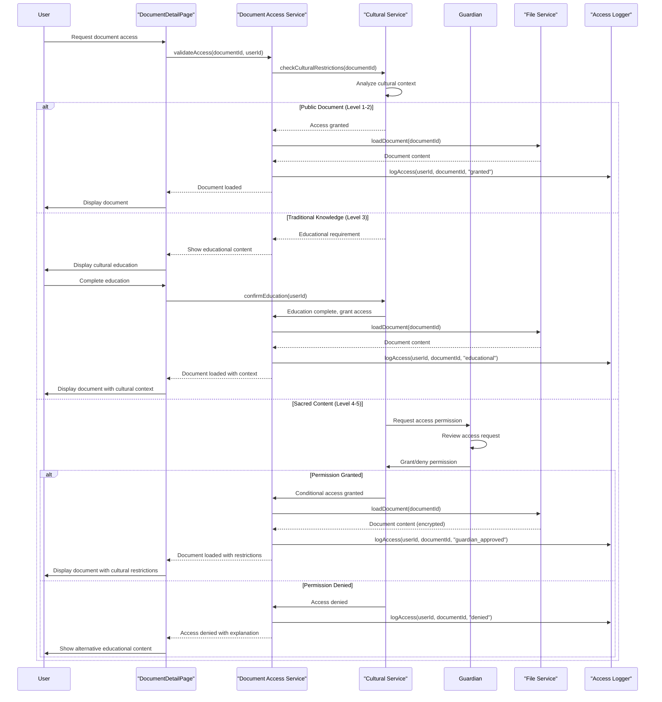
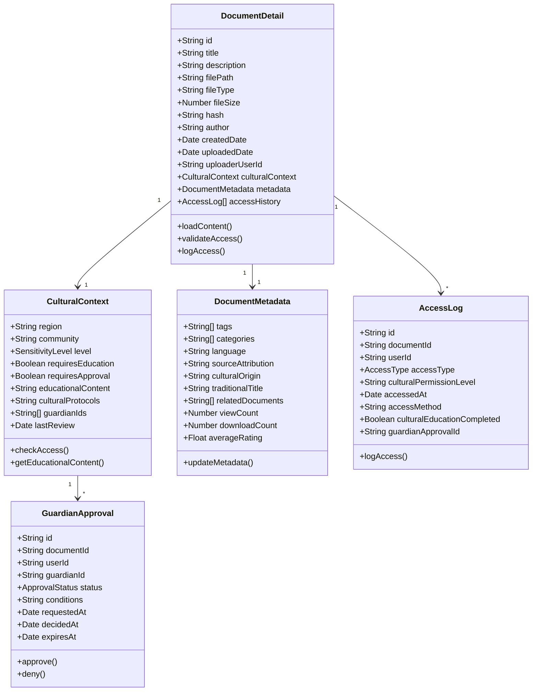
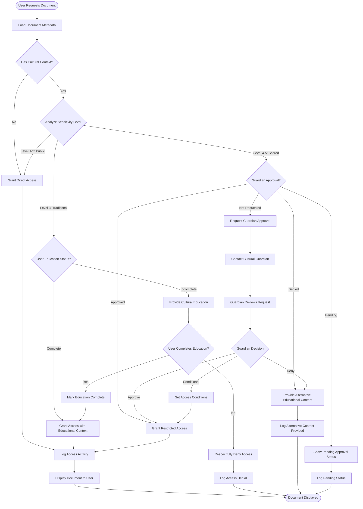
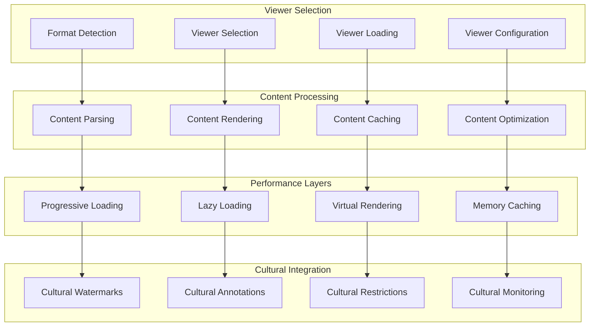
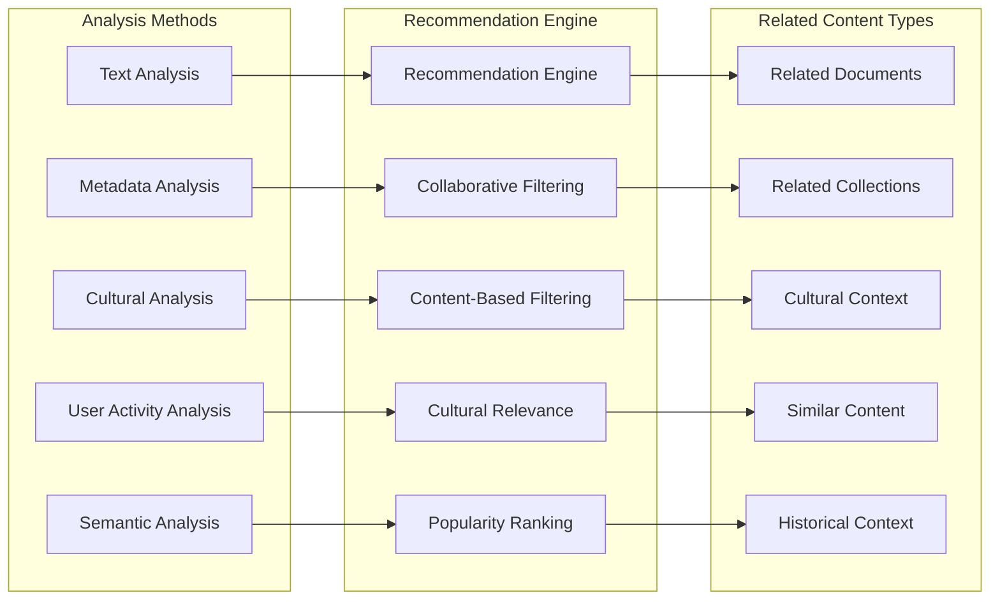
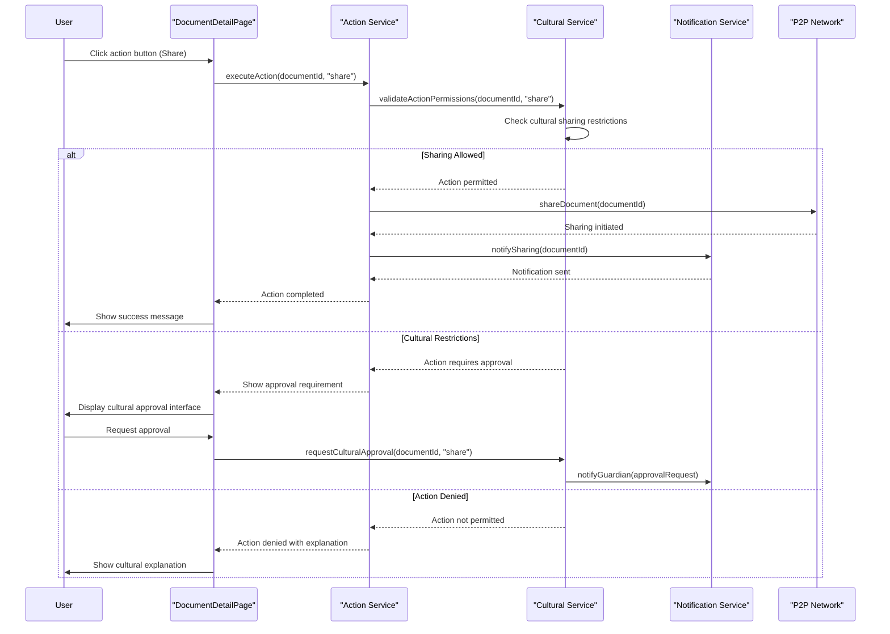

# DocumentDetailPage - Software Engineering Diagrams

## 🏗️ Component Architecture

### DocumentDetailPage Component Structure

```mermaid
graph TB
    subgraph "DocumentDetailPage Components"
        DDP[DocumentDetailPage]
        DH[DocumentHeader]
        DV[DocumentViewer]
        DM[DocumentMetadata]
        DA[DocumentActions]
        CC[CulturalContext]
        RC[RelatedContent]
    end

    subgraph "Viewer Components"
        PDFViewer[PDF Viewer]
        EPUBViewer[EPUB Viewer]
        TextViewer[Text Viewer]
        ImageViewer[Image Viewer]
        VideoViewer[Video Viewer]
    end

    subgraph "Cultural Components"
        CCR[Cultural Context Renderer]
        SLI[Sensitivity Level Indicator]
        CAW[Cultural Access Workflow]
        GAN[Guardian Approval Notice]
        ECM[Educational Content Modal]
    end

    subgraph "Action Components"
        DAT[Download Action]
        SAT[Share Action]
        FAT[Favorite Action]
        CAT[Collection Add Action]
        RAT[Report Action]
    end

    DDP --> DH
    DDP --> DV
    DDP --> DM
    DDP --> DA
    DDP --> CC
    DDP --> RC

    DV --> PDFViewer
    DV --> EPUBViewer
    DV --> TextViewer
    DV --> ImageViewer
    DV --> VideoViewer

    CC --> CCR
    CC --> SLI
    CC --> CAW
    CC --> GAN
    CC --> ECM

    DA --> DAT
    DA --> SAT
    DA --> FAT
    DA --> CAT
    DA --> RAT
```

---

## 🔄 Document Access Flow

### Cultural Access Validation Sequence

---

## 📊 Document Detail Data Model

### Comprehensive Document Schema

---

## 🛡️ Cultural Protection Workflow

### Document Protection Activity Diagram

---

## ⚡ Document Viewer Performance

### Multi-Format Viewer Architecture

---

## 🔍 Related Content Discovery

### Intelligent Content Recommendations

---

## 📱 Document Actions Integration

### Action-Oriented Interface

---

_DocumentDetailPage Excellence: Comprehensive document viewing with integrated cultural protection, multi-format support, and intelligent content discovery._
