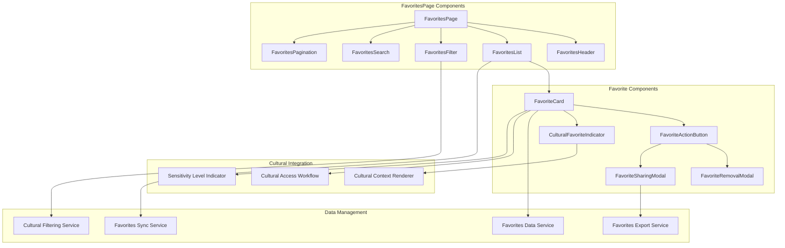
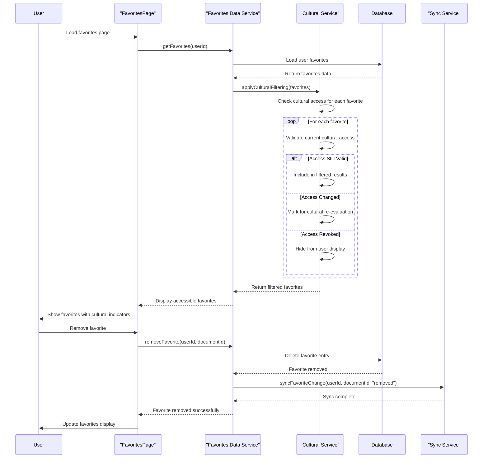
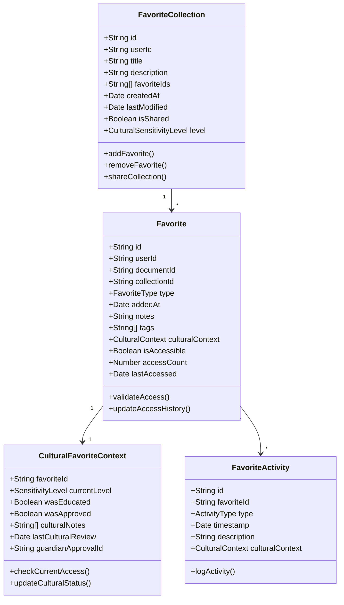
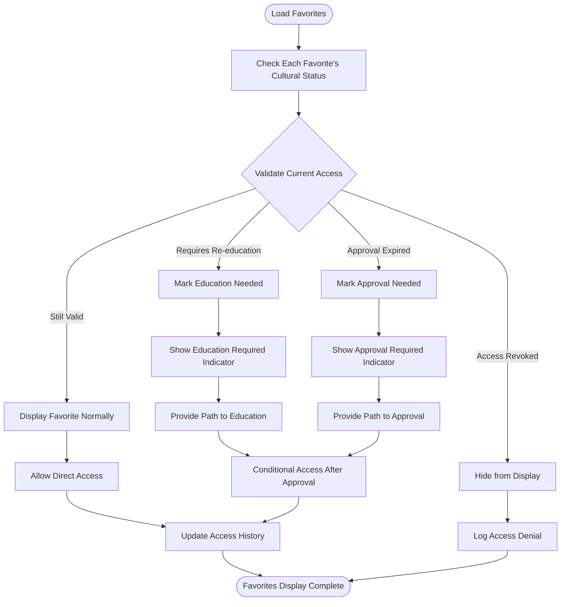
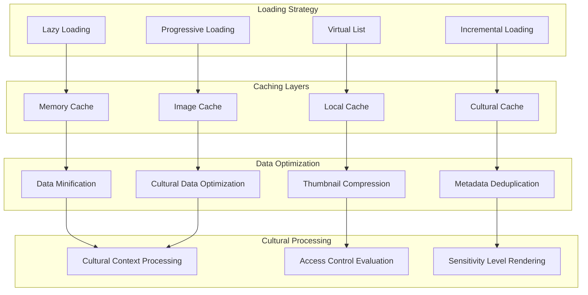
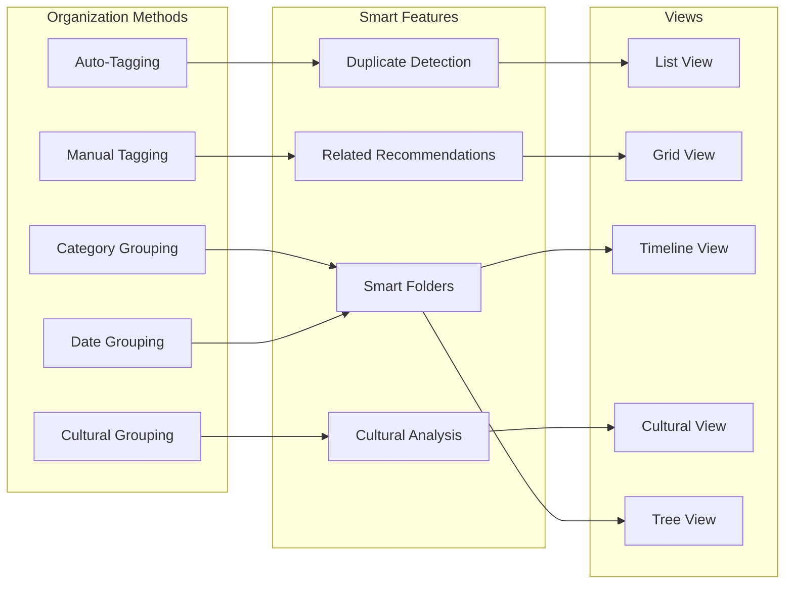
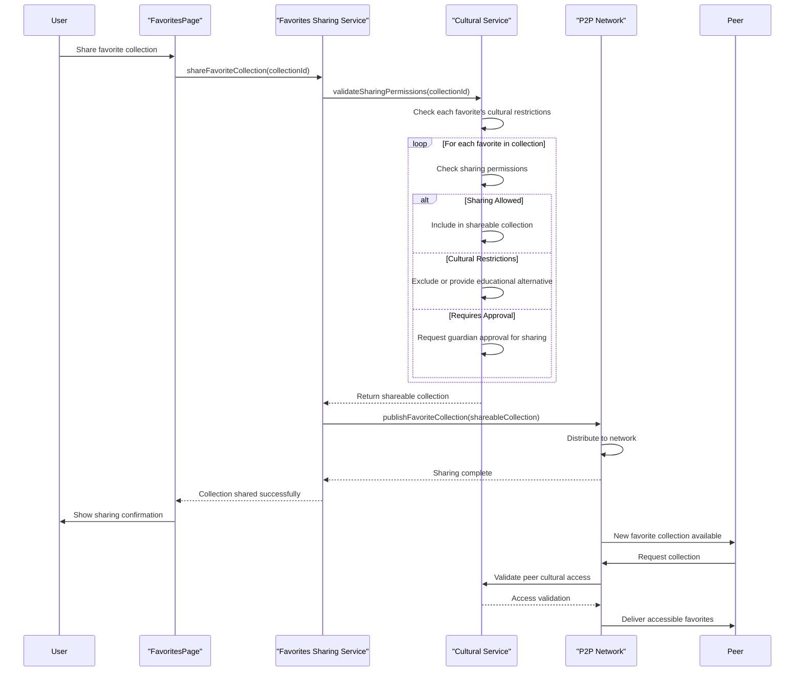

# FavoritesPage - Software Engineering Diagrams

## 🏗️ Component Architecture

### FavoritesPage Component Structure

---

## 🔄 Favorites Management Flow

### Cultural-Aware Favorites System

---

## 📊 Favorites Data Model

### Personal Favorites Schema

---

## 🛡️ Cultural Access Validation

### Favorites Access Checking

---

## ⚡ Performance Optimization

### Favorites Loading Strategy

---

## 🔍 Favorites Organization

### Smart Favorites Management

---

## 📱 Favorites Sharing

### P2P Favorites Sharing

---

_FavoritesPage Excellence: Intelligent favorites management with cultural sensitivity validation, smart organization, and secure P2P sharing capabilities._
