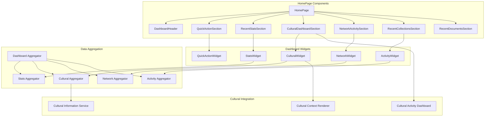
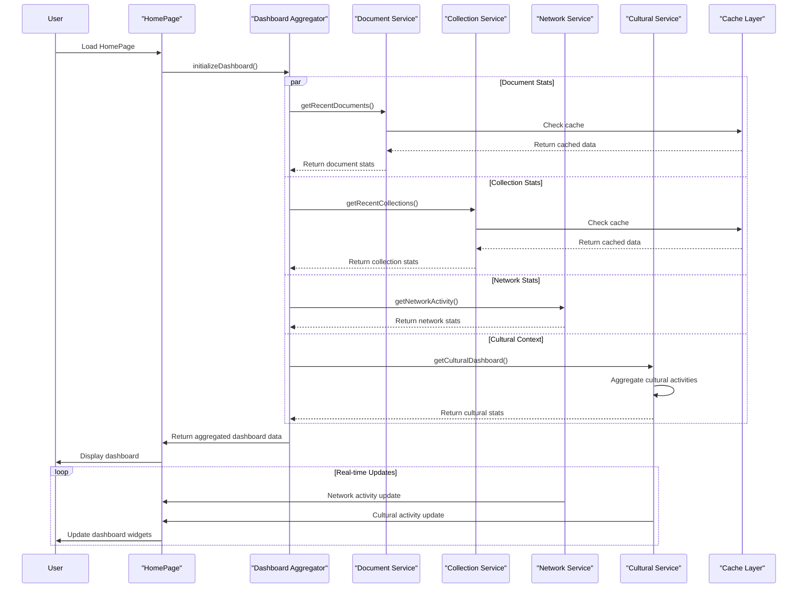
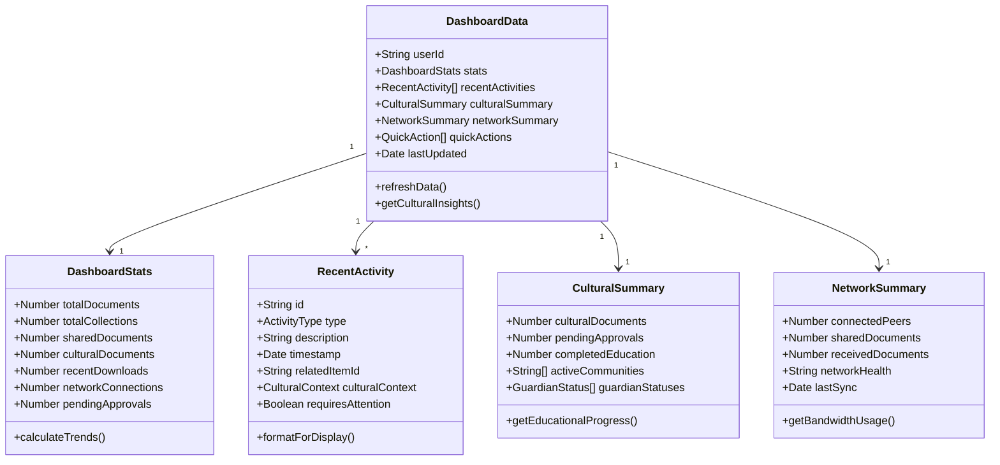
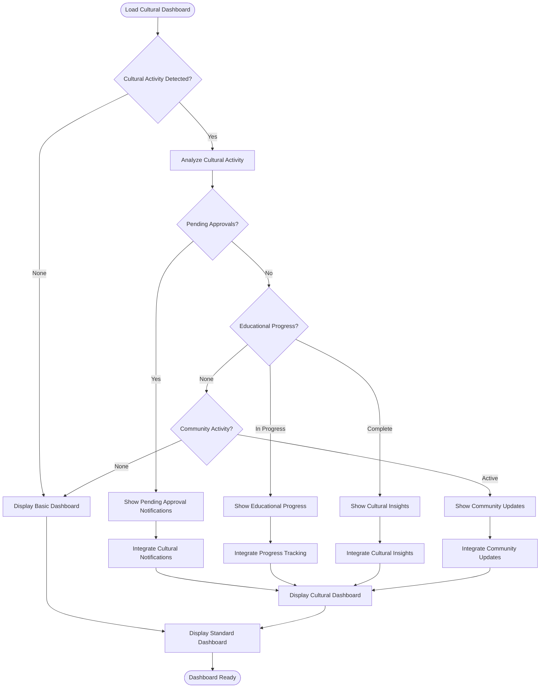
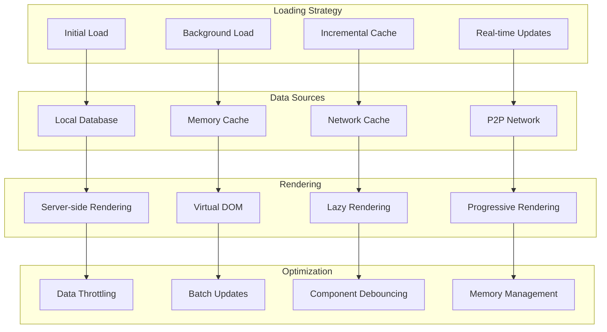
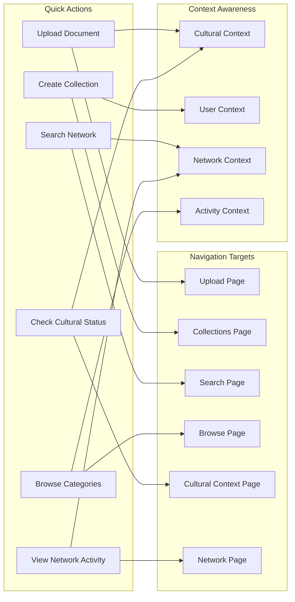
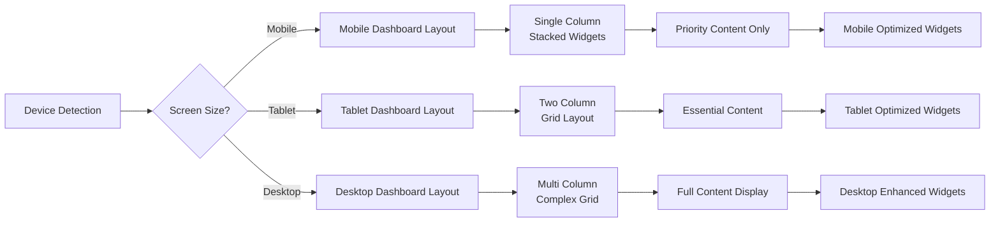

# HomePage - Software Engineering Diagrams

## 🏗️ Component Architecture

### HomePage Dashboard Structure

---

## 🔄 Dashboard Data Aggregation Flow

### Real-time Dashboard Updates

---

## 📊 Dashboard Data Model

### Unified Dashboard Schema

---

## 🛡️ Cultural Dashboard Integration

### Cultural Activity Monitoring

---

## ⚡ Performance Architecture

### Dashboard Optimization Strategy

---

## 🚀 Quick Actions Integration

### Action-Oriented User Interface

---

## 📱 Responsive Dashboard Layout

### Multi-Device Dashboard Adaptation

---

_HomePage Excellence: Comprehensive dashboard providing unified access to all AlLibrary functions while maintaining cultural sensitivity and performance optimization._
