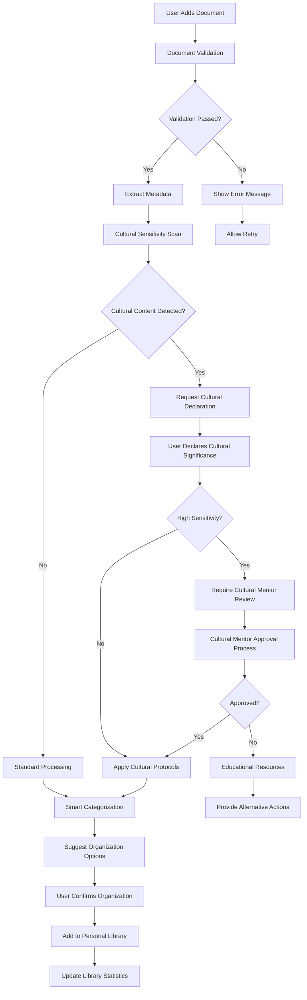
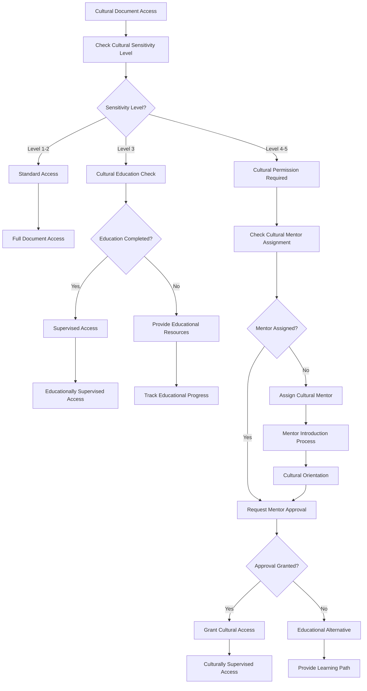
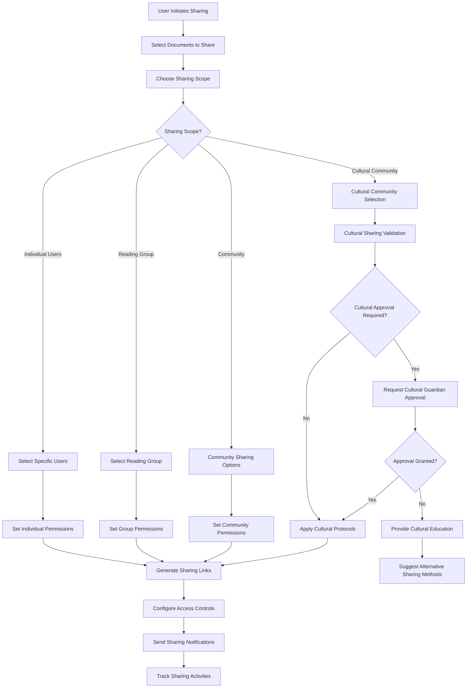

# MyDocumentsPage - Business Rules

## 🎯 Business Objectives

### Primary Goals

1. **Personal Library Management** - Provide comprehensive organization and management of user's personal document collection
2. **Seamless Integration** - Connect personal library with broader AlLibrary network and community features
3. **Cultural Sensitivity** - Ensure personal cultural documents are handled with appropriate protocols and respect
4. **Intelligent Organization** - Offer smart categorization, tagging, and discovery within personal collection
5. **Privacy Control** - Give users complete control over sharing and visibility of their personal documents

### Success Metrics

- **Organization Efficiency**: >90% of users successfully organize documents within first session
- **Usage Frequency**: Average 3+ interactions per user per day with personal library
- **Cultural Compliance**: 100% adherence to cultural protocols for sensitive personal content
- **Sharing Engagement**: >60% of users share at least one document with community
- **Search Satisfaction**: >95% success rate for finding documents in personal library

## 📋 Functional Requirements

### Personal Document Management

```typescript
interface PersonalDocumentRequirements {
  // Document organization
  documentOrganization: {
    folderStructure: "Hierarchical folder system with unlimited nesting";
    smartCategories: "AI-assisted categorization based on content and metadata";
    customTags: "User-defined tagging system with autocomplete";
    culturalCategories: "Cultural sensitivity-based organization options";
    collections: "Custom collections and reading lists";
  };

  // Document metadata management
  metadataManagement: {
    automaticExtraction: "PDF/EPUB metadata extraction and enrichment";
    manualEditing: "User-editable metadata with validation";
    culturalContext: "Cultural significance and sensitivity level assignment";
    personalNotes: "Private notes and annotations for each document";
    readingProgress: "Reading status and progress tracking";
  };

  // Document lifecycle
  documentLifecycle: {
    importMethods: "Drag-drop, file browser, network import, P2P sharing";
    validation: "Automatic format validation and malware scanning";
    processing: "Content extraction, indexing, and thumbnail generation";
    backup: "Automatic backup with configurable retention policies";
    archival: "Long-term preservation with format migration";
  };
}
```

### Cultural Document Handling

```typescript
interface CulturalDocumentRequirements {
  // Cultural sensitivity assessment
  culturalAssessment: {
    sensitivityDetection: "Automatic detection of cultural content and themes";
    userDeclaration: "User-declared cultural significance and restrictions";
    communityValidation: "Optional community validation for cultural accuracy";
    elderReview: "Elder or guardian review for highly sensitive content";
    protocolCompliance: "Automatic enforcement of cultural sharing protocols";
  };

  // Cultural metadata enhancement
  culturalMetadata: {
    culturalOrigin: "Source culture and traditional territory identification";
    traditionalKnowledge: "Traditional knowledge system classification";
    accessRestrictions: "Cultural access and sharing restrictions";
    ceremonialContext: "Ceremonial or sacred context information";
    educationalContext: "Cultural learning and educational value";
  };

  // Cultural sharing controls
  culturalSharingControls: {
    permissionLevels: "Graduated permission system for cultural content";
    communitySharing: "Sharing within specific cultural communities";
    educationalSharing: "Controlled sharing for educational purposes";
    guardianApproval: "Required approval for sensitive content sharing";
    protocolEnforcement: "Automatic enforcement of traditional protocols";
  };
}
```

### Search and Discovery

```typescript
interface SearchDiscoveryRequirements {
  // Personal library search
  personalSearch: {
    fullTextSearch: "Complete text search across all documents";
    metadataSearch: "Search by title, author, tags, and custom metadata";
    culturalSearch: "Search by cultural significance and sensitivity";
    contentSearch: "Search within document content and annotations";
    semanticSearch: "AI-powered semantic and conceptual search";
  };

  // Smart recommendations
  smartRecommendations: {
    readingHistory: "Recommendations based on reading patterns";
    culturalInterests: "Suggestions based on cultural preferences";
    networkRecommendations: "Community recommendations for similar content";
    educationalPaths: "Suggested learning paths and related documents";
    culturalConnections: "Connections to related cultural content";
  };

  // Discovery features
  discoveryFeatures: {
    visualBrowsing: "Visual exploration through cover art and thumbnails";
    timelineBrowsing: "Chronological browsing of reading history";
    topicClusters: "Visual clustering of documents by topic and theme";
    culturalMaps: "Visual mapping of cultural connections and origins";
    readingStats: "Personal reading statistics and achievement tracking";
  };
}
```

### Sharing and Collaboration

```typescript
interface SharingCollaborationRequirements {
  // Document sharing
  documentSharing: {
    directSharing: "Direct sharing with specific users or groups";
    communitySharing: "Sharing with broader AlLibrary community";
    educationalSharing: "Sharing for educational and research purposes";
    culturalSharing: "Sharing within appropriate cultural communities";
    limitedTimeSharing: "Temporary sharing with expiration dates";
  };

  // Collaboration features
  collaborationFeatures: {
    sharedAnnotations: "Collaborative annotation and discussion";
    readingGroups: "Private reading groups and book clubs";
    expertConsultation: "Consultation with subject matter experts";
    culturalMentorship: "Mentorship relationships for cultural content";
    peerLearning: "Peer-to-peer learning and knowledge sharing";
  };

  // Permission management
  permissionManagement: {
    granularPermissions: "Fine-grained control over access and permissions";
    roleBasedAccess: "Role-based access control for shared content";
    culturalPermissions: "Cultural protocol-based permission system";
    timeBasedPermissions: "Temporary and scheduled access permissions";
    auditTrail: "Complete audit trail for all sharing activities";
  };
}
```

### Integration and Synchronization

```typescript
interface IntegrationSyncRequirements {
  // Network integration
  networkIntegration: {
    p2pSharing: "Peer-to-peer sharing with other AlLibrary users";
    communityContributions: "Contributing documents to community collections";
    networkDiscovery: "Discovering relevant content across the network";
    distributedBackup: "Distributed backup across trusted network peers";
    offlineSync: "Synchronization when returning to network connectivity";
  };

  // Cross-device synchronization
  crossDeviceSync: {
    librarySync: "Synchronization of library structure and metadata";
    readingProgress: "Sync reading progress and bookmarks across devices";
    annotations: "Synchronization of personal annotations and notes";
    preferences: "Sync user preferences and configuration settings";
    culturalSettings: "Sync cultural preferences and access permissions";
  };

  // External integrations
  externalIntegrations: {
    academicDatabases: "Integration with academic and research databases";
    libraryServices: "Connection with traditional library systems";
    educationalPlatforms: "Integration with educational and learning platforms";
    culturalInstitutions: "Connections with museums and cultural institutions";
    referenceManagers: "Integration with citation and reference management tools";
  };
}
```

## 🗄️ Data Architecture

### Personal Library Data Model

```sql
-- User personal libraries
CREATE TABLE user_libraries (
    id TEXT PRIMARY KEY,
    user_id TEXT NOT NULL UNIQUE,

    -- Library configuration
    library_name TEXT DEFAULT 'My Library',
    default_organization_method TEXT DEFAULT 'folders',
    auto_categorization_enabled BOOLEAN DEFAULT TRUE,
    cultural_sensitivity_default INTEGER DEFAULT 2,

    -- Privacy and sharing settings
    default_sharing_level TEXT DEFAULT 'private',
    allow_community_recommendations BOOLEAN DEFAULT TRUE,
    allow_cultural_validation BOOLEAN DEFAULT TRUE,

    -- Backup and sync settings
    auto_backup_enabled BOOLEAN DEFAULT TRUE,
    cross_device_sync_enabled BOOLEAN DEFAULT TRUE,
    p2p_sharing_enabled BOOLEAN DEFAULT TRUE,

    -- Statistics
    total_documents INTEGER DEFAULT 0,
    total_reading_time INTEGER DEFAULT 0,
    documents_shared INTEGER DEFAULT 0,
    cultural_documents_count INTEGER DEFAULT 0,

    created_at TIMESTAMP DEFAULT CURRENT_TIMESTAMP,
    updated_at TIMESTAMP DEFAULT CURRENT_TIMESTAMP
);

-- Personal document entries
CREATE TABLE personal_documents (
    id TEXT PRIMARY KEY,
    user_library_id TEXT NOT NULL REFERENCES user_libraries(id),
    document_id TEXT NOT NULL REFERENCES documents(id),

    -- Personal organization
    folder_path TEXT DEFAULT '/',
    custom_title TEXT,
    personal_tags TEXT[], -- JSON array of user tags
    personal_category TEXT,
    collection_ids TEXT[], -- JSON array of collection IDs

    -- Reading status
    reading_status TEXT DEFAULT 'unread', -- 'unread', 'reading', 'completed', 'abandoned'
    reading_progress REAL DEFAULT 0.0, -- Percentage completed
    time_spent_reading INTEGER DEFAULT 0, -- Total seconds
    last_read_position TEXT, -- JSON with page/position info

    -- Personal metadata
    personal_rating INTEGER, -- 1-5 star rating
    personal_notes TEXT,
    reading_goal_date DATE,
    priority_level INTEGER DEFAULT 3, -- 1-5 priority scale

    -- Cultural handling
    declared_cultural_significance INTEGER DEFAULT 1,
    cultural_sharing_permission TEXT DEFAULT 'private',
    requires_cultural_approval BOOLEAN DEFAULT FALSE,
    cultural_mentor_assigned TEXT,

    -- Sharing and collaboration
    shared_with_community BOOLEAN DEFAULT FALSE,
    shared_with_users TEXT[], -- JSON array of user IDs
    collaboration_enabled BOOLEAN DEFAULT FALSE,
    sharing_permissions TEXT, -- JSON with detailed permissions

    -- Timestamps
    added_to_library TIMESTAMP DEFAULT CURRENT_TIMESTAMP,
    last_accessed TIMESTAMP,
    last_modified TIMESTAMP DEFAULT CURRENT_TIMESTAMP
);

-- Personal folders and organization
CREATE TABLE personal_folders (
    id TEXT PRIMARY KEY,
    user_library_id TEXT NOT NULL REFERENCES user_libraries(id),
    parent_folder_id TEXT REFERENCES personal_folders(id),

    -- Folder details
    folder_name TEXT NOT NULL,
    folder_path TEXT NOT NULL,
    folder_description TEXT,
    folder_color TEXT,
    folder_icon TEXT,

    -- Organization options
    sort_method TEXT DEFAULT 'name',
    view_mode TEXT DEFAULT 'grid',
    filter_criteria TEXT, -- JSON with folder-specific filters

    -- Cultural considerations
    cultural_sensitivity_level INTEGER DEFAULT 1,
    cultural_folder BOOLEAN DEFAULT FALSE,
    requires_cultural_permission BOOLEAN DEFAULT FALSE,

    -- Metadata
    document_count INTEGER DEFAULT 0,
    total_size_bytes INTEGER DEFAULT 0,

    created_at TIMESTAMP DEFAULT CURRENT_TIMESTAMP,
    updated_at TIMESTAMP DEFAULT CURRENT_TIMESTAMP
);

-- Personal collections (thematic groupings)
CREATE TABLE personal_collections (
    id TEXT PRIMARY KEY,
    user_library_id TEXT NOT NULL REFERENCES user_libraries(id),

    -- Collection details
    collection_name TEXT NOT NULL,
    collection_description TEXT,
    collection_theme TEXT,
    collection_image_url TEXT,

    -- Collection configuration
    is_public BOOLEAN DEFAULT FALSE,
    allow_community_contributions BOOLEAN DEFAULT FALSE,
    auto_add_criteria TEXT, -- JSON with automatic addition criteria

    -- Cultural considerations
    cultural_collection BOOLEAN DEFAULT FALSE,
    cultural_origin TEXT,
    requires_cultural_permission BOOLEAN DEFAULT FALSE,
    cultural_guardian_id TEXT,

    -- Sharing and collaboration
    shared_with_community BOOLEAN DEFAULT FALSE,
    collaboration_enabled BOOLEAN DEFAULT FALSE,
    contributor_permissions TEXT, -- JSON with collaboration permissions

    -- Statistics
    document_count INTEGER DEFAULT 0,
    follower_count INTEGER DEFAULT 0,
    total_reading_time INTEGER DEFAULT 0,

    created_at TIMESTAMP DEFAULT CURRENT_TIMESTAMP,
    updated_at TIMESTAMP DEFAULT CURRENT_TIMESTAMP
);

-- Reading activities and progress tracking
CREATE TABLE reading_activities (
    id TEXT PRIMARY KEY,
    user_id TEXT NOT NULL,
    personal_document_id TEXT NOT NULL REFERENCES personal_documents(id),

    -- Activity details
    activity_type TEXT NOT NULL, -- 'start_reading', 'bookmark', 'annotation', 'complete'
    page_number INTEGER,
    position_data TEXT, -- JSON with detailed position information
    session_duration INTEGER, -- Duration in seconds

    -- Reading context
    reading_environment TEXT, -- 'focused', 'casual', 'research', 'cultural_study'
    device_used TEXT,
    network_status TEXT DEFAULT 'online',

    -- Cultural context
    cultural_learning_session BOOLEAN DEFAULT FALSE,
    cultural_mentor_present BOOLEAN DEFAULT FALSE,
    cultural_ceremony_context BOOLEAN DEFAULT FALSE,

    -- Social context
    reading_group_session BOOLEAN DEFAULT FALSE,
    shared_reading_session BOOLEAN DEFAULT FALSE,
    expert_consultation_session BOOLEAN DEFAULT FALSE,

    timestamp TIMESTAMP DEFAULT CURRENT_TIMESTAMP
);
```

### Personal Annotations and Notes

```sql
-- Personal annotations linked to documents
CREATE TABLE personal_annotations (
    id TEXT PRIMARY KEY,
    personal_document_id TEXT NOT NULL REFERENCES personal_documents(id),
    user_id TEXT NOT NULL,

    -- Annotation content
    annotation_type TEXT NOT NULL, -- 'highlight', 'note', 'bookmark', 'cultural_note'
    content TEXT NOT NULL,
    page_number INTEGER,
    position_data TEXT, -- JSON with precise positioning

    -- Annotation metadata
    annotation_color TEXT DEFAULT '#ffff00',
    is_private BOOLEAN DEFAULT TRUE,
    tags TEXT[], -- JSON array of annotation tags

    -- Cultural annotations
    cultural_context BOOLEAN DEFAULT FALSE,
    cultural_significance_level INTEGER DEFAULT 1,
    cultural_mentor_approved BOOLEAN DEFAULT FALSE,
    traditional_knowledge_reference BOOLEAN DEFAULT FALSE,

    -- Sharing and collaboration
    shared_with_mentor BOOLEAN DEFAULT FALSE,
    shared_with_reading_group BOOLEAN DEFAULT FALSE,
    community_contribution BOOLEAN DEFAULT FALSE,

    created_at TIMESTAMP DEFAULT CURRENT_TIMESTAMP,
    updated_at TIMESTAMP DEFAULT CURRENT_TIMESTAMP
);

-- Personal reading goals and achievements
CREATE TABLE reading_goals (
    id TEXT PRIMARY KEY,
    user_id TEXT NOT NULL,

    -- Goal details
    goal_type TEXT NOT NULL, -- 'documents_per_month', 'cultural_learning', 'topic_mastery'
    goal_target INTEGER NOT NULL,
    goal_period TEXT NOT NULL, -- 'daily', 'weekly', 'monthly', 'yearly'
    goal_description TEXT,

    -- Cultural learning goals
    cultural_focus TEXT,
    cultural_competency_target TEXT,
    cultural_mentor_involvement BOOLEAN DEFAULT FALSE,

    -- Progress tracking
    current_progress INTEGER DEFAULT 0,
    goal_status TEXT DEFAULT 'active', -- 'active', 'completed', 'paused', 'abandoned'
    completion_percentage REAL DEFAULT 0.0,

    -- Dates
    start_date DATE NOT NULL,
    target_date DATE NOT NULL,
    completed_date DATE,

    created_at TIMESTAMP DEFAULT CURRENT_TIMESTAMP,
    updated_at TIMESTAMP DEFAULT CURRENT_TIMESTAMP
);
```

## 🔄 Core Business Workflows

### Document Addition and Organization Workflow



### Cultural Document Handling Workflow



### Personal Library Sharing Workflow



## 🛡️ Security & Privacy Requirements

### Personal Data Protection

```typescript
interface PersonalDataProtection {
  // User privacy controls
  privacyControls: {
    dataVisibility: "Granular control over what data is visible to whom";
    readingHistory: "Private by default with user-controlled sharing";
    annotations: "Private annotations with selective sharing options";
    culturalData: "Special protection for cultural declarations and progress";
    mentorshipData: "Protected communication with cultural mentors";
  };

  // Data encryption
  dataEncryption: {
    localStorage: "Local encryption of all personal library data";
    culturalContent: "Additional encryption for culturally sensitive content";
    personalNotes: "Encrypted storage of private annotations and notes";
    sharingData: "Encrypted transmission for all sharing activities";
    backupData: "Encrypted backup storage with user-controlled keys";
  };

  // Access controls
  accessControls: {
    deviceAuthentication: "Multi-factor authentication for library access";
    culturalPermissions: "Cultural protocol-based access controls";
    sharingPermissions: "Fine-grained permissions for shared content";
    temporaryAccess: "Time-limited access for shared documents";
    emergencyAccess: "Emergency access protocols for cultural guardians";
  };
}
```

### Cultural Data Protection

```typescript
interface CulturalDataProtection {
  // Traditional knowledge protection
  traditionalKnowledgeProtection: {
    accessLogging: "Complete audit trail for cultural content access";
    communityOversight: "Cultural community oversight of sensitive content";
    elderApproval: "Required elder approval for sacred content sharing";
    protocolEnforcement: "Automatic enforcement of traditional protocols";
    ceremonialContext: "Special handling for ceremonial and sacred content";
  };

  // Cultural privacy
  culturalPrivacy: {
    culturalIdentity: "Protected storage of cultural identity information";
    mentorRelationships: "Private communication channels with cultural mentors";
    ceremonialParticipation: "Confidential tracking of cultural ceremony participation";
    learningProgress: "Private tracking of cultural education progress";
    communityConnections: "Protected information about cultural community memberships";
  };

  // Community controls
  communityControls: {
    communityValidation: "Community validation of cultural content accuracy";
    culturalModeration: "Community moderation of cultural discussions";
    elderOversight: "Elder oversight of cultural content sharing";
    protocolCompliance: "Community enforcement of cultural protocols";
    educationalGuidance: "Community-provided cultural education and guidance";
  };
}
```

## 📊 Performance & Quality Standards

### Personal Library Performance Requirements

- **Library Loading**: <1 second for personal library overview (up to 10,000 documents)
- **Document Search**: <300ms for search results within personal library
- **Organization Operations**: <500ms for folder creation, document moving, tagging
- **Cultural Validation**: <2 seconds for cultural sensitivity assessment
- **Synchronization**: <5 seconds for cross-device library synchronization

### User Experience Quality Metrics

- **Organization Success Rate**: >95% of users successfully organize documents in first session
- **Search Success Rate**: >98% successful document discovery within personal library
- **Cultural Compliance**: 100% adherence to cultural protocols without user friction
- **Sharing Success**: >90% successful document sharing on first attempt
- **Synchronization Reliability**: 99.9% successful cross-device synchronization

### Cultural Sensitivity Quality Standards

- **Cultural Accuracy**: 100% accuracy in cultural sensitivity detection and classification
- **Community Validation**: >95% community satisfaction with cultural handling
- **Educational Effectiveness**: >80% improvement in cultural understanding through guided interactions
- **Protocol Compliance**: 100% compliance with traditional knowledge protocols
- **Mentor Satisfaction**: >95% cultural mentor satisfaction with guidance and oversight tools

## 🎯 Success Criteria & Validation

### Personal Library Management Success

1. **Intuitive Organization**: Users easily organize and find documents in their personal library
2. **Intelligent Assistance**: Smart categorization and recommendations enhance user productivity
3. **Cultural Respect**: Cultural documents are handled with appropriate sensitivity and protocols
4. **Seamless Integration**: Personal library seamlessly integrates with broader AlLibrary ecosystem
5. **Privacy Control**: Users feel in complete control of their personal document privacy and sharing

### Cultural Integration Success

1. **Respectful Handling**: All cultural content is handled according to appropriate traditional protocols
2. **Educational Value**: Users gain cultural understanding through guided interactions with cultural content
3. **Community Connection**: Users successfully connect with appropriate cultural mentors and communities
4. **Protocol Compliance**: Zero cultural protocol violations in personal library management
5. **Cultural Empowerment**: Cultural communities feel empowered and respected in the digital environment

### Network Integration Success

1. **P2P Sharing**: Seamless peer-to-peer sharing of appropriate documents with community
2. **Community Contribution**: Users actively contribute valuable documents to community collections
3. **Collaborative Learning**: Successful collaborative learning experiences through shared documents
4. **Expert Connection**: Users successfully connect with subject matter experts and cultural authorities
5. **Knowledge Preservation**: Personal libraries contribute to broader knowledge preservation efforts

---

_MyDocuments Excellence: Comprehensive personal library management that respects cultural protocols while enabling seamless integration with the global AlLibrary community for democratic knowledge sharing._
