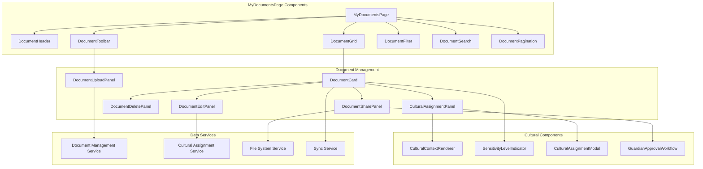
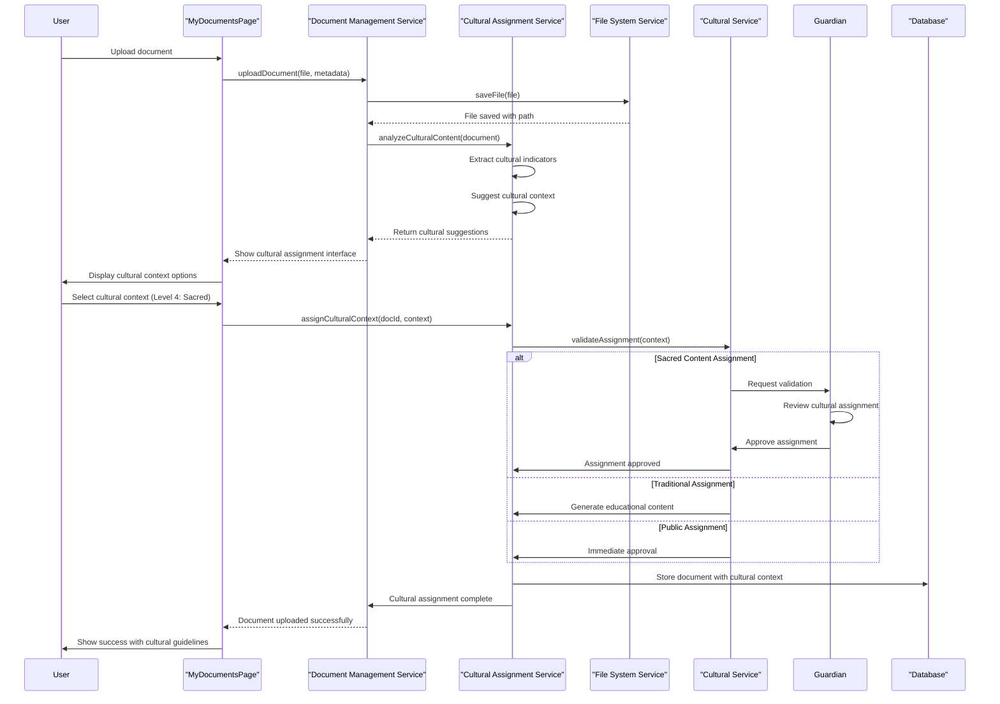
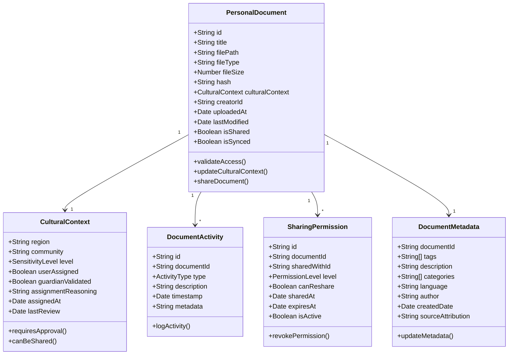
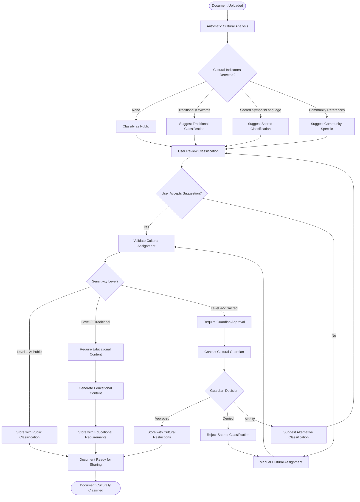
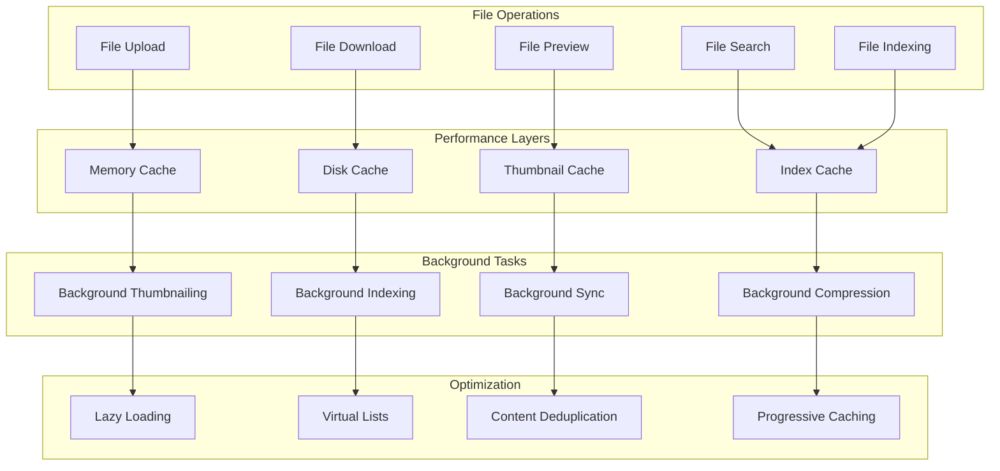
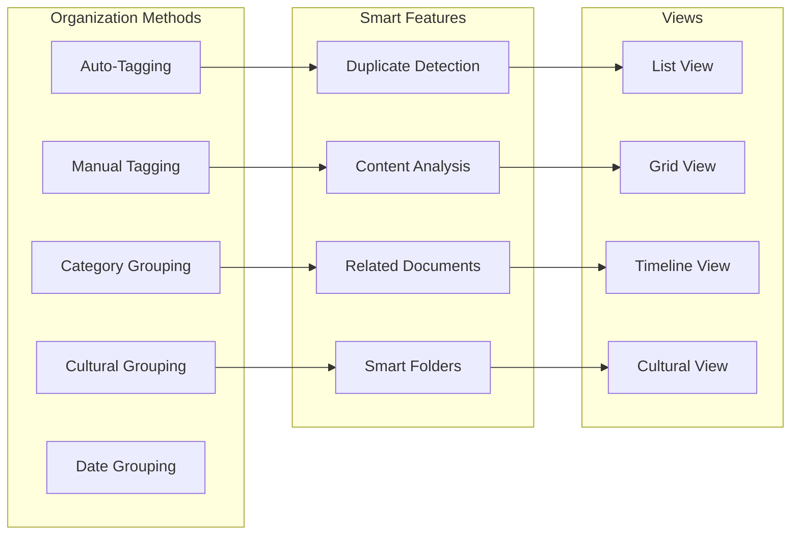
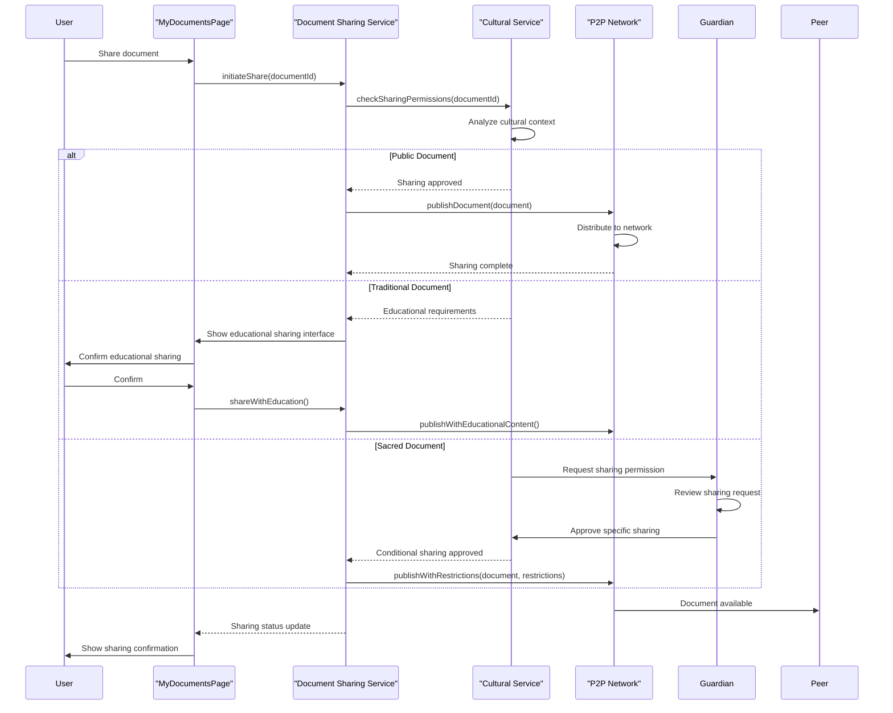

# MyDocumentsPage - Software Engineering Diagrams

## 🏗️ Component Architecture

### MyDocumentsPage Component Structure

---

## 🔄 Document Upload and Cultural Assignment

### Cultural Context Assignment Workflow

---

## 📊 Document Management Data Model

### Personal Library Schema

---

## 🛡️ Cultural Assignment Activity

### Document Sensitivity Classification

---

## ⚡ Document Management Performance

### Efficient File Operations

---

## 🔍 Document Organization

### Smart Organization Features

---

## 📱 Document Sharing Integration

### P2P Document Sharing

---

_MyDocumentsPage Excellence: Comprehensive personal library management with integrated cultural sensitivity, smart organization, and secure P2P sharing capabilities._
