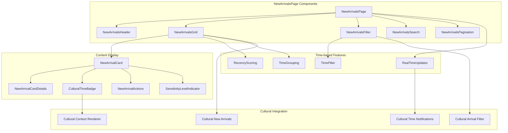
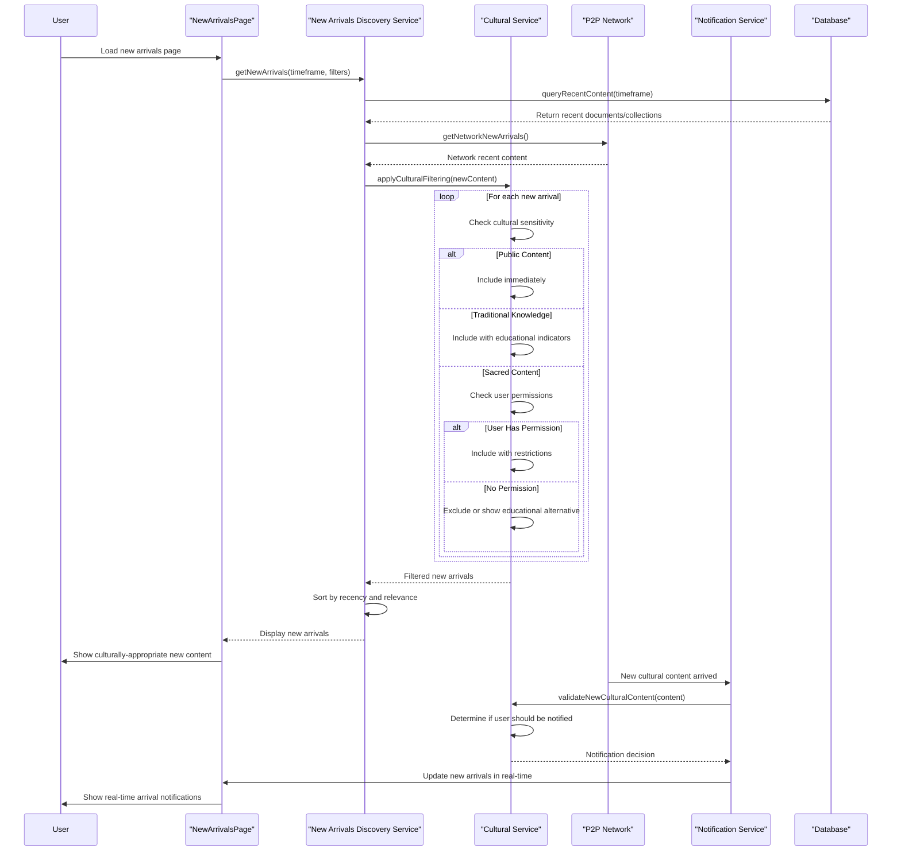
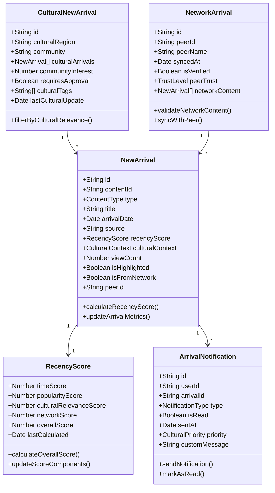
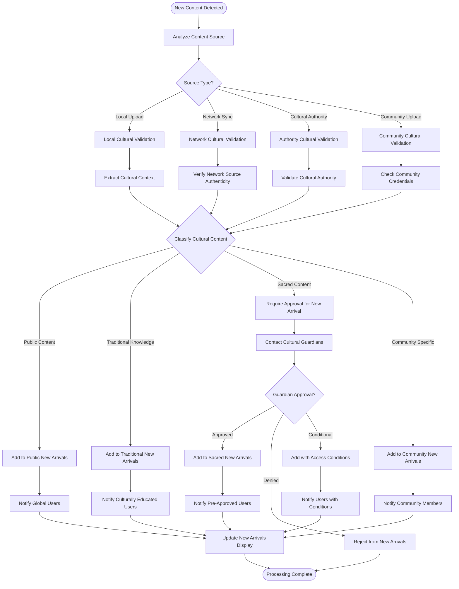
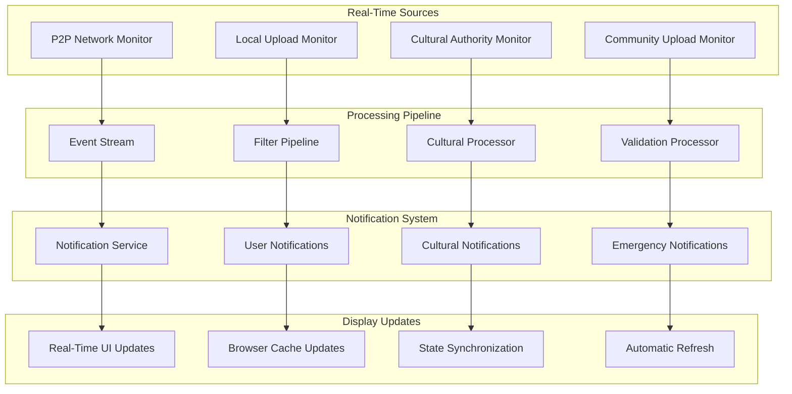
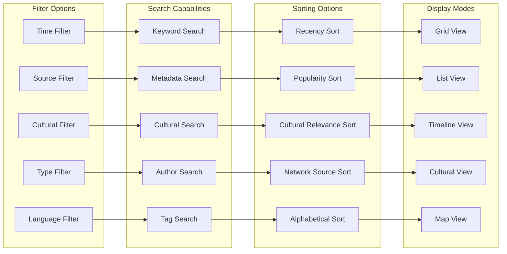
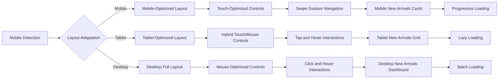
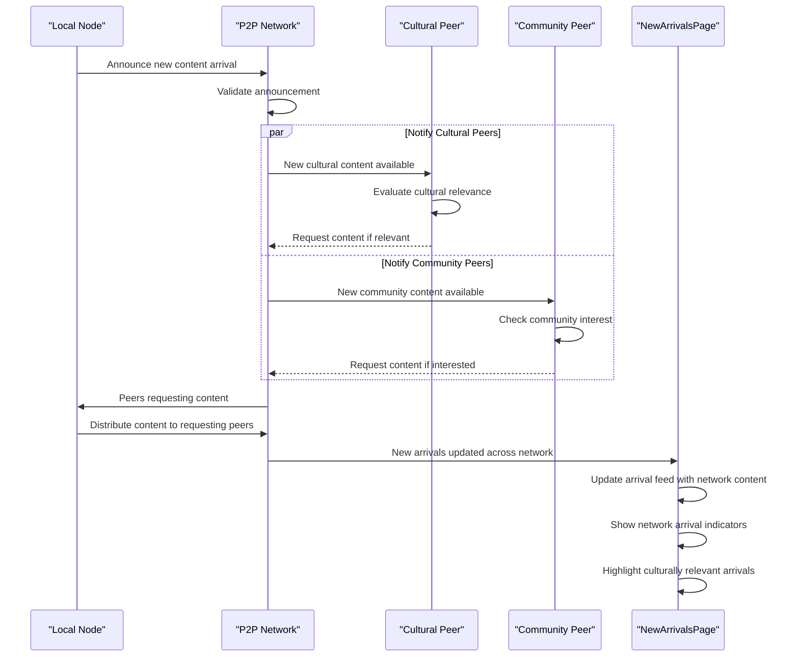

# NewArrivalsPage - Software Engineering Diagrams

## 🏗️ Component Architecture

### NewArrivalsPage Component Structure

---

## 🔄 New Arrivals Discovery Flow

### Cultural-Aware Content Discovery

---

## 📊 New Arrivals Data Model

### Time-Sensitive Content Schema

---

## 🛡️ Cultural New Arrivals Processing

### Cultural Content Validation for New Arrivals

---

## ⚡ Real-Time Arrival Updates

### Live Content Discovery System

---

## 🔍 Arrival Filtering and Search

### Advanced Discovery Features

---

## 📱 Mobile-First Arrival Experience

### Responsive New Arrivals Interface

---

## 🌐 Network Synchronization

### P2P New Arrivals Distribution

---

_NewArrivalsPage Excellence: Real-time content discovery with cultural sensitivity, intelligent filtering, and seamless P2P network integration for fresh content awareness._
