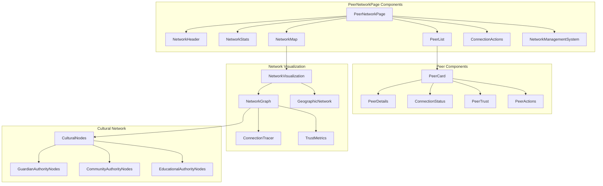
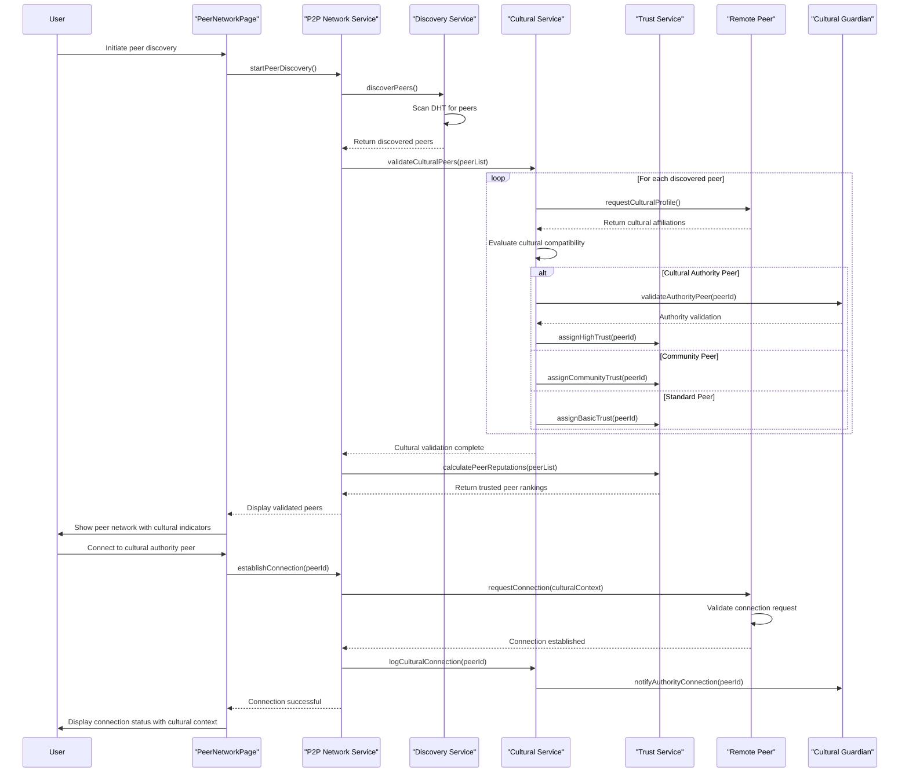
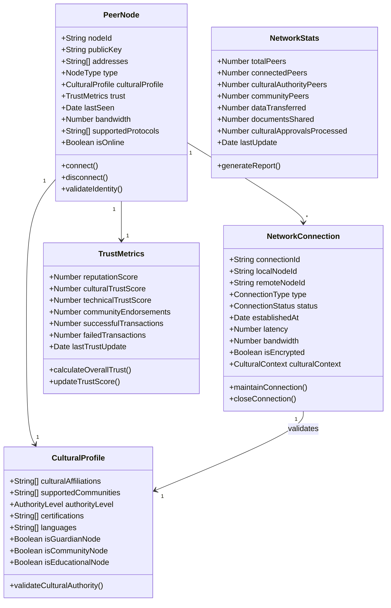
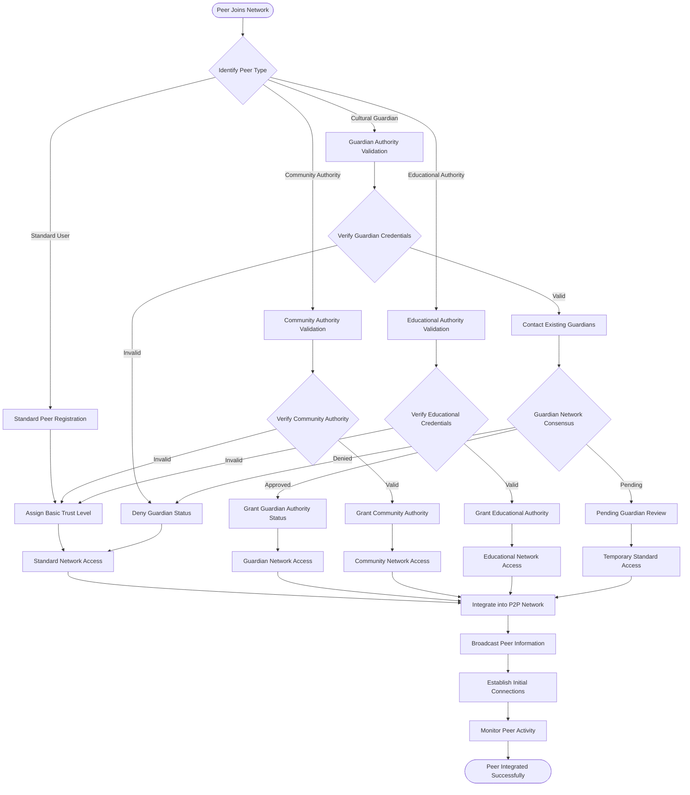
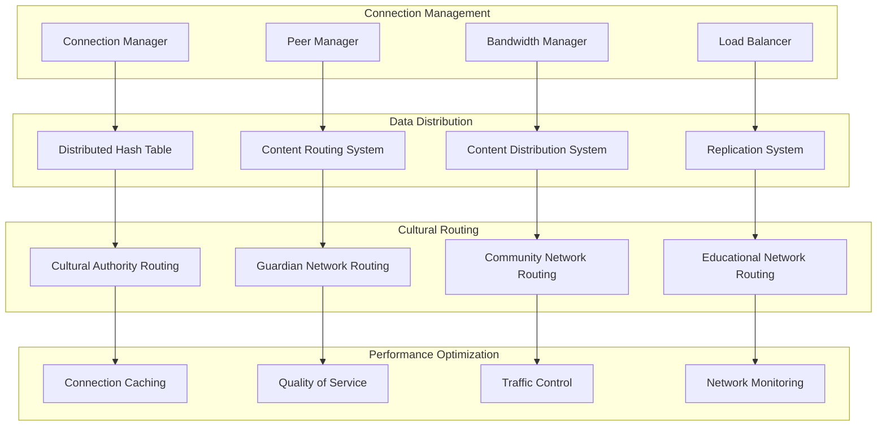
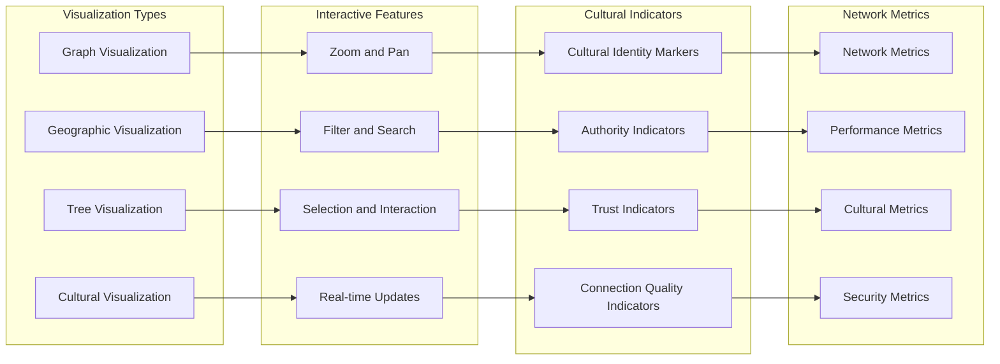
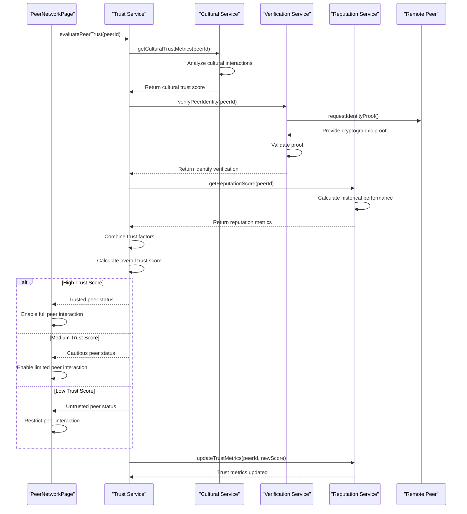
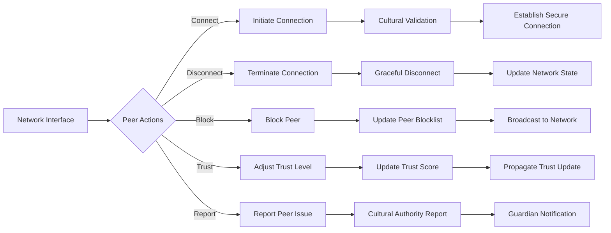

# PeerNetworkPage - Software Engineering Diagrams

## 🏗️ Component Architecture

### PeerNetworkPage Component Structure

---

## 🔄 P2P Network Connection Flow

### Peer Discovery and Cultural Validation

---

## 📊 P2P Network Data Model

### Distributed Network Schema

---

## 🛡️ Cultural Authority Network

### Guardian Network Integration

---

## ⚡ Network Performance Architecture

### Optimized P2P Communication

---

## 🌐 Network Visualization

### Interactive Network Mapping

---

## 🔐 Security and Trust Management

### Peer Trust Evaluation System

---

## 📱 Network Management Interface

### Comprehensive Peer Control

---

_PeerNetworkPage Excellence: Comprehensive P2P network management with integrated cultural authority validation, trust metrics, and secure peer-to-peer communication._
