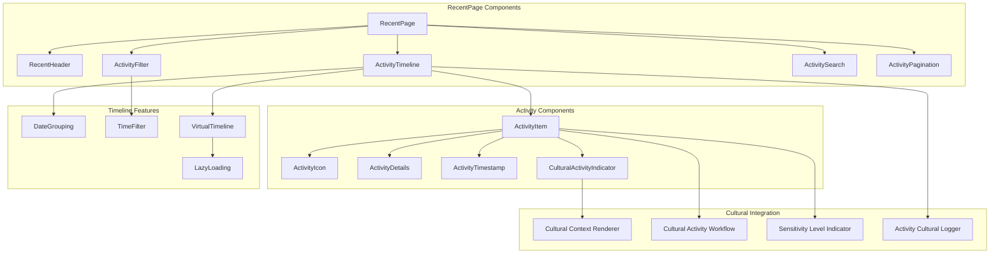
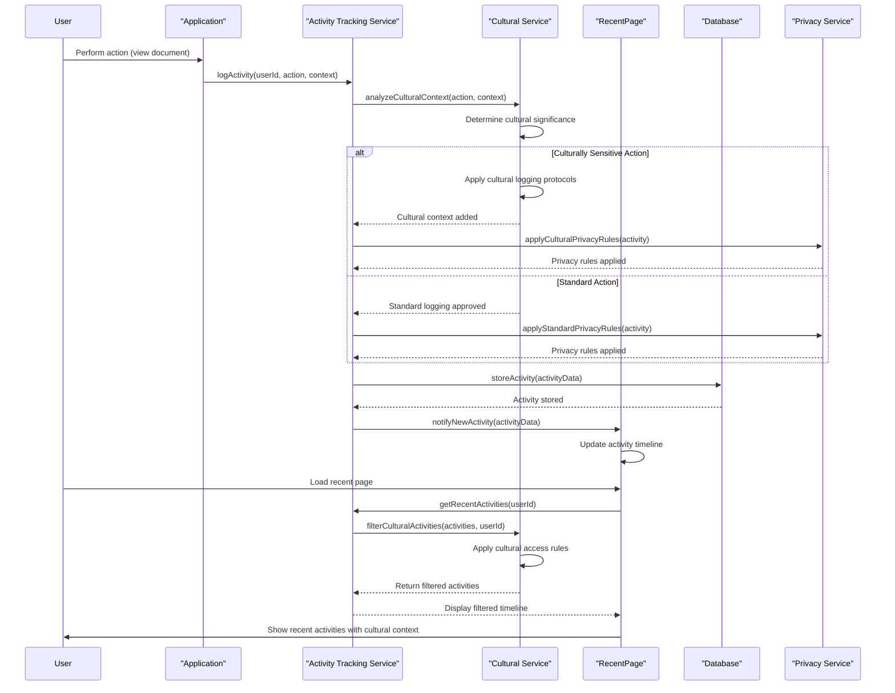
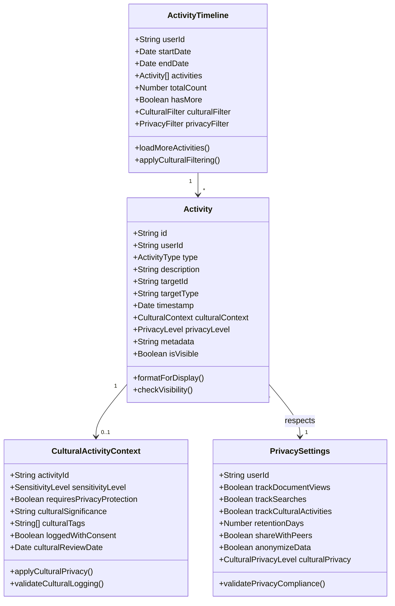
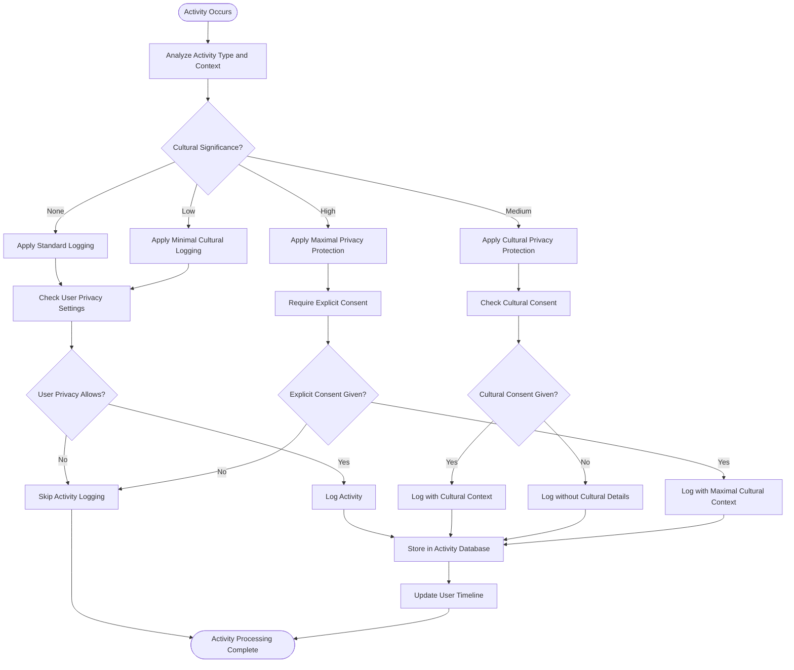
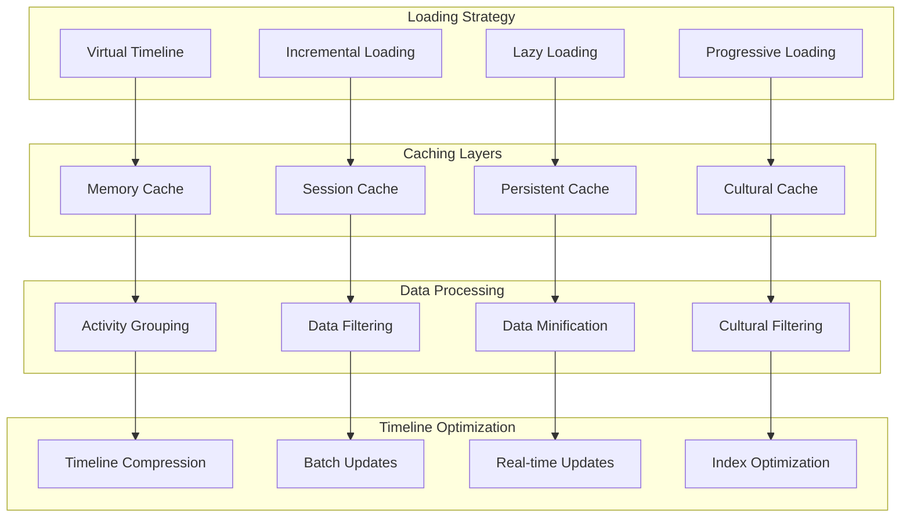
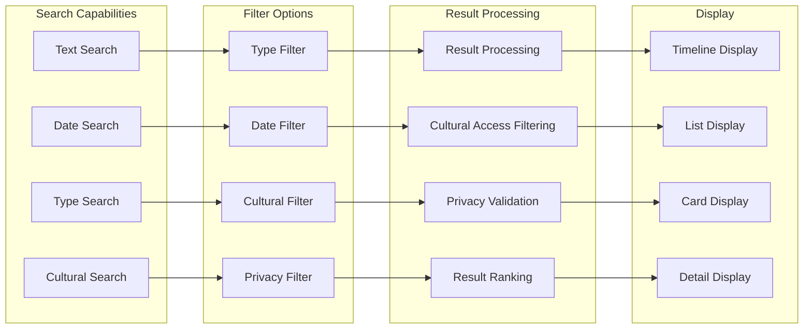
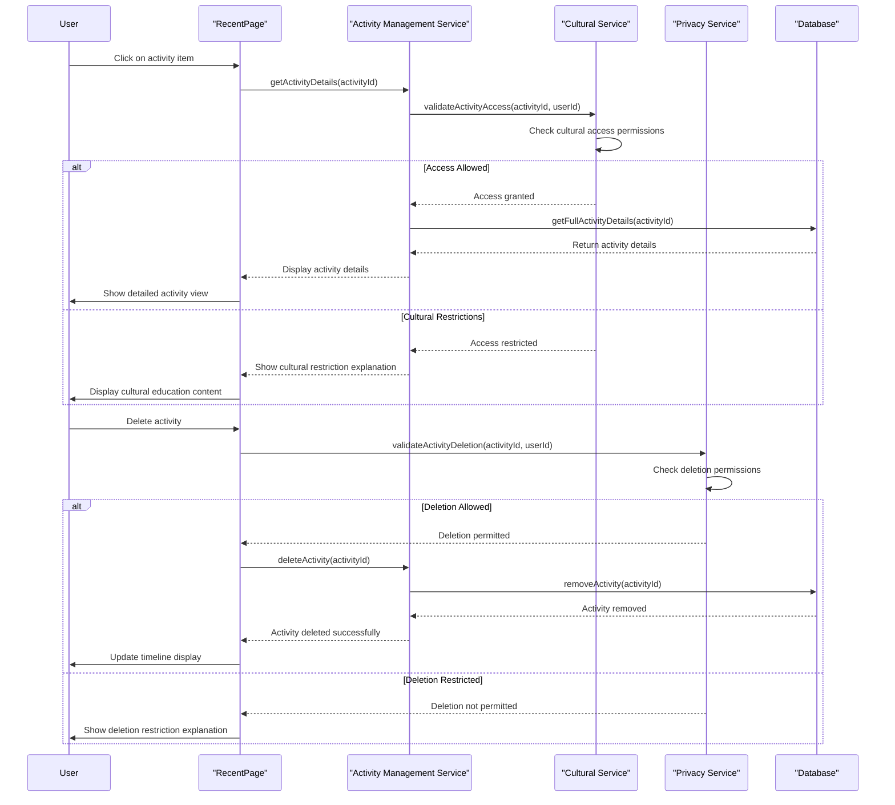

# RecentPage - Software Engineering Diagrams

## 🏗️ Component Architecture

### RecentPage Component Structure

---

## 🔄 Activity Tracking Flow

### Cultural-Aware Activity Logging

---

## 📊 Activity Data Model

### Comprehensive Activity Schema

---

## 🛡️ Cultural Privacy Protection

### Activity Privacy Workflow

---

## ⚡ Timeline Performance

### Efficient Activity Loading

---

## 🔍 Activity Search and Filtering

### Intelligent Activity Discovery

---

## 📱 Activity Interaction

### User Activity Management

---

_RecentPage Excellence: Comprehensive activity tracking with cultural privacy protection, intelligent filtering, and user-controlled activity management._
