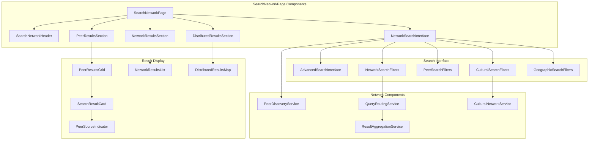
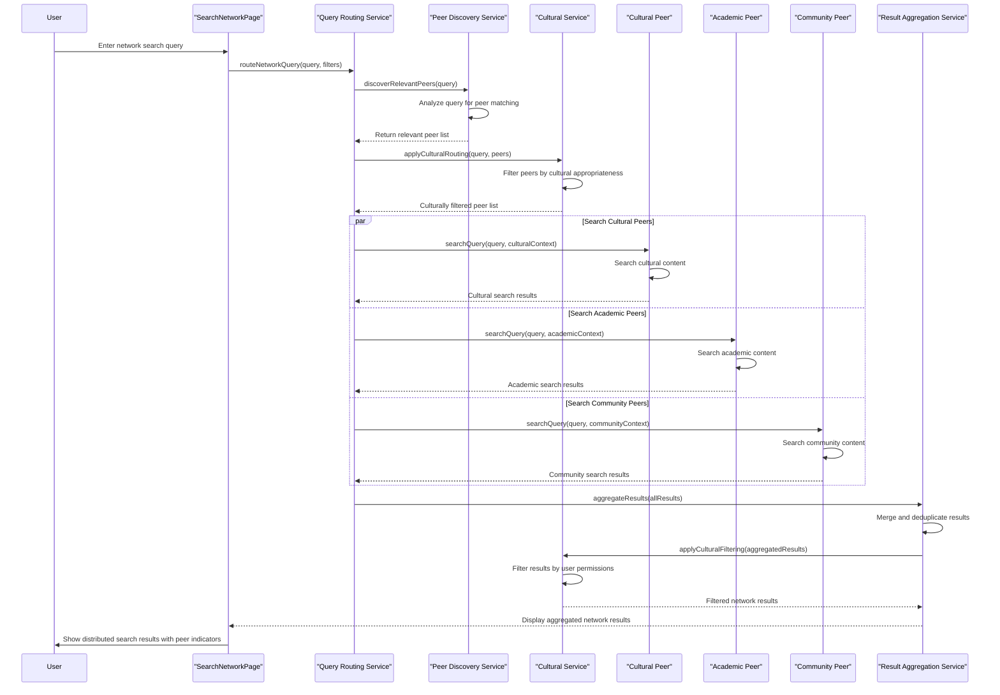
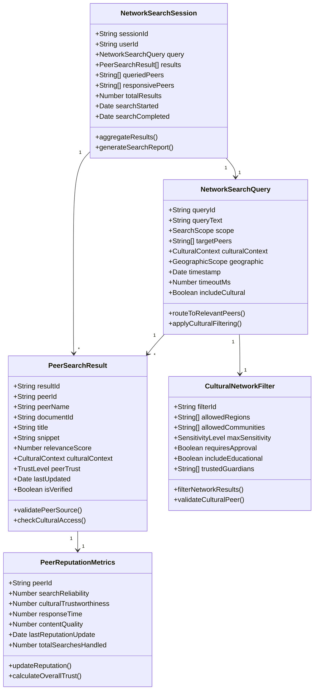
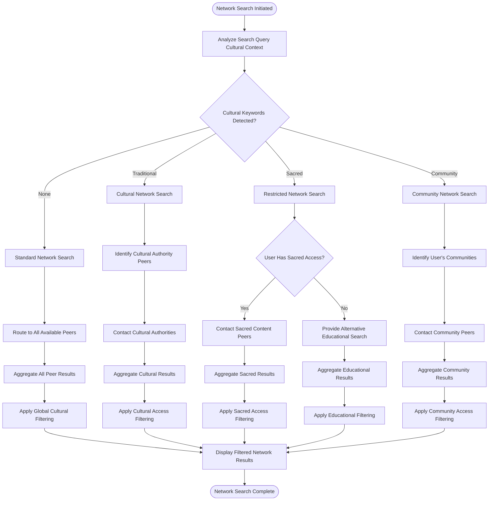
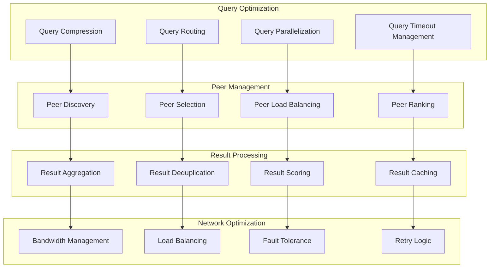
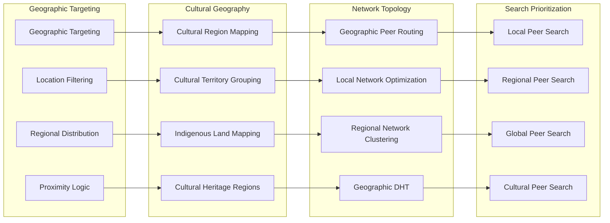
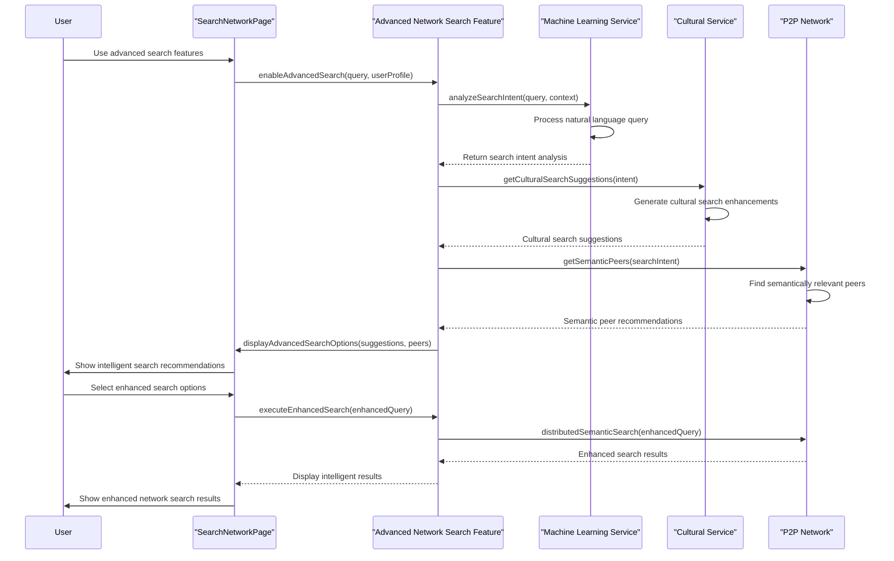
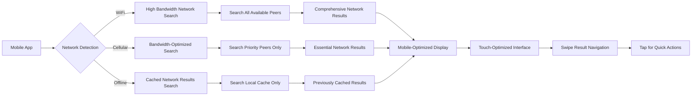

# SearchNetworkPage - Software Engineering Diagrams

## 🏗️ Component Architecture

### SearchNetworkPage Component Structure

---

## 🔄 Distributed Search Flow

### P2P Network Search Process

---

## 📊 Network Search Data Model

### Distributed Search Schema

---

## 🛡️ Cultural Network Search Validation

### Distributed Cultural Access Control

---

## ⚡ Network Search Performance

### Optimized Distributed Search

---

## 🌐 Geographic Search Distribution

### Location-Aware Network Search

---

## 🔍 Advanced Network Search Features

### Intelligent Network Discovery

---

## 📱 Mobile Network Search

### Mobile-Optimized Distributed Search

---

_SearchNetworkPage Excellence: Comprehensive distributed search with cultural sensitivity, intelligent peer routing, and optimized network performance for global knowledge discovery._
