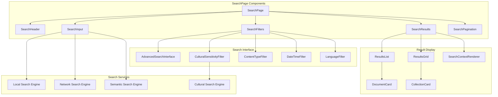
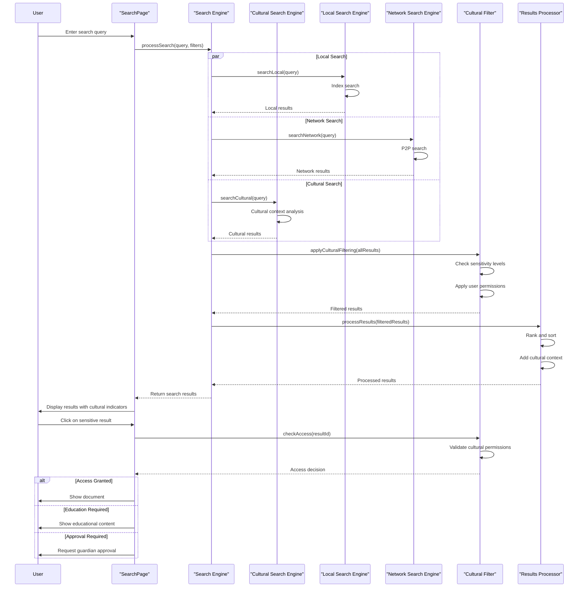
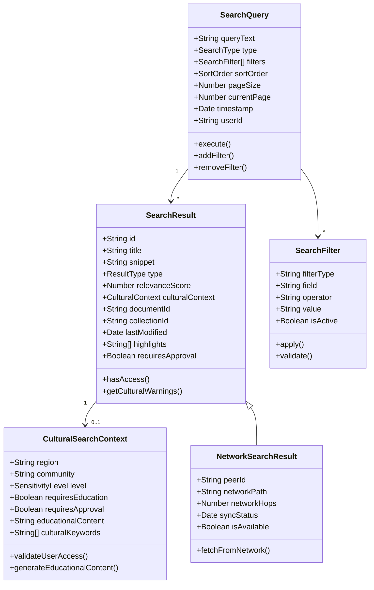
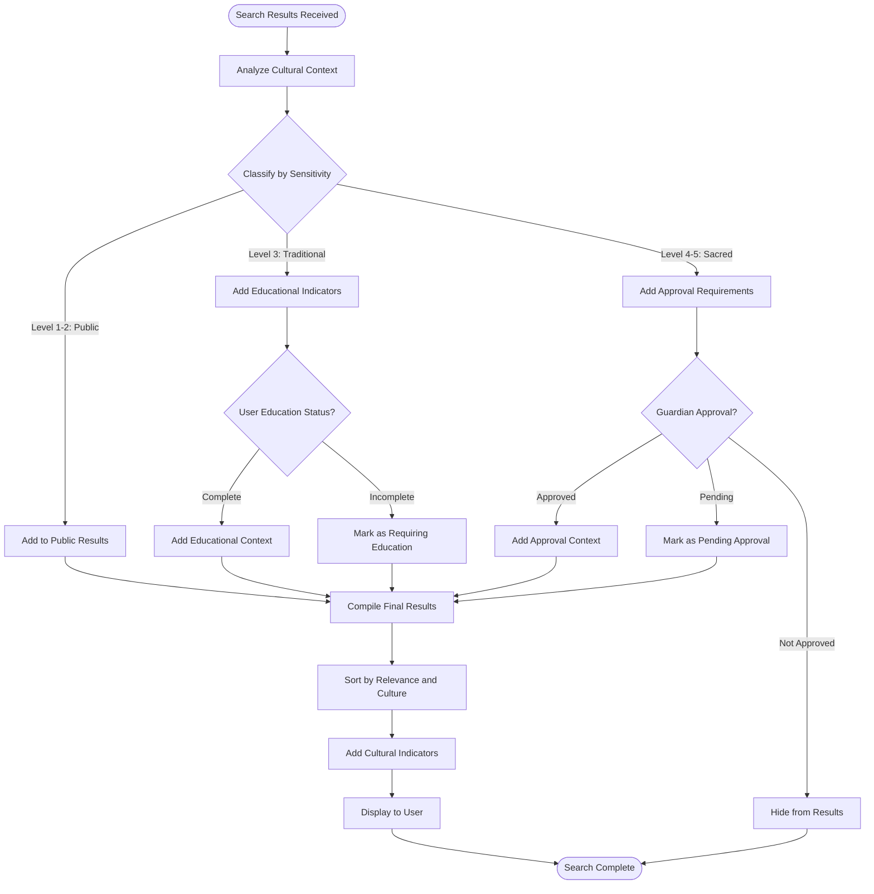
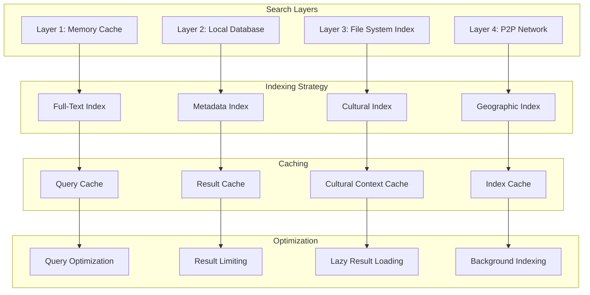
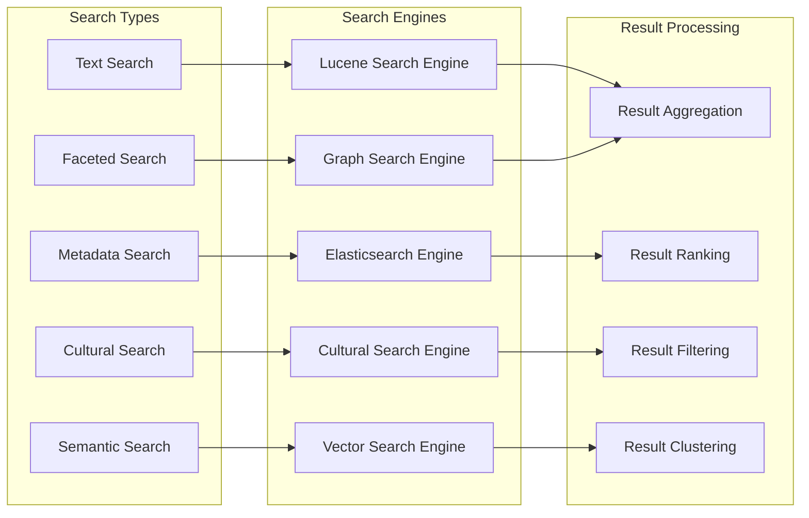
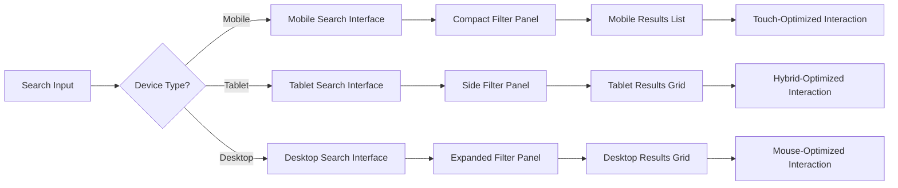

# SearchPage - Software Engineering Diagrams

## 🏗️ Component Architecture

### SearchPage Component Structure

---

## 🔍 Search Processing Flow

### Cultural-Aware Search Algorithm

---

## 📊 Search Data Model

### Comprehensive Search Schema

---

## 🛡️ Cultural Search Filtering

### Sensitivity-Based Result Processing

---

## ⚡ Search Performance Architecture

### Multi-Layered Search Optimization

---

## 🔍 Advanced Search Features

### Multi-Modal Search Architecture

---

## 📱 Search Interface Design

### Responsive Search Experience

---

_SearchPage Excellence: Powerful multi-modal search with integrated cultural sensitivity, performance optimization, and comprehensive result processing._
