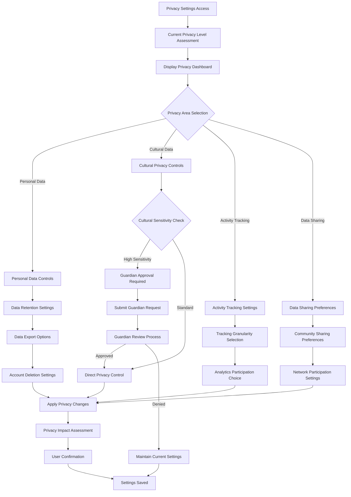

# SettingsPage - Business Rules

## 🎯 Business Objectives

### Primary Goals

1. **User Empowerment** - Provide comprehensive control over application behavior and preferences
2. **Cultural Customization** - Enable deep cultural preference configuration for respectful engagement
3. **Privacy Control** - Offer granular privacy settings for personal data and cultural interactions
4. **System Optimization** - Allow users to optimize performance based on their system capabilities
5. **Community Integration** - Facilitate cultural community connections and mentorship setup

### Success Metrics

- **User Adoption**: >90% of users customize at least 3 settings categories
- **Cultural Engagement**: >80% of users configure cultural preferences
- **Privacy Satisfaction**: >95% user satisfaction with privacy control granularity
- **Performance Optimization**: >70% improvement in personalized performance metrics
- **Support Reduction**: 50% reduction in support requests through self-service settings

## 📋 Functional Requirements

### General Application Settings

```typescript
interface GeneralSettingsRequirements {
  // Core application behavior
  applicationBehavior: {
    language: "System language selection with cultural context";
    theme: "Light/Dark/Auto with cultural color schemes";
    startupBehavior: "Last session restore options";
    updatePreferences: "Automatic/Manual update configuration";
    performanceMode: "Balanced/Performance/Battery optimization";
  };

  // User interface preferences
  interfaceSettings: {
    fontSize: "Accessibility font size scaling (50%-200%)";
    fontFamily: "Cultural script-appropriate font selection";
    animationLevel: "Full/Reduced/None for accessibility";
    screenReader: "Screen reader compatibility settings";
    keyboardNavigation: "Keyboard shortcut customization";
  };

  // Notification preferences
  notificationSettings: {
    systemNotifications: "Desktop notification preferences";
    culturalAlerts: "Cultural sensitivity warning preferences";
    communityUpdates: "Community activity notification settings";
    qualityUpdates: "Document quality change notifications";
    educationalReminders: "Cultural education progress reminders";
  };
}
```

### Cultural Preferences Configuration

```typescript
interface CulturalPreferencesRequirements {
  // Cultural identity and background
  culturalIdentity: {
    primaryCulturalAffiliation: "Main cultural identity declaration";
    secondaryCulturalConnections: "Additional cultural associations";
    culturalCompetencyLevel: "Self-assessed cultural knowledge levels";
    culturalInterests: "Areas of cultural learning interest";
    respectfulEngagementPledge: "Commitment to cultural protocols";
  };

  // Cultural interaction preferences
  interactionPreferences: {
    culturalContentDisplayLevel: "Sensitivity level comfort zone";
    educationalGuidanceLevel: "Preferred level of cultural guidance";
    communityEngagementStyle: "Observer/Participant/Contributor levels";
    mentorshipPreferences: "Willingness to mentor or be mentored";
    culturalCeremonyParticipation: "Participation preferences and availability";
  };

  // Cultural learning settings
  learningSettings: {
    preferredLearningMethods: "Visual/Audio/Interactive/Traditional";
    culturalEducationPacing: "Self-paced/Guided/Structured programs";
    certificationPursual: "Interest in cultural competency certification";
    educationalResourceTypes: "Preferred types of learning materials";
    practicalApplicationPreferences: "How to apply cultural learning";
  };
}
```

### Privacy & Security Settings

```typescript
interface PrivacySecurityRequirements {
  // Personal data privacy
  personalDataPrivacy: {
    profileVisibility: "Public/Community/Private profile settings";
    activityTracking: "Reading history and activity logging preferences";
    analyticsParticipation: "Anonymous usage analytics opt-in/out";
    dataRetention: "Personal data retention period preferences";
    dataPortability: "Export personal data and settings options";
  };

  // Cultural privacy controls
  culturalPrivacy: {
    culturalDataSharing: "Sharing cultural background with community";
    traditionalKnowledgeAccess: "Tracking of sacred content interactions";
    culturalEducationProgress: "Visibility of cultural learning progress";
    ceremonialParticipation: "Privacy of cultural ceremony attendance";
    mentorshipVisibility: "Public display of cultural mentorship";
  };

  // Security preferences
  securitySettings: {
    twoFactorAuthentication: "Multi-factor authentication setup";
    sessionManagement: "Active session monitoring and control";
    deviceTrust: "Trusted device registration and management";
    accessLogging: "Security event logging and notifications";
    emergencyAccess: "Emergency cultural guardian access protocols";
  };
}
```

### Document & Content Preferences

```typescript
interface ContentPreferencesRequirements {
  // Document viewing preferences
  documentViewing: {
    defaultViewMode: "Page/Continuous/Presentation view preferences";
    annotationDefaultVisibility: "Personal/Public annotation defaults";
    qualityIndicatorDisplay: "Quality metric display preferences";
    culturalContextDisplay: "Cultural information display options";
    expertValidationVisibility: "Expert verification badge display";
  };

  // Content filtering and discovery
  contentFiltering: {
    culturalSensitivityFilter: "Auto-filter by sensitivity comfort level";
    languagePreferences: "Preferred content languages with priorities";
    contentTypePreferences: "Academic/Cultural/Community content priorities";
    qualityThresholds: "Minimum quality scores for content display";
    communityRecommendations: "Algorithm transparency and customization";
  };

  // Collaboration preferences
  collaborationSettings: {
    defaultSharingPermissions: "Default sharing scope for new content";
    discussionParticipation: "Automatic/Manual discussion participation";
    expertContributions: "Willingness to provide expert validation";
    communityModeration: "Participation in community content moderation";
    culturalGuidance: "Offering cultural guidance to community members";
  };
}
```

### Network & Synchronization Settings

```typescript
interface NetworkSyncRequirements {
  // P2P network preferences
  networkSettings: {
    networkParticipation: "Level of P2P network participation";
    bandwidthAllocation: "Upload/Download bandwidth limits for sharing";
    storageContribution: "Local storage allocated for network caching";
    nodeReliability: "Uptime commitment and availability schedule";
    culturalNodePreferences: "Preferred cultural community nodes";
  };

  // Synchronization preferences
  synchronizationSettings: {
    deviceSyncEnabled: "Cross-device setting and data synchronization";
    syncFrequency: "Real-time/Hourly/Daily/Manual sync preferences";
    syncScope: "What data to sync across devices";
    conflictResolution: "Preferences for handling sync conflicts";
    offlineMode: "Offline reading and annotation capabilities";
  };

  // Backup and recovery
  backupSettings: {
    automaticBackup: "Automated backup schedule and frequency";
    backupScope: "What data to include in backups";
    backupLocation: "Local/Network backup storage preferences";
    recoveryTesting: "Periodic backup recovery validation";
    culturalDataProtection: "Special handling for cultural content backups";
  };
}
```

## 🗄️ Data Architecture

### User Settings Data Model

```sql
-- Comprehensive user settings table
CREATE TABLE user_settings (
    id TEXT PRIMARY KEY,
    user_id TEXT NOT NULL UNIQUE,

    -- General application settings
    language TEXT DEFAULT 'auto',
    theme TEXT DEFAULT 'auto',
    font_size REAL DEFAULT 1.0,
    font_family TEXT DEFAULT 'system',
    animation_level TEXT DEFAULT 'full',

    -- Cultural preferences
    primary_cultural_affiliation TEXT,
    cultural_competency_level TEXT DEFAULT 'beginner',
    cultural_content_comfort_level INTEGER DEFAULT 3,
    educational_guidance_level TEXT DEFAULT 'standard',

    -- Privacy settings
    profile_visibility TEXT DEFAULT 'community',
    activity_tracking_enabled BOOLEAN DEFAULT TRUE,
    analytics_participation BOOLEAN DEFAULT TRUE,
    cultural_data_sharing_enabled BOOLEAN DEFAULT FALSE,

    -- Document preferences
    default_view_mode TEXT DEFAULT 'page',
    annotation_default_visibility TEXT DEFAULT 'private',
    quality_indicators_enabled BOOLEAN DEFAULT TRUE,
    cultural_context_display TEXT DEFAULT 'always',

    -- Network settings
    network_participation_level TEXT DEFAULT 'standard',
    max_upload_bandwidth INTEGER DEFAULT 1048576, -- 1MB/s
    max_download_bandwidth INTEGER DEFAULT 5242880, -- 5MB/s
    storage_contribution_gb INTEGER DEFAULT 10,

    -- Sync and backup
    device_sync_enabled BOOLEAN DEFAULT TRUE,
    sync_frequency TEXT DEFAULT 'hourly',
    automatic_backup_enabled BOOLEAN DEFAULT TRUE,
    backup_frequency TEXT DEFAULT 'daily',

    created_at TIMESTAMP DEFAULT CURRENT_TIMESTAMP,
    updated_at TIMESTAMP DEFAULT CURRENT_TIMESTAMP
);

-- Cultural preference details
CREATE TABLE cultural_preferences (
    id TEXT PRIMARY KEY,
    user_id TEXT NOT NULL REFERENCES users(id),

    -- Cultural identity
    cultural_affiliations TEXT[], -- JSON array of cultural connections
    cultural_learning_interests TEXT[], -- JSON array of learning areas
    mentorship_preferences TEXT, -- JSON object with mentorship settings

    -- Interaction preferences
    ceremony_participation_willingness BOOLEAN DEFAULT FALSE,
    cultural_guidance_offering BOOLEAN DEFAULT FALSE,
    community_engagement_style TEXT DEFAULT 'observer',

    -- Learning settings
    preferred_learning_methods TEXT[], -- JSON array
    education_pacing TEXT DEFAULT 'self_paced',
    certification_interest BOOLEAN DEFAULT FALSE,

    -- Cultural boundaries
    sensitive_topics_to_avoid TEXT[], -- JSON array
    cultural_triggers TEXT[], -- JSON array for content warnings
    preferred_cultural_mentors TEXT[], -- JSON array of mentor IDs

    created_at TIMESTAMP DEFAULT CURRENT_TIMESTAMP,
    updated_at TIMESTAMP DEFAULT CURRENT_TIMESTAMP
);

-- Privacy and security settings
CREATE TABLE privacy_security_settings (
    id TEXT PRIMARY KEY,
    user_id TEXT NOT NULL REFERENCES users(id),

    -- Privacy controls
    data_retention_period INTEGER DEFAULT 2555, -- 7 years in days
    data_export_enabled BOOLEAN DEFAULT TRUE,
    tracking_consent_given BOOLEAN DEFAULT FALSE,

    -- Cultural privacy
    cultural_education_progress_visibility TEXT DEFAULT 'mentors_only',
    traditional_knowledge_access_logging BOOLEAN DEFAULT TRUE,
    cultural_ceremony_participation_privacy TEXT DEFAULT 'private',

    -- Security settings
    two_factor_enabled BOOLEAN DEFAULT FALSE,
    trusted_devices TEXT[], -- JSON array of device IDs
    session_timeout_minutes INTEGER DEFAULT 480, -- 8 hours

    -- Emergency access
    emergency_cultural_guardian TEXT, -- User ID of emergency contact
    emergency_access_enabled BOOLEAN DEFAULT FALSE,

    created_at TIMESTAMP DEFAULT CURRENT_TIMESTAMP,
    updated_at TIMESTAMP DEFAULT CURRENT_TIMESTAMP
);

-- Notification preferences
CREATE TABLE notification_preferences (
    id TEXT PRIMARY KEY,
    user_id TEXT NOT NULL REFERENCES users(id),

    -- System notifications
    desktop_notifications_enabled BOOLEAN DEFAULT TRUE,
    email_notifications_enabled BOOLEAN DEFAULT TRUE,

    -- Cultural notifications
    cultural_sensitivity_alerts BOOLEAN DEFAULT TRUE,
    cultural_education_reminders BOOLEAN DEFAULT TRUE,
    cultural_ceremony_invitations BOOLEAN DEFAULT TRUE,

    -- Community notifications
    community_discussion_updates BOOLEAN DEFAULT TRUE,
    document_quality_changes BOOLEAN DEFAULT TRUE,
    new_expert_validations BOOLEAN DEFAULT FALSE,

    -- Frequency settings
    notification_frequency TEXT DEFAULT 'immediate',
    quiet_hours_enabled BOOLEAN DEFAULT TRUE,
    quiet_hours_start TIME DEFAULT '22:00',
    quiet_hours_end TIME DEFAULT '08:00',

    created_at TIMESTAMP DEFAULT CURRENT_TIMESTAMP,
    updated_at TIMESTAMP DEFAULT CURRENT_TIMESTAMP
);
```

### Setting Categories and Validation

```sql
-- Settings categories and metadata
CREATE TABLE setting_categories (
    id TEXT PRIMARY KEY,
    name TEXT NOT NULL,
    display_order INTEGER NOT NULL,
    description TEXT,

    -- Cultural sensitivity
    requires_cultural_consideration BOOLEAN DEFAULT FALSE,
    cultural_impact_level INTEGER DEFAULT 1,

    -- Access control
    requires_guardian_approval BOOLEAN DEFAULT FALSE,
    minimum_user_level TEXT DEFAULT 'basic',

    created_at TIMESTAMP DEFAULT CURRENT_TIMESTAMP
);

-- Setting validation rules
CREATE TABLE setting_validation_rules (
    id TEXT PRIMARY KEY,
    setting_key TEXT NOT NULL,
    validation_type TEXT NOT NULL, -- 'range', 'enum', 'pattern', 'cultural'
    validation_data TEXT NOT NULL, -- JSON with validation parameters
    error_message TEXT NOT NULL,

    -- Cultural validation
    cultural_context TEXT,
    requires_community_approval BOOLEAN DEFAULT FALSE,

    created_at TIMESTAMP DEFAULT CURRENT_TIMESTAMP
);
```

## 🔄 Core Business Workflows

### Settings Configuration Workflow


### Cultural Preferences Setup Workflow


### Privacy Settings Management Workflow



## 🛡️ Security & Cultural Validation

### Settings Security Matrix

```typescript
interface SettingsSecurityRequirements {
  // Access control for settings
  accessControl: {
    basicSettings: "All authenticated users";
    culturalSettings: "Cultural identity verification required";
    privacySettings: "Enhanced authentication for sensitive changes";
    networkSettings: "Performance impact warnings and confirmations";
    securitySettings: "Multi-factor authentication required";
  };

  // Cultural validation requirements
  culturalValidation: {
    primaryCulturalAffiliation: "Community verification for authentic connections";
    culturalCompetencyLevel: "Assessment validation for advanced levels";
    traditionalKnowledgeAccess: "Elder approval for sacred content settings";
    ceremonialParticipation: "Cultural protocol compliance verification";
    culturalGuidanceOffering: "Community endorsement for mentorship roles";
  };

  // Change impact assessment
  changeImpactAssessment: {
    privacyReduction: "Explicit user confirmation with impact explanation";
    culturalExposureIncrease: "Cultural sensitivity training requirement";
    networkResourceIncrease: "Performance impact notification and limits";
    securityLevelReduction: "Security risk explanation and alternatives";
    dataRetentionIncrease: "Privacy impact and legal compliance notice";
  };
}
```

### Cultural Settings Validation

```typescript
interface CulturalSettingsValidation {
  // Cultural identity validation
  identityValidation: {
    primaryAffiliation: "Community member verification or cultural education completion";
    culturalKnowledge: "Assessment or community endorsement for advanced levels";
    traditionalAccess: "Progressive access based on cultural education and community integration";
    ceremonialRights: "Elder approval and traditional protocol compliance";
  };

  // Community integration validation
  communityValidation: {
    mentorshipOffering: "Community endorsement and competency demonstration";
    culturalGuidance: "Elder approval and traditional knowledge verification";
    ceremonyParticipation: "Protocol education and community acceptance";
    sacredContentAccess: "Multi-level approval and ongoing community oversight";
  };

  // Ongoing compliance monitoring
  complianceMonitoring: {
    culturalProtocolAdherence: "Regular assessment of cultural respect and protocol compliance";
    communityFeedback: "Community member feedback on cultural interactions";
    educationContinuation: "Ongoing cultural education and awareness updates";
    traditionPreservation: "Contribution to traditional knowledge preservation efforts";
  };
}
```

## 📊 Performance & Quality Standards

### Settings Performance Requirements

- **Settings Load Time**: <1 second for all settings categories
- **Setting Change Application**: <500ms for immediate-effect settings
- **Cross-Device Sync**: <2 seconds for settings synchronization
- **Cultural Validation**: <3 seconds for community validation requests
- **Backup Creation**: <5 seconds for complete settings backup

### Cultural Validation Quality Metrics

- **Cultural Appropriateness**: 100% validation through community oversight
- **Traditional Knowledge Protection**: Zero unauthorized access through settings manipulation
- **Community Integration**: >90% positive community feedback on cultural settings usage
- **Elder Approval Process**: <24 hours for elder review of high-sensitivity settings
- **Educational Compliance**: 100% completion of required cultural education before access increases

### User Experience Quality Standards

- **Settings Discoverability**: >95% of users find needed settings within 3 clicks
- **Explanation Clarity**: >90% user comprehension of setting impacts and consequences
- **Cultural Guidance**: 100% availability of cultural guidance for sensitive settings
- **Error Prevention**: >95% reduction in invalid setting configurations through validation
- **Accessibility Compliance**: WCAG 2.1 AA compliance for all settings interfaces

## 🎯 Success Criteria & Validation

### Business Success Metrics

1. **User Control**: Users report feeling in complete control of their application experience
2. **Cultural Respect**: Zero cultural protocol violations through settings misconfiguration
3. **Privacy Satisfaction**: Users express confidence in their privacy control granularity
4. **Community Integration**: Smooth cultural community integration through settings-guided onboarding
5. **Support Efficiency**: Dramatic reduction in support requests through comprehensive self-service settings

### Cultural Success Metrics

1. **Cultural Authenticity**: Settings enable authentic cultural expression and connection
2. **Traditional Knowledge Protection**: Settings effectively protect sacred and sensitive content
3. **Community Harmony**: Settings promote respectful cross-cultural interactions
4. **Educational Integration**: Settings facilitate meaningful cultural learning and growth
5. **Elder Satisfaction**: Cultural elders approve of settings that affect traditional knowledge access

### Technical Success Metrics

1. **Performance Optimization**: Settings enable users to optimize application performance for their needs
2. **Synchronization Reliability**: Settings sync seamlessly across all user devices
3. **Backup Integrity**: Complete and reliable backup and restoration of all user settings
4. **Validation Accuracy**: Setting validation prevents configuration errors and conflicts
5. **Migration Success**: Smooth settings migration during application updates

---

_Settings Excellence: Empowering users with comprehensive, culturally-sensitive control over their AlLibrary experience while maintaining community respect and traditional knowledge protection._
