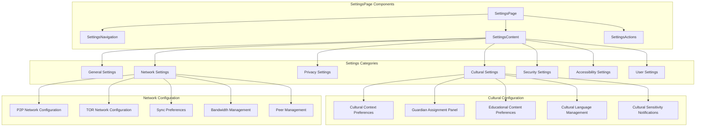
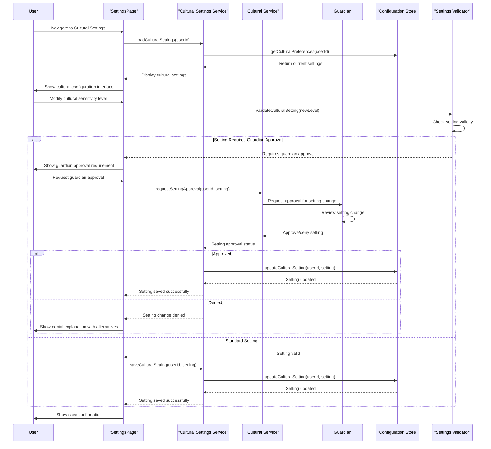
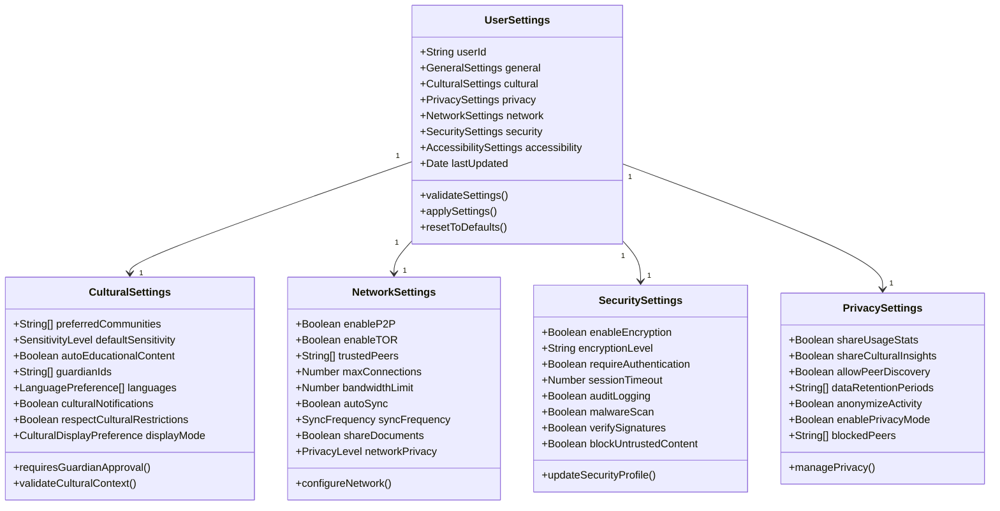
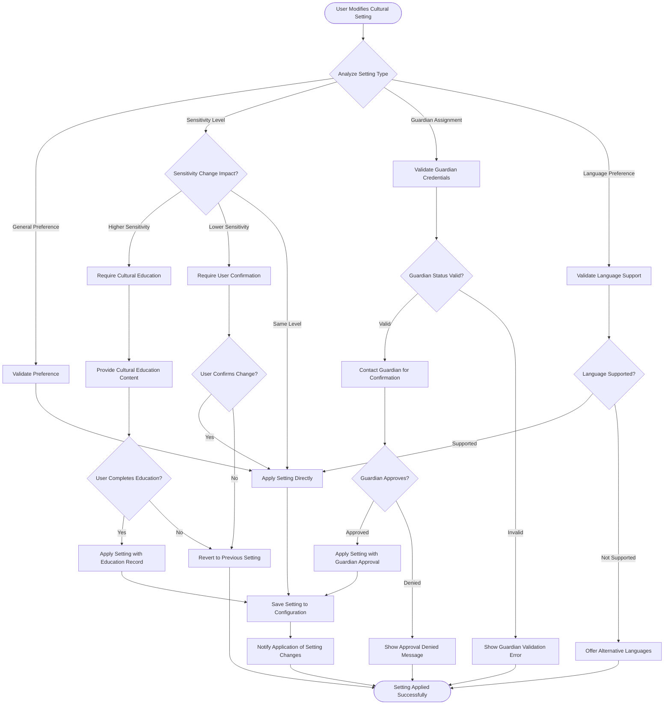
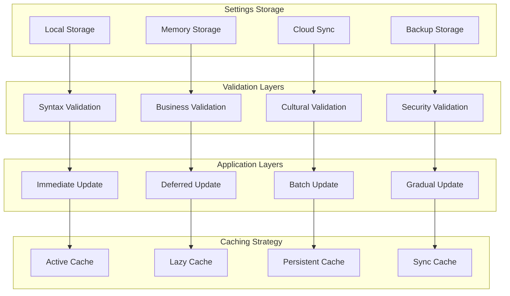
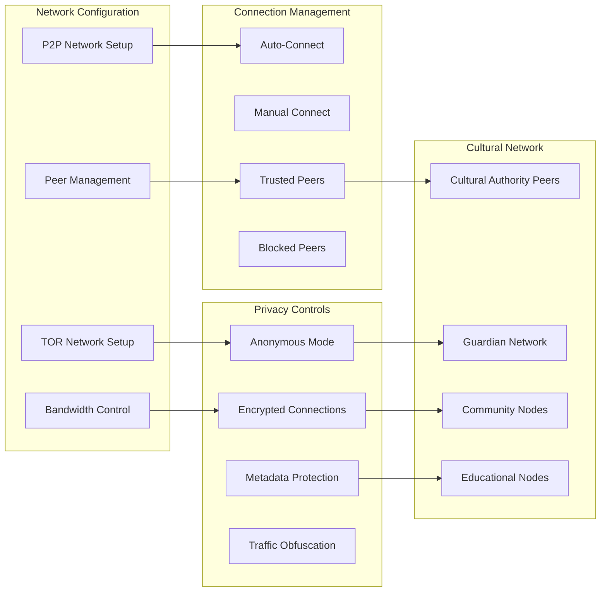
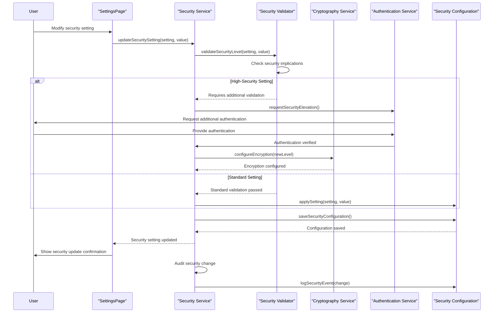

# SettingsPage - Software Engineering Diagrams

## 🏗️ Component Architecture

### SettingsPage Component Structure

---

## 🔄 Settings Management Flow

### Cultural Settings Configuration

---

## 📊 Settings Data Model

### Comprehensive Configuration Schema

---

## 🛡️ Cultural Settings Validation

### Cultural Configuration Workflow

---

## ⚡ Settings Performance Architecture

### Configuration Management Optimization

---

## 🌐 Network Settings Integration

### P2P and TOR Configuration

---

## 🔐 Security Settings Configuration

### Multi-Layer Security Management

---

_SettingsPage Excellence: Comprehensive configuration management with integrated cultural governance, security controls, and network optimization._
