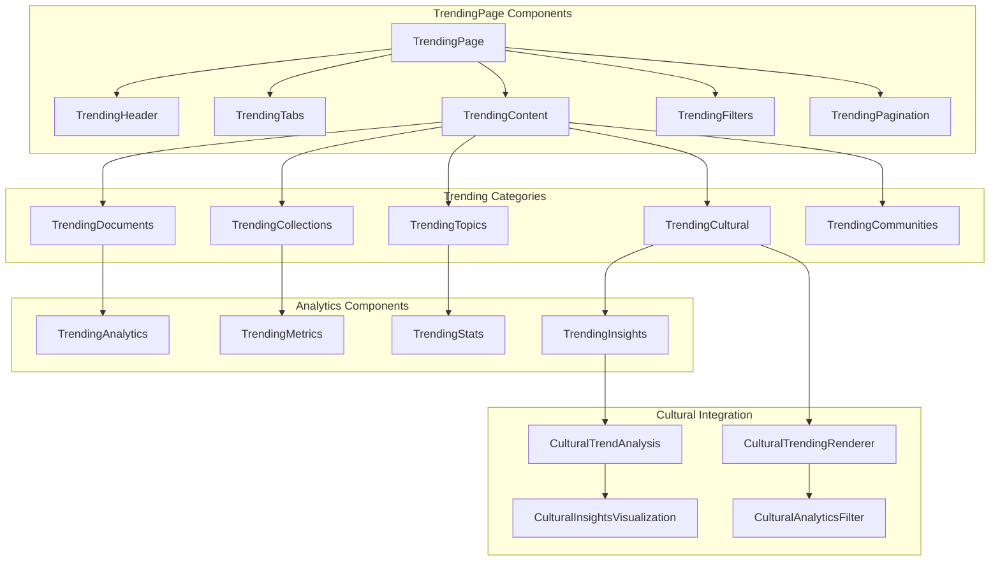
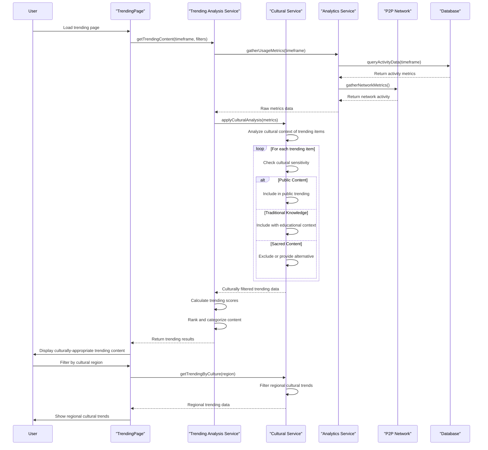
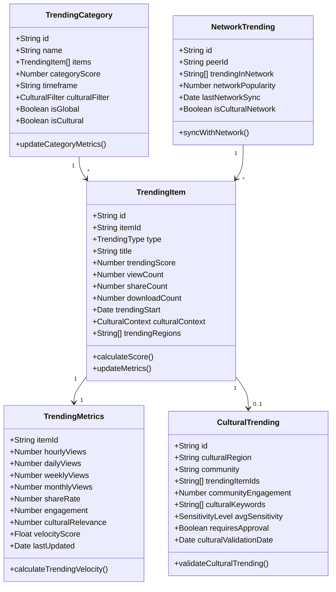
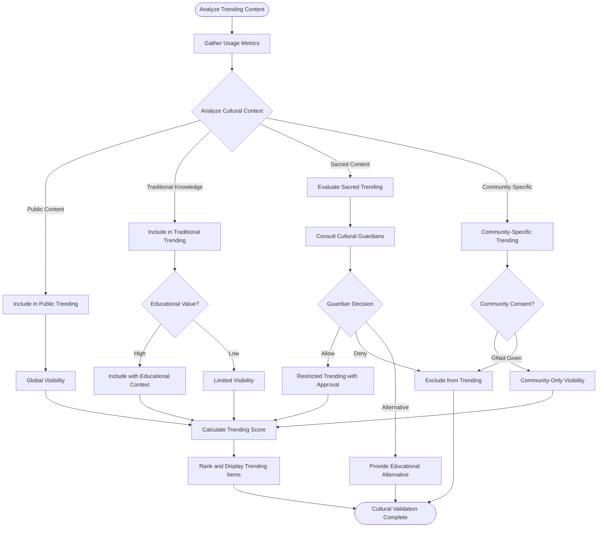
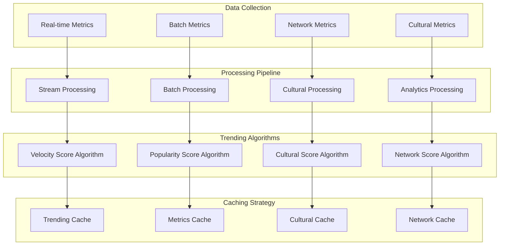
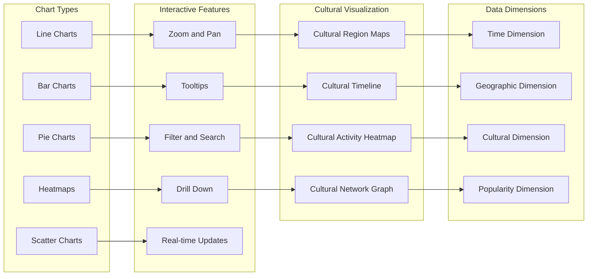
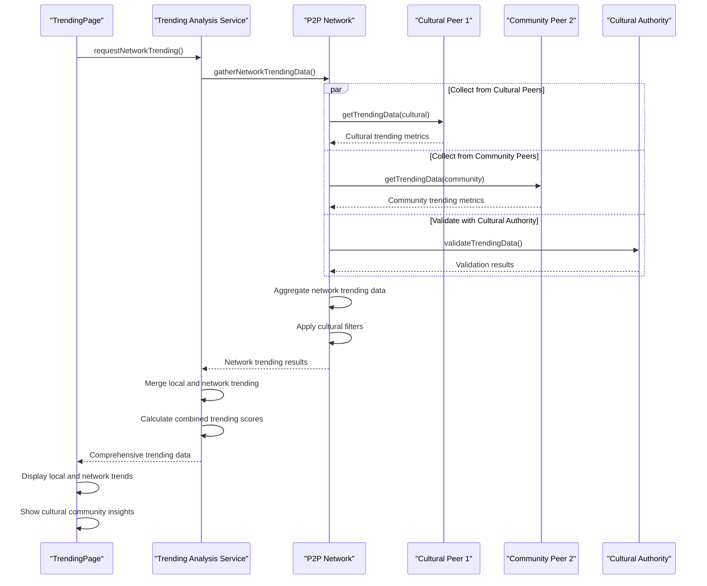
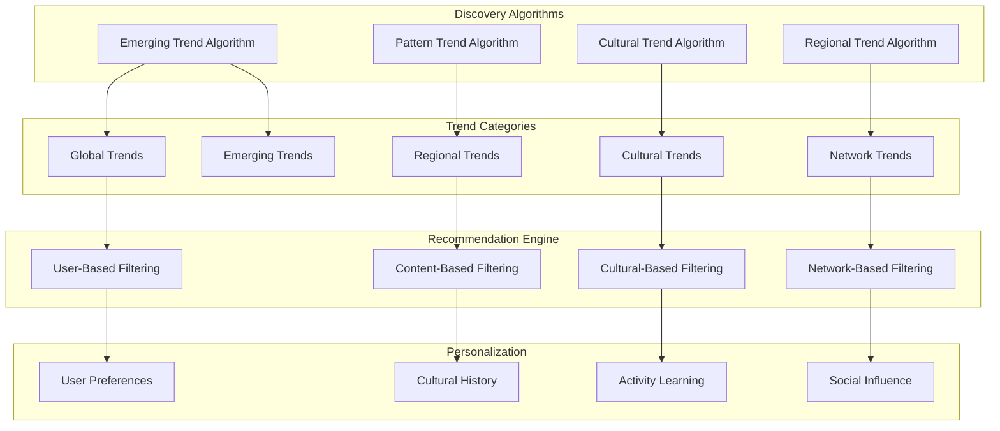

# TrendingPage - Software Engineering Diagrams

## 🏗️ Component Architecture

### TrendingPage Component Structure

---

## 🔄 Trending Analysis Flow

### Cultural-Aware Trending Algorithm

---

## 📊 Trending Data Model

### Comprehensive Trending Schema

---

## 🛡️ Cultural Trending Validation

### Cultural Sensitivity in Trending

---

## ⚡ Trending Performance Architecture

### Real-time Trending Analysis

---

## 📈 Trending Visualization

### Interactive Trending Analytics

---

## 🌐 Network Trending Integration

### P2P Trending Synchronization

---

## 🔍 Trending Discovery Features

### Intelligent Trend Discovery

---

_TrendingPage Excellence: Comprehensive trending analysis with cultural sensitivity, real-time network synchronization, and intelligent discovery algorithms._
