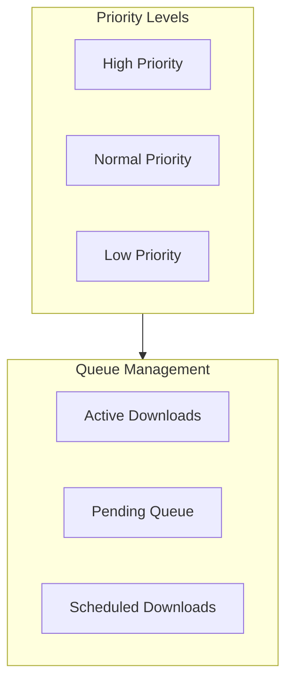
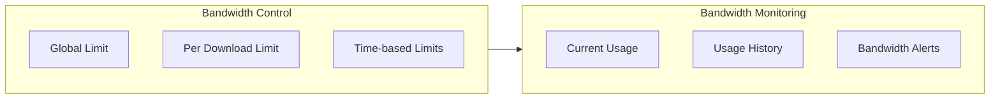
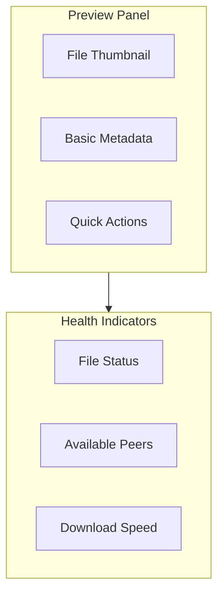
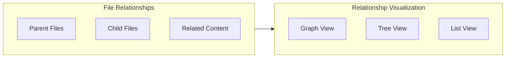
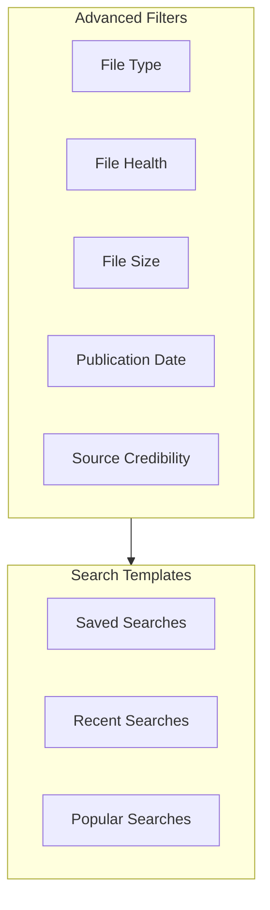
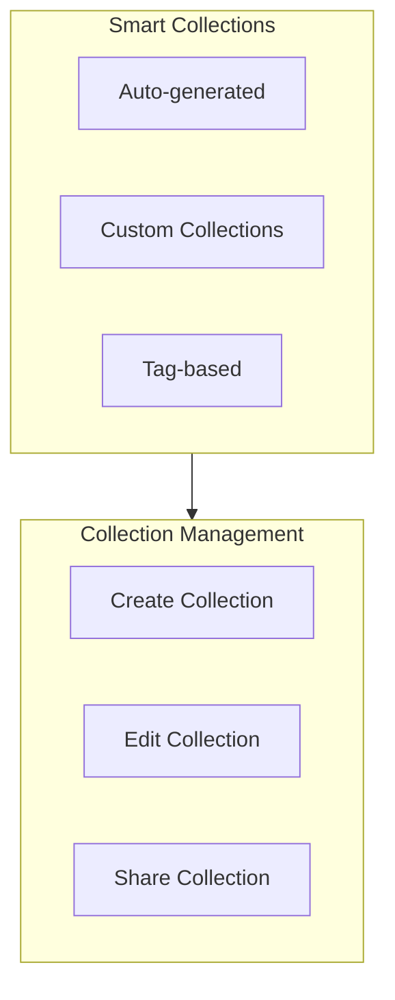
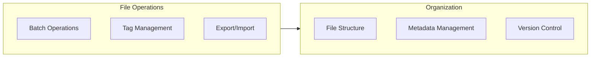
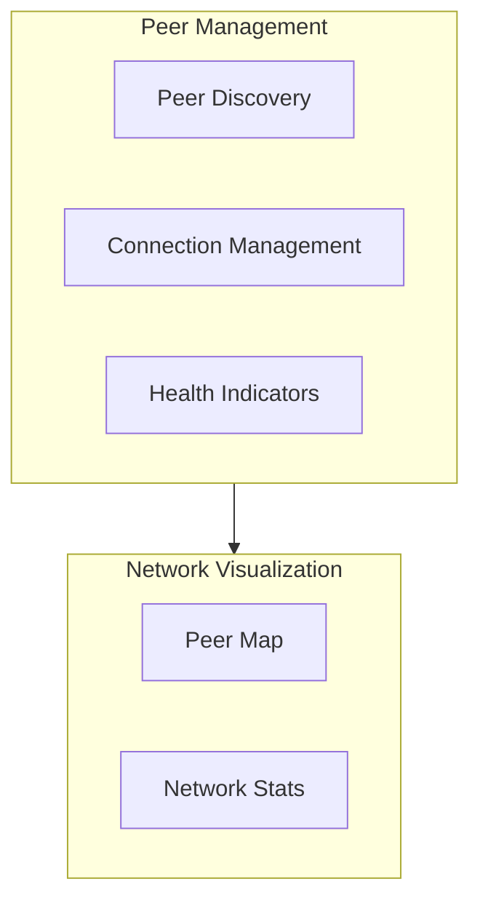
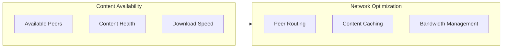

# Enhanced Features Documentation

## 1. Smart Download Management

### Priority System

### Bandwidth Management

## 2. Enhanced File Preview

### Quick Preview Panel

### File Relationships

## 3. Advanced Search Features

### Search Filters

### Search Results

## 4. Library Organization

### Smart Collections

### File Management

## 5. Network Features

### Peer Management

### Content Availability

## Implementation Guidelines

### 1. Performance Optimization

- Implement smart caching for frequently accessed content
- Use background tasks for non-critical operations
- Optimize storage usage with compression
- Implement efficient network protocols
- Use lazy loading for UI components

### 2. Security Measures

- Implement content verification
- Validate sources
- Protect user privacy
- Secure data storage
- Control access permissions

### 3. User Experience

- Provide clear feedback
- Implement intuitive navigation
- Prevent errors
- Offer help and documentation
- Allow customization

### 4. Accessibility

- Follow WCAG guidelines
- Support screen readers
- Enable keyboard navigation
- Provide visual customization
- Handle errors gracefully
