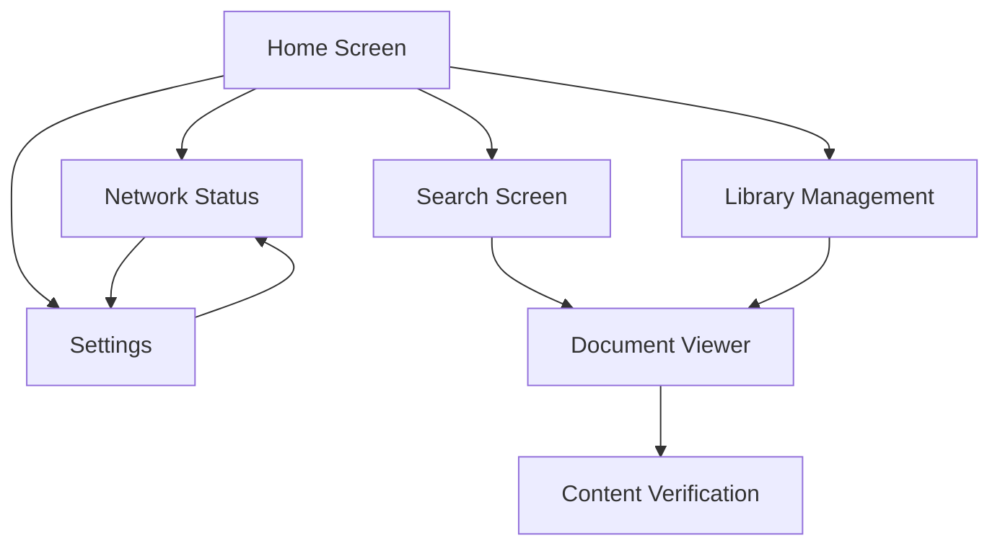

# AlLibrary Screen Design

## Core Screens

### 1. Home Screen

**Purpose**: Main entry point and content discovery
**Key Features**:

- Recent documents
- Popular content
- Quick search
- Network status
- Offline content access
- Smart collections
- Download queue status
- System health indicators

**Layout Structure**:

```
+------------------------------------------+
|  Navigation Bar                          |
+------------------------------------------+
|  Quick Search                            |
+------------------------------------------+
|  Status Bar                              |
|  [Network] [Downloads] [Storage] [Health]|
+------------------------------------------+
|  Recent & Popular |  Download Queue      |
|  - Recent Docs    |  - Active Downloads  |
|  - Popular        |  - Queue Status      |
|  - Collections    |  - Bandwidth Usage   |
+------------------------------------------+
|  Smart Collections |  System Health      |
|  - By Topic       |  - Network Status    |
|  - By Type        |  - Storage Usage     |
|  - By Source      |  - Performance       |
+------------------------------------------+
```

**Heuristic Considerations**:

- Visibility of system status (network connectivity)
- User control and freedom (easy navigation)
- Recognition rather than recall (recent items)

### 2. Search Screen

**Purpose**: Advanced content discovery and filtering
**Key Features**:

- Split-pane layout
- Advanced filters
- Health indicators
- Relationship view
- Smart suggestions
- Saved searches

**Layout Structure**:

```
+------------------+------------------+
|  Search Panel    |  Preview Panel   |
|  +------------+ |  +------------+  |
|  | Search Bar | |  | Thumbnail  |  |
|  +------------+ |  +------------+  |
|  | Filters    | |  | Metadata   |  |
|  | - Type     | |  | - Title    |  |
|  | - Health   | |  | - Author   |  |
|  | - Date     | |  | - Source   |  |
|  | - Size     | |  | - Status   |  |
|  +------------+ |  +------------+  |
|  | Results    | |  | Actions    |  |
|  | - List     | |  | - Download |  |
|  | - Grid     | |  | - Preview  |  |
|  | - Map      | |  | - Share    |  |
|  +------------+ |  +------------+  |
+------------------+------------------+
```

**Heuristic Considerations**:

- Visibility of system status (download progress)
- User control and freedom (easy switching between files)
- Recognition rather than recall (visual previews)
- Flexibility and efficiency (quick actions)
- Error prevention (clear status indicators)

### 3. Document Viewer

**Purpose**: Content consumption and management
**Key Features**:

- Multi-format support
- Reading progress
- Annotations
- Version history
- Source verification
- Relationship view
- Offline reading
- Accessibility options

**Layout Structure**:

```
+------------------------------------------+
|  Toolbar                                 |
|  [View] [Tools] [Share] [Accessibility]  |
+------------------------------------------+
|  Content        |  Sidebar               |
|                 |  - Metadata            |
|                 |  - Annotations         |
|                 |  - Relationships       |
|                 |  - Version History     |
+------------------------------------------+
|  Progress Bar                            |
+------------------------------------------+
```

**Heuristic Considerations**:

- Consistency and standards
- Error prevention
- Help and documentation

### 4. Library Management

**Purpose**: Content organization and download management
**Key Features**:

- Torrent-like interface
- Smart collections
- Batch operations
- Health monitoring
- Relationship visualization
- Export/Import

**Layout Structure**:

```
+------------------------------------------+
|  Toolbar                                 |
|  [Actions] [Search] [Filters] [View]     |
+------------------------------------------+
|  Status Tabs                             |
|  [All] [Downloading] [Completed] [Error] |
+------------------------------------------+
|  Collections |  File List                |
|  - Smart     |  +----------------------+ |
|  - Custom    |  | Name | Size | Status | |
|  - Tags      |  |----------------------| |
|              |  | File1| 1.2GB| Active | |
|              |  | File2| 500MB| Done   | |
|              |  +----------------------+ |
+------------------------------------------+
|  Status Bar                              |
|  [Progress] [Speed] [Queue] [Health]     |
+------------------------------------------+
```

**Heuristic Considerations**:

- Visibility of system status (download progress, speed)
- User control and freedom (pause/resume, prioritize)
- Recognition rather than recall (status indicators)
- Flexibility and efficiency (batch operations)
- Error prevention (clear error states)

**Key Interactions**:

1. **File Selection**:

   - Click file in list to show details
   - Double-click to open/view
   - Right-click for context menu

2. **Download Management**:

   - Progress bar shows download status
   - Speed and ETA indicators
   - Pause/Resume controls
   - Priority settings

3. **Status Indicators**:

   - Downloading
   - Completed
   - Error
   - Already Downloaded
   - Verifying
   - Seeding (sharing)

4. **Batch Operations**:
   - Select multiple files
   - Bulk download
   - Bulk delete
   - Bulk verify

### 5. Network Status

**Purpose**: P2P network management and monitoring
**Key Features**:

- Peer visualization
- Health metrics
- Bandwidth management
- Content availability
- Network optimization

**Layout Structure**:

```
+------------------------------------------+
|  Network Overview                        |
|  [Health] [Peers] [Speed] [Content]      |
+------------------------------------------+
|  Peer Map        |  Network Stats        |
|  - Connections   |  - Bandwidth Usage    |
|  - Health        |  - Content Available  |
|  - Speed         |  - Optimization       |
+------------------------------------------+
|  Content Availability Map                |
+------------------------------------------+
```

**Heuristic Considerations**:

- Visibility of system status
- Error prevention
- Help users recognize, diagnose, and recover from errors

### 6. Settings

**Purpose**: Application configuration and optimization
**Key Features**:

- Download management
- Network preferences
- Display options
- Search preferences
- Privacy settings
- Accessibility
- Performance

**Layout Structure**:

```
+------------------------------------------+
|  Settings Categories                     |
|  [General] [Network] [Display] [Advanced]|
+------------------------------------------+
|  Category Options                        |
|  +------------------------------------+  |
|  | Download Settings                  |  |
|  | - Priority Levels                  |  |
|  | - Bandwidth Management             |  |
|  | - Scheduling                       |  |
|  +------------------------------------+  |
|  | Network Settings                   |  |
|  | - Connection Limits                |  |
|  | - Optimization                     |  |
|  | - Security                         |  |
|  +------------------------------------+  |
|  | Display Settings                   |  |
|  | - Theme                            |  |
|  | - Layout                           |  |
|  | - Accessibility                    |  |
|  +------------------------------------+  |
+------------------------------------------+
```

**Heuristic Considerations**:

- User control and freedom
- Consistency and standards
- Help and documentation

### 7. Content Verification

**Purpose**: Source and content verification
**Key Features**:

- Source information
- Verification status
- Historical context
- Community ratings
- Fact-checking tools

**Heuristic Considerations**:

- Error prevention
- Help users recognize, diagnose, and recover from errors
- Help and documentation

## Screen Flow



## Screen-Specific Heuristic Implementation

### Home Screen

1. **Visibility of System Status**

   - Network connectivity indicator
   - Sync status
   - Storage usage

2. **User Control and Freedom**

   - Quick access to recent items
   - Easy navigation to all main features
   - Clear exit points

3. **Recognition Rather Than Recall**
   - Visual previews of recent documents
   - Categorized content
   - Clear icons and labels

### Search Screen

1. **Flexibility and Efficiency**

   - Saved search templates
   - Quick filters
   - Keyboard shortcuts

2. **Aesthetic and Minimalist Design**

   - Clean search interface
   - Progressive disclosure of advanced options
   - Clear result presentation

3. **Error Prevention**
   - Search suggestions
   - Input validation
   - Clear error messages

### Document Viewer

1. **Consistency and Standards**

   - Standard document controls
   - Familiar reading interface
   - Consistent navigation

2. **Error Prevention**

   - Auto-save
   - Version control
   - Offline access warnings

3. **Help and Documentation**
   - Contextual help
   - Format support information
   - Reading tips

### Library Management

1. **User Control and Freedom**

   - Easy organization
   - Flexible categorization
   - Undo/redo support

2. **Recognition Rather Than Recall**

   - Visual document previews
   - Clear categorization
   - Search within library

3. **Flexibility and Efficiency**
   - Bulk operations
   - Quick filters
   - Custom views

### Network Status

1. **Visibility of System Status**

   - Real-time network health
   - Peer connections
   - Content availability

2. **Error Prevention**

   - Connection warnings
   - Sync status
   - Bandwidth management

3. **Help and Documentation**
   - Network troubleshooting
   - Connection guides
   - Status explanations

### Settings

1. **User Control and Freedom**

   - Comprehensive options
   - Easy reset
   - Profile management

2. **Consistency and Standards**

   - Standard settings layout
   - Familiar options
   - Clear categories

3. **Help and Documentation**
   - Option descriptions
   - Recommended settings
   - Contextual help

### Content Verification

1. **Error Prevention**

   - Source validation
   - Content checks
   - Warning indicators

2. **Help Users Recognize, Diagnose, and Recover from Errors**

   - Clear verification status
   - Issue explanations
   - Resolution steps

3. **Help and Documentation**
   - Verification process explanation
   - Source information
   - Fact-checking guidelines

## Screen Interactions

### 1. Download Management

- Priority levels (High, Normal, Low)
- Bandwidth throttling
- Download scheduling
- Progress tracking
- Health monitoring

### 2. File Operations

- Quick preview
- Batch operations
- Relationship viewing
- Version control
- Export/Import

### 3. Search and Discovery

- Advanced filters
- Saved searches
- Smart suggestions
- Relationship discovery
- Health indicators

### 4. Network Operations

- Peer management
- Bandwidth control
- Content availability
- Health monitoring
- Optimization

### 5. Accessibility

- Screen reader support
- Keyboard navigation
- High contrast mode
- Font customization
- Layout options

## Implementation Considerations

### 1. Performance

- Smart caching
- Resource optimization
- Background tasks
- Storage efficiency
- Network optimization

### 2. Security

- Content verification
- Source validation
- Privacy controls
- Data protection
- Access control

### 3. User Experience

- Intuitive navigation
- Clear feedback
- Error prevention
- Help system
- Customization

### 4. Accessibility

- WCAG compliance
- Screen reader support
- Keyboard navigation
- Visual customization
- Error handling
