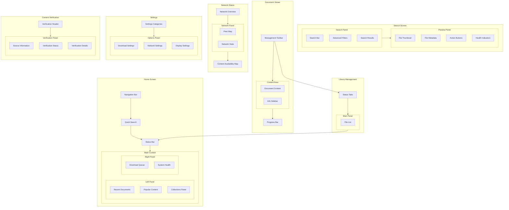

```mermaid
graph TB
    %% Home Screen Wireframe
    subgraph HomeScreen[Home Screen]
        direction TB
        NavBar[Navigation Bar]
        QuickSearch[Quick Search]
        StatusBar[Status Bar]

        subgraph MainContent[Main Content]
            direction LR
            subgraph LeftPanel[Left Panel]
                RecentDocs[Recent Documents]
                PopularContent[Popular Content]
                Collections[Collections]
            end

            subgraph RightPanel[Right Panel]
                DownloadQueue[Download Queue]
                SystemHealth[System Health]
            end
        end

        NavBar --> QuickSearch
        QuickSearch --> StatusBar
        StatusBar --> MainContent
    end

    %% Search Screen Wireframe
    subgraph SearchScreen[Search Screen]
        direction LR
        subgraph SearchPanel[Search Panel]
            direction TB
            SearchBar[Search Bar]
            Filters[Advanced Filters]
            Results[Search Results]
        end

        subgraph PreviewPanel[Preview Panel]
            direction TB
            Thumbnail[File Thumbnail]
            Metadata[File Metadata]
            Actions[Action Buttons]
            Health[Health Indicators]
        end

        SearchPanel --> PreviewPanel
    end

    %% Document Viewer Wireframe
    subgraph DocViewer[Document Viewer]
        direction TB
        Toolbar[Viewer Toolbar]

        subgraph ContentArea[Content Area]
            direction LR
            Document[Document Content]
            Sidebar[Info Sidebar]
        end

        ProgressBar[Progress Bar]

        Toolbar --> ContentArea
        ContentArea --> ProgressBar
    end

    %% Library Management Wireframe
    subgraph Library[Library Management]
        direction TB
        Toolbar[Management Toolbar]
        StatusTabs[Status Tabs]

        subgraph MainPanel[Main Panel]
            direction LR
            Collections[Collections Panel]
            FileList[File List]
        end

        StatusBar[Status Bar]

        Toolbar --> StatusTabs
        StatusTabs --> MainPanel
        MainPanel --> StatusBar
    end

    %% Network Status Wireframe
    subgraph Network[Network Status]
        direction TB
        Overview[Network Overview]

        subgraph NetworkPanel[Network Panel]
            direction LR
            PeerMap[Peer Map]
            Stats[Network Stats]
        end

        ContentMap[Content Availability Map]

        Overview --> NetworkPanel
        NetworkPanel --> ContentMap
    end

    %% Settings Wireframe
    subgraph Settings[Settings]
        direction TB
        Categories[Settings Categories]

        subgraph OptionsPanel[Options Panel]
            direction TB
            DownloadSettings[Download Settings]
            NetworkSettings[Network Settings]
            DisplaySettings[Display Settings]
        end

        Categories --> OptionsPanel
    end

    %% Content Verification Wireframe
    subgraph Verification[Content Verification]
        direction TB
        Header[Verification Header]

        subgraph VerificationPanel[Verification Panel]
            direction TB
            SourceInfo[Source Information]
            Status[Verification Status]
            Details[Verification Details]
        end

        Header --> VerificationPanel
    end
```
