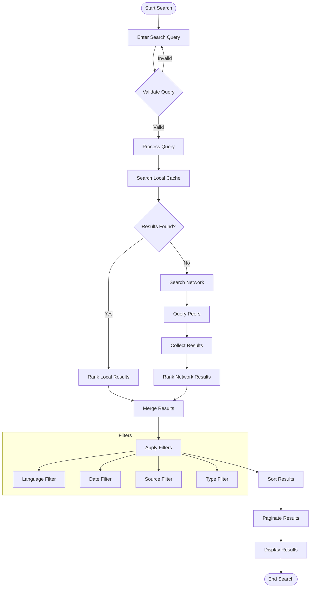

```mermaid
flowchart TD
    Start([Start Search]) --> Input[Enter Search Query]
    Input --> Validate{Validate Query}
    Validate -->|Invalid| Input
    Validate -->|Valid| Process[Process Query]

    Process --> LocalSearch[Search Local Cache]
    LocalSearch --> CheckResults{Results Found?}

    CheckResults -->|Yes| RankLocal[Rank Local Results]
    CheckResults -->|No| NetworkSearch[Search Network]

    NetworkSearch --> PeerQuery[Query Peers]
    PeerQuery --> CollectResults[Collect Results]
    CollectResults --> RankNetwork[Rank Network Results]

    RankLocal --> MergeResults[Merge Results]
    RankNetwork --> MergeResults

    MergeResults --> Filter[Apply Filters]
    Filter --> Sort[Sort Results]
    Sort --> Paginate[Paginate Results]
    Paginate --> Display[Display Results]
    Display --> End([End Search])

    subgraph Filters
        Filter --> Language[Language Filter]
        Filter --> Date[Date Filter]
        Filter --> Source[Source Filter]
        Filter --> Type[Type Filter]
    end
```
