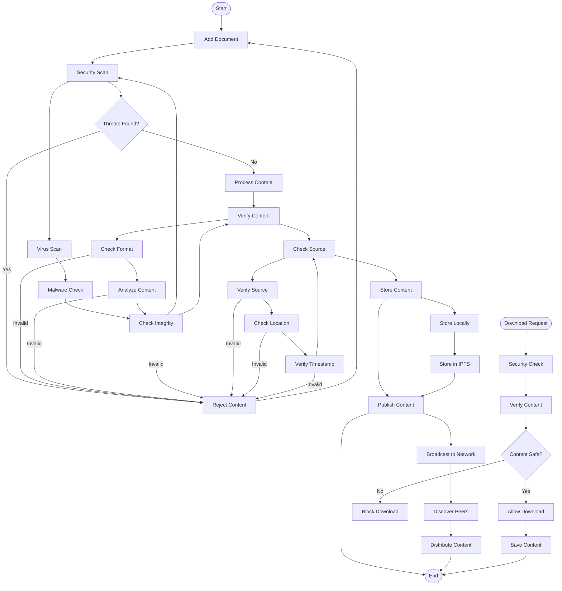

```mermaid
graph TB
    %% Document Processing Flow
    Start([Start]) --> AddDoc[Add Document]
    AddDoc --> SecurityScan[Security Scan]
    SecurityScan --> ThreatCheck{Threats Found?}
    ThreatCheck -->|Yes| RejectContent[Reject Content]
    ThreatCheck -->|No| ProcessContent[Process Content]
    ProcessContent --> VerifyContent[Verify Content]
    VerifyContent --> CheckSource[Check Source]
    CheckSource --> StoreContent[Store Content]
    StoreContent --> PublishContent[Publish Content]
    PublishContent --> End([End])

    %% Security Scanning Flow
    SecurityScan --> VirusScan[Virus Scan]
    VirusScan --> MalwareCheck[Malware Check]
    MalwareCheck --> IntegrityCheck[Integrity Check]
    IntegrityCheck --> SecurityScan

    %% Content Verification Flow
    VerifyContent --> FormatCheck[Check Format]
    FormatCheck --> ContentAnalysis[Analyze Content]
    ContentAnalysis --> IntegrityCheck[Check Integrity]
    IntegrityCheck --> VerifyContent

    %% Source Verification Flow
    CheckSource --> SourceCheck[Verify Source]
    SourceCheck --> LocationCheck[Check Location]
    LocationCheck --> TimestampCheck[Verify Timestamp]
    TimestampCheck --> CheckSource

    %% Error Handling
    FormatCheck -->|Invalid| RejectContent
    ContentAnalysis -->|Invalid| RejectContent
    IntegrityCheck -->|Invalid| RejectContent
    SourceCheck -->|Invalid| RejectContent
    LocationCheck -->|Invalid| RejectContent
    TimestampCheck -->|Invalid| RejectContent
    RejectContent --> AddDoc

    %% Content Storage Flow
    StoreContent --> LocalStorage[Store Locally]
    LocalStorage --> IPFSStorage[Store in IPFS]
    IPFSStorage --> PublishContent

    %% Content Publishing Flow
    PublishContent --> NetworkBroadcast[Broadcast to Network]
    NetworkBroadcast --> PeerDiscovery[Discover Peers]
    PeerDiscovery --> ContentDistribution[Distribute Content]
    ContentDistribution --> End

    %% Download Flow
    Download([Download Request]) --> SecurityCheck[Security Check]
    SecurityCheck --> ContentVerify[Verify Content]
    ContentVerify --> DownloadCheck{Content Safe?}
    DownloadCheck -->|No| BlockDownload[Block Download]
    DownloadCheck -->|Yes| AllowDownload[Allow Download]
    AllowDownload --> SaveContent[Save Content]
    SaveContent --> End
```
