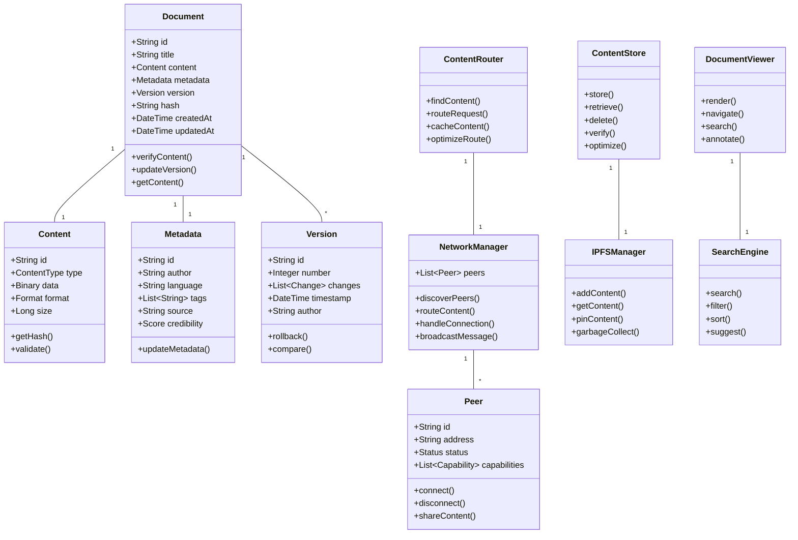

```mermaid
classDiagram
    %% Core Domain Classes
    class Document {
        +String id
        +String title
        +Content content
        +Metadata metadata
        +Version version
        +String hash
        +DateTime createdAt
        +DateTime updatedAt
        +verifyContent()
        +updateVersion()
        +getContent()
    }

    class Content {
        +String id
        +ContentType type
        +Binary data
        +Format format
        +Long size
        +getHash()
        +validate()
    }

    class Metadata {
        +String id
        +String author
        +String language
        +List~String~ tags
        +String source
        +Score credibility
        +updateMetadata()
    }

    class Version {
        +String id
        +Integer number
        +List~Change~ changes
        +DateTime timestamp
        +String author
        +rollback()
        +compare()
    }

    %% P2P Network Classes
    class Peer {
        +String id
        +String address
        +Status status
        +List~Capability~ capabilities
        +connect()
        +disconnect()
        +shareContent()
    }

    class NetworkManager {
        +List~Peer~ peers
        +discoverPeers()
        +routeContent()
        +handleConnection()
        +broadcastMessage()
    }

    class ContentRouter {
        +findContent()
        +routeRequest()
        +cacheContent()
        +optimizeRoute()
    }

    %% Storage Classes
    class ContentStore {
        +store()
        +retrieve()
        +delete()
        +verify()
        +optimize()
    }

    class IPFSManager {
        +addContent()
        +getContent()
        +pinContent()
        +garbageCollect()
    }

    %% UI Classes
    class DocumentViewer {
        +render()
        +navigate()
        +search()
        +annotate()
    }

    class SearchEngine {
        +search()
        +filter()
        +sort()
        +suggest()
    }

    %% Relationships
    Document "1" -- "1" Content
    Document "1" -- "1" Metadata
    Document "1" -- "*" Version
    NetworkManager "1" -- "*" Peer
    ContentRouter "1" -- "1" NetworkManager
    ContentStore "1" -- "1" IPFSManager
    DocumentViewer "1" -- "1" SearchEngine
```
