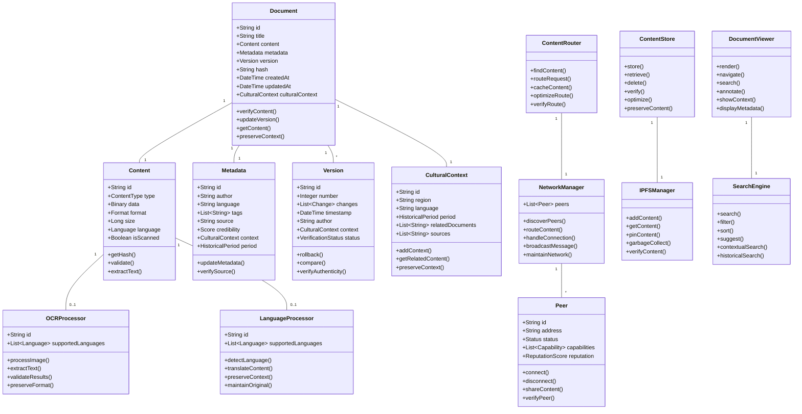

```mermaid
classDiagram
    %% Core Domain Classes
    class Document {
        +String id
        +String title
        +Content content
        +Metadata metadata
        +Version version
        +String hash
        +DateTime createdAt
        +DateTime updatedAt
        +CulturalContext culturalContext
        +verifyContent()
        +updateVersion()
        +getContent()
        +preserveContext()
    }

    class Content {
        +String id
        +ContentType type
        +Binary data
        +Format format
        +Long size
        +Language language
        +Boolean isScanned
        +getHash()
        +validate()
        +extractText()
    }

    class Metadata {
        +String id
        +String author
        +String language
        +List~String~ tags
        +String source
        +Score credibility
        +CulturalContext context
        +HistoricalPeriod period
        +updateMetadata()
        +verifySource()
    }

    class Version {
        +String id
        +Integer number
        +List~Change~ changes
        +DateTime timestamp
        +String author
        +CulturalContext context
        +VerificationStatus status
        +rollback()
        +compare()
        +verifyAuthenticity()
    }

    class CulturalContext {
        +String id
        +String region
        +String language
        +HistoricalPeriod period
        +List~String~ relatedDocuments
        +List~String~ sources
        +addContext()
        +getRelatedContent()
        +preserveContext()
    }

    %% P2P Network Classes
    class Peer {
        +String id
        +String address
        +Status status
        +List~Capability~ capabilities
        +ReputationScore reputation
        +connect()
        +disconnect()
        +shareContent()
        +verifyPeer()
    }

    class NetworkManager {
        +List~Peer~ peers
        +discoverPeers()
        +routeContent()
        +handleConnection()
        +broadcastMessage()
        +maintainNetwork()
    }

    class ContentRouter {
        +findContent()
        +routeRequest()
        +cacheContent()
        +optimizeRoute()
        +verifyRoute()
    }

    %% Storage Classes
    class ContentStore {
        +store()
        +retrieve()
        +delete()
        +verify()
        +optimize()
        +preserveContent()
    }

    class IPFSManager {
        +addContent()
        +getContent()
        +pinContent()
        +garbageCollect()
        +verifyContent()
    }

    %% Processing Classes
    class OCRProcessor {
        +String id
        +List~Language~ supportedLanguages
        +processImage()
        +extractText()
        +validateResults()
        +preserveFormat()
    }

    class LanguageProcessor {
        +String id
        +List~Language~ supportedLanguages
        +detectLanguage()
        +translateContent()
        +preserveContext()
        +maintainOriginal()
    }

    %% UI Classes
    class DocumentViewer {
        +render()
        +navigate()
        +search()
        +annotate()
        +showContext()
        +displayMetadata()
    }

    class SearchEngine {
        +search()
        +filter()
        +sort()
        +suggest()
        +contextualSearch()
        +historicalSearch()
    }

    %% Relationships
    Document "1" -- "1" Content
    Document "1" -- "1" Metadata
    Document "1" -- "*" Version
    Document "1" -- "1" CulturalContext
    NetworkManager "1" -- "*" Peer
    ContentRouter "1" -- "1" NetworkManager
    ContentStore "1" -- "1" IPFSManager
    DocumentViewer "1" -- "1" SearchEngine
    Content "1" -- "0..1" OCRProcessor
    Content "1" -- "0..1" LanguageProcessor
```
