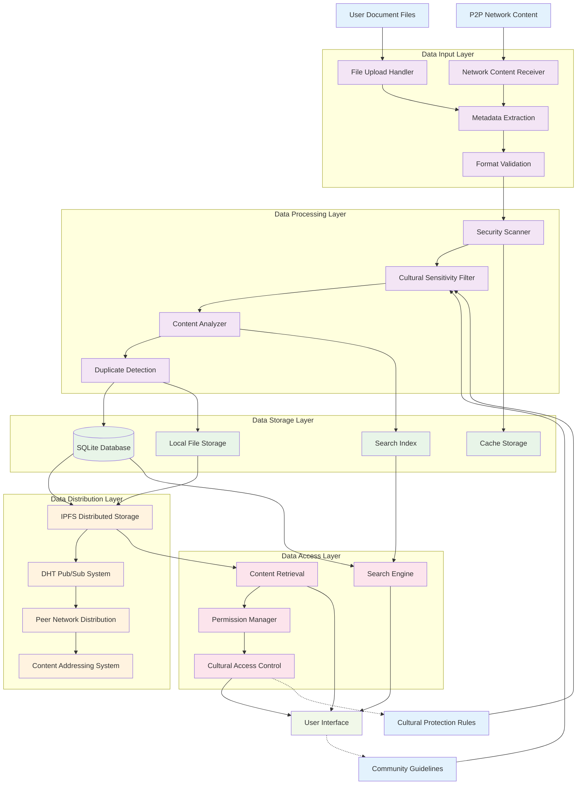
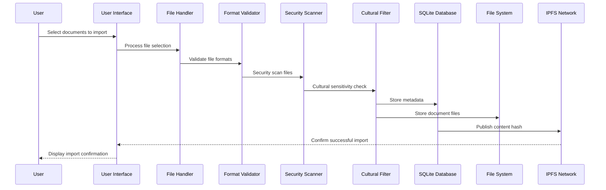
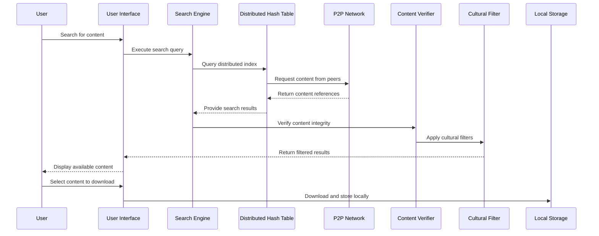
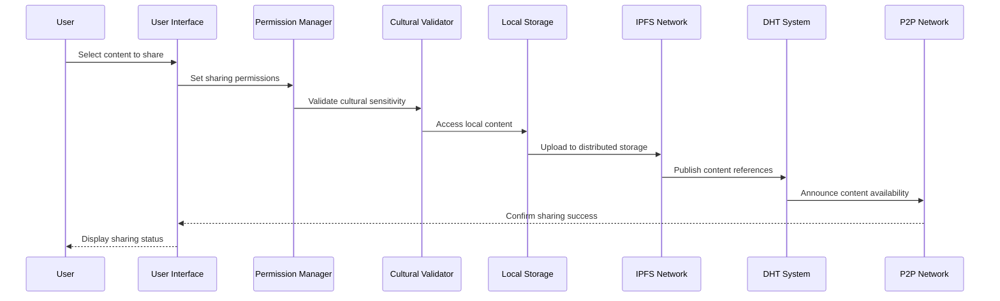

# AlLibrary Data Flow Diagram

## Overview

This diagram illustrates how data flows through the AlLibrary system, from document import to P2P sharing and community interaction.

## Complete System Data Flow



## Document Import Data Flow



## P2P Content Discovery Data Flow



## Content Sharing Data Flow



## Data Types and Structures

### **Document Metadata**

```yaml
DocumentMetadata:
  id: UUID
  title: String
  author: String
  file_type: Enum[PDF, EPUB]
  file_size: Integer
  content_hash: String
  cultural_sensitivity: Enum[Public, Restricted, Sacred]
  permissions: Array[Permission]
  created_at: DateTime
  modified_at: DateTime
  tags: Array[String]
  collections: Array[UUID]
```

### **Cultural Protection Data**

```yaml
CulturalProtection:
  content_id: UUID
  sensitivity_level: Enum[Low, Medium, High, Sacred]
  community_origin: String
  access_restrictions: Object
    geographic: Array[String]
    temporal: Object
    ceremonial: Boolean
  approval_required: Boolean
  elder_verification: Boolean
  attribution_required: Boolean
```

### **P2P Network Data**

```yaml
NetworkMessage:
  message_type: Enum[Query, Response, Announcement]
  peer_id: String
  content_hash: String
  metadata: Object
  signature: String
  timestamp: DateTime
  ttl: Integer
```

### **Search Index Data**

```yaml
SearchIndex:
  content_id: UUID
  content_text: String (Full-text)
  metadata_index: Object
    title: String
    author: String
    tags: Array[String]
  cultural_index: Object
    sensitivity: String
    community: String
    permissions: Array[String]
  vector_embeddings: Array[Float] (Future semantic search)
```

## Data Security and Privacy

### **Encryption Layers**

1. **Transport Encryption**: All network communication encrypted with TLS
2. **Content Encryption**: Sensitive content encrypted with user-controlled keys
3. **Metadata Protection**: Personal metadata encrypted locally
4. **Cultural Protection**: Sacred content protected with community keys

### **Data Sovereignty**

1. **User Control**: Users control their data sharing and retention
2. **Community Control**: Cultural communities control sensitive content
3. **Decentralized Storage**: No central data collection points
4. **Right to Deletion**: Users can remove content from network

### **Privacy Protection**

1. **Anonymous Sharing**: Content can be shared without revealing identity
2. **Selective Disclosure**: Granular control over what data is shared
3. **Local-First**: Primary data storage is local to user
4. **Network Anonymity**: P2P communication can be anonymous
