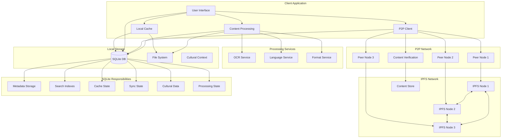

```mermaid
graph TB
    %% Client Node
    subgraph Client[Client Application]
        UI[User Interface]
        LocalCache[Local Cache]
        P2PClient[P2P Client]
        Processing[Content Processing]
    end

    %% Network Nodes
    subgraph Network[P2P Network]
        Peer1[Peer Node 1]
        Peer2[Peer Node 2]
        Peer3[Peer Node 3]
        Verification[Content Verification]
    end

    %% IPFS Network
    subgraph IPFSNetwork[IPFS Network]
        IPFSNode1[IPFS Node 1]
        IPFSNode2[IPFS Node 2]
        IPFSNode3[IPFS Node 3]
        ContentStore[Content Store]
    end

    %% Processing Services
    subgraph ProcessingServices[Processing Services]
        OCR[OCR Service]
        Language[Language Service]
        Format[Format Service]
    end

    %% Connections
    UI --> LocalCache
    UI --> P2PClient
    UI --> Processing
    P2PClient --> Peer1
    P2PClient --> Peer2
    P2PClient --> Peer3
    P2PClient --> Verification

    Peer1 --> IPFSNode1
    Peer2 --> IPFSNode2
    Peer3 --> IPFSNode3
    Verification --> ContentStore

    IPFSNode1 <--> IPFSNode2
    IPFSNode2 <--> IPFSNode3
    IPFSNode3 <--> IPFSNode1

    Processing --> OCR
    Processing --> Language
    Processing --> Format

    %% Storage
    subgraph Storage[Local Storage]
        SQLite[(SQLite DB)]
        FileSystem[File System]
        ContextStore[Cultural Context]
    end

    %% SQLite Connections
    LocalCache --> SQLite
    UI --> SQLite
    P2PClient --> SQLite
    Processing --> SQLite

    %% File System Connections
    LocalCache --> FileSystem
    Processing --> FileSystem

    %% SQLite Responsibilities
    subgraph SQLiteRoles[SQLite Responsibilities]
        Metadata[Metadata Storage]
        Indexes[Search Indexes]
        CacheState[Cache State]
        SyncState[Sync State]
        CulturalData[Cultural Data]
        ProcessingState[Processing State]
    end

    SQLite --> Metadata
    SQLite --> Indexes
    SQLite --> CacheState
    SQLite --> SyncState
    SQLite --> CulturalData
    SQLite --> ProcessingState
```
