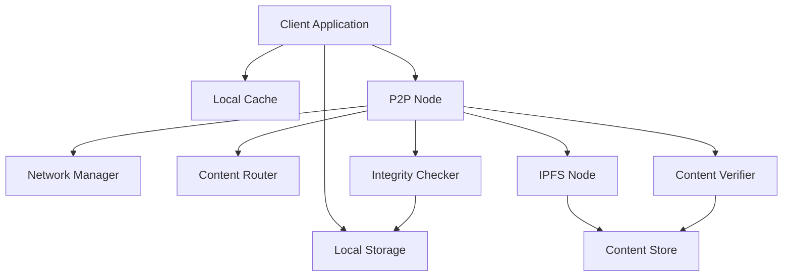

```mermaid
graph TB
    %% Client Application
    Client[Client Application]
    LocalStorage[Local Storage]
    Cache[Local Cache]

    %% P2P Network
    P2PNode[P2P Node]
    NetworkManager[Network Manager]
    ContentRouter[Content Router]

    %% Storage
    IPFSNode[IPFS Node]
    ContentStore[Content Store]

    %% Security
    Verifier[Content Verifier]
    IntegrityChecker[Integrity Checker]

    %% Relationships
    Client --> LocalStorage
    Client --> Cache
    Client --> P2PNode
    P2PNode --> NetworkManager
    P2PNode --> ContentRouter
    P2PNode --> IPFSNode
    IPFSNode --> ContentStore
    P2PNode --> Verifier
    P2PNode --> IntegrityChecker
    Verifier --> ContentStore
    IntegrityChecker --> LocalStorage
```
