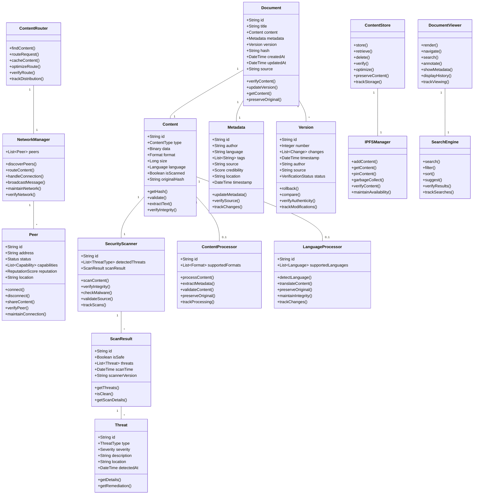

```mermaid
classDiagram
    %% Core Domain Classes
    class Document {
        +String id
        +String title
        +Content content
        +Metadata metadata
        +Version version
        +String hash
        +DateTime createdAt
        +DateTime updatedAt
        +String source
        +verifyContent()
        +updateVersion()
        +getContent()
        +preserveOriginal()
    }

    class Content {
        +String id
        +ContentType type
        +Binary data
        +Format format
        +Long size
        +Language language
        +Boolean isScanned
        +String originalHash
        +getHash()
        +validate()
        +extractText()
        +verifyIntegrity()
    }

    class Metadata {
        +String id
        +String author
        +String language
        +List~String~ tags
        +String source
        +Score credibility
        +String location
        +DateTime timestamp
        +updateMetadata()
        +verifySource()
        +trackChanges()
    }

    class Version {
        +String id
        +Integer number
        +List~Change~ changes
        +DateTime timestamp
        +String author
        +String source
        +VerificationStatus status
        +rollback()
        +compare()
        +verifyAuthenticity()
        +trackModifications()
    }

    %% Security Classes
    class SecurityScanner {
        +String id
        +List~ThreatType~ detectedThreats
        +ScanResult scanResult
        +scanContent()
        +verifyIntegrity()
        +checkMalware()
        +validateSource()
        +trackScans()
    }

    class ScanResult {
        +String id
        +Boolean isSafe
        +List~Threat~ threats
        +DateTime scanTime
        +String scannerVersion
        +getThreats()
        +isClean()
        +getScanDetails()
    }

    class Threat {
        +String id
        +ThreatType type
        +Severity severity
        +String description
        +String location
        +DateTime detectedAt
        +getDetails()
        +getRemediation()
    }

    %% P2P Network Classes
    class Peer {
        +String id
        +String address
        +Status status
        +List~Capability~ capabilities
        +ReputationScore reputation
        +String location
        +connect()
        +disconnect()
        +shareContent()
        +verifyPeer()
        +maintainConnection()
    }

    class NetworkManager {
        +List~Peer~ peers
        +discoverPeers()
        +routeContent()
        +handleConnection()
        +broadcastMessage()
        +maintainNetwork()
        +verifyNetwork()
    }

    class ContentRouter {
        +findContent()
        +routeRequest()
        +cacheContent()
        +optimizeRoute()
        +verifyRoute()
        +trackDistribution()
    }

    %% Storage Classes
    class ContentStore {
        +store()
        +retrieve()
        +delete()
        +verify()
        +optimize()
        +preserveContent()
        +trackStorage()
    }

    class IPFSManager {
        +addContent()
        +getContent()
        +pinContent()
        +garbageCollect()
        +verifyContent()
        +maintainAvailability()
    }

    %% Processing Classes
    class ContentProcessor {
        +String id
        +List~Format~ supportedFormats
        +processContent()
        +extractMetadata()
        +validateContent()
        +preserveOriginal()
        +trackProcessing()
    }

    class LanguageProcessor {
        +String id
        +List~Language~ supportedLanguages
        +detectLanguage()
        +translateContent()
        +preserveOriginal()
        +maintainIntegrity()
        +trackChanges()
    }

    %% UI Classes
    class DocumentViewer {
        +render()
        +navigate()
        +search()
        +annotate()
        +showMetadata()
        +displayHistory()
        +trackViewing()
    }

    class SearchEngine {
        +search()
        +filter()
        +sort()
        +suggest()
        +verifyResults()
        +trackSearches()
    }

    %% Relationships
    Document "1" -- "1" Content
    Document "1" -- "1" Metadata
    Document "1" -- "*" Version
    Content "1" -- "1" SecurityScanner
    SecurityScanner "1" -- "*" ScanResult
    ScanResult "1" -- "*" Threat
    NetworkManager "1" -- "*" Peer
    ContentRouter "1" -- "1" NetworkManager
    ContentStore "1" -- "1" IPFSManager
    DocumentViewer "1" -- "1" SearchEngine
    Content "1" -- "0..1" ContentProcessor
    Content "1" -- "0..1" LanguageProcessor
```
