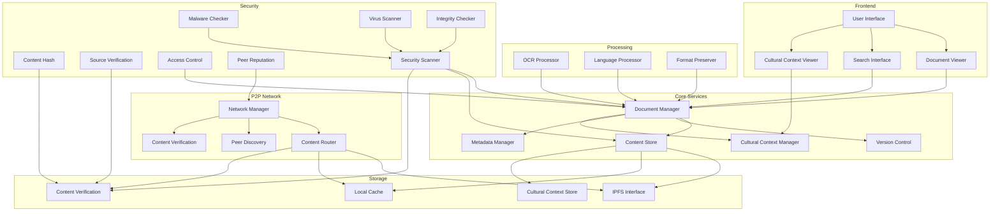

```mermaid
graph TB
    %% Frontend Components
    subgraph Frontend
        Viewer[Document Viewer]
        Search[Search Interface]
        UI[User Interface]
        Context[Cultural Context Viewer]
    end

    %% Core Services
    subgraph CoreServices[Core Services]
        DocManager[Document Manager]
        Store[Content Store]
        Version[Version Control]
        Metadata[Metadata Manager]
        Cultural[Cultural Context Manager]
    end

    %% P2P Network
    subgraph P2PNetwork[P2P Network]
        Network[Network Manager]
        Router[Content Router]
        Discovery[Peer Discovery]
        Verification[Content Verification]
    end

    %% Storage
    subgraph Storage
        IPFS[IPFS Interface]
        Cache[Local Cache]
        Verify[Content Verification]
        ContextStore[Cultural Context Store]
    end

    %% Processing
    subgraph Processing
        OCR[OCR Processor]
        Language[Language Processor]
        Format[Format Preserver]
    end

    %% Security
    subgraph Security
        Hash[Content Hash]
        Source[Source Verification]
        Access[Access Control]
        Reputation[Peer Reputation]
        Scanner[Security Scanner]
        MalwareCheck[Malware Checker]
        VirusScan[Virus Scanner]
        IntegrityCheck[Integrity Checker]
    end

    %% Frontend Connections
    UI --> Viewer
    UI --> Search
    UI --> Context
    Viewer --> DocManager
    Search --> DocManager
    Context --> Cultural

    %% Core Service Connections
    DocManager --> Store
    DocManager --> Version
    DocManager --> Metadata
    DocManager --> Cultural
    Store --> IPFS
    Store --> Cache
    Store --> ContextStore

    %% Network Connections
    Network --> Router
    Network --> Discovery
    Network --> Verification
    Router --> IPFS
    Router --> Cache
    Router --> Verify

    %% Processing Connections
    OCR --> DocManager
    Language --> DocManager
    Format --> DocManager

    %% Security Connections
    Hash --> Verify
    Source --> Verify
    Access --> DocManager
    Reputation --> Network
    Scanner --> DocManager
    Scanner --> Store
    MalwareCheck --> Scanner
    VirusScan --> Scanner
    IntegrityCheck --> Scanner
    Scanner --> Verify
```
