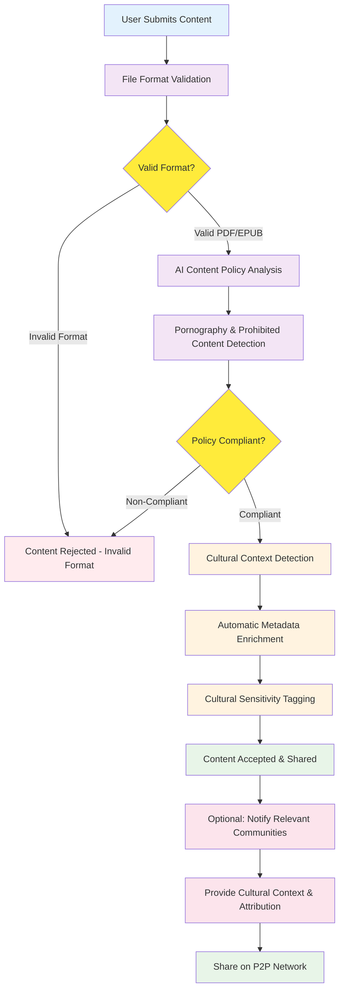
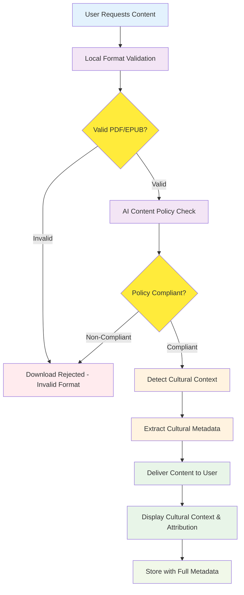
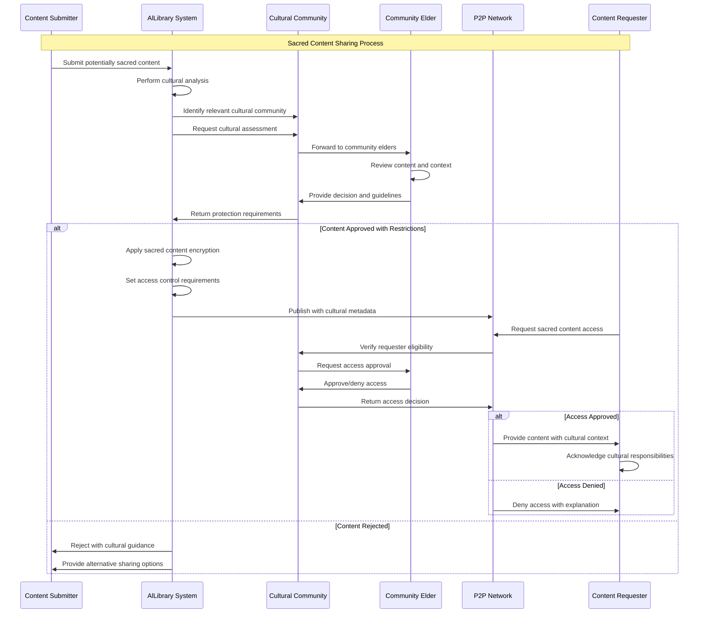
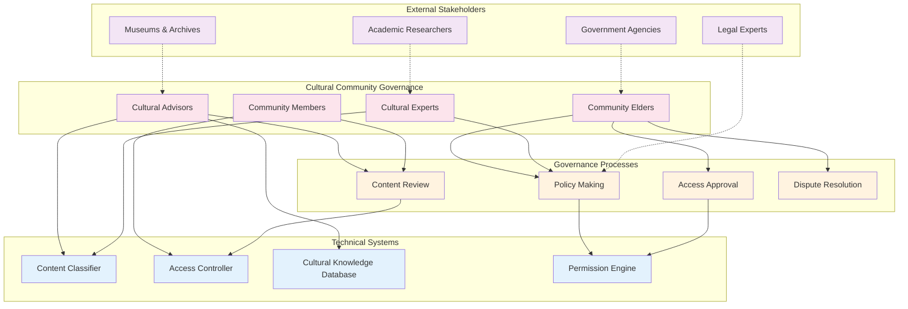
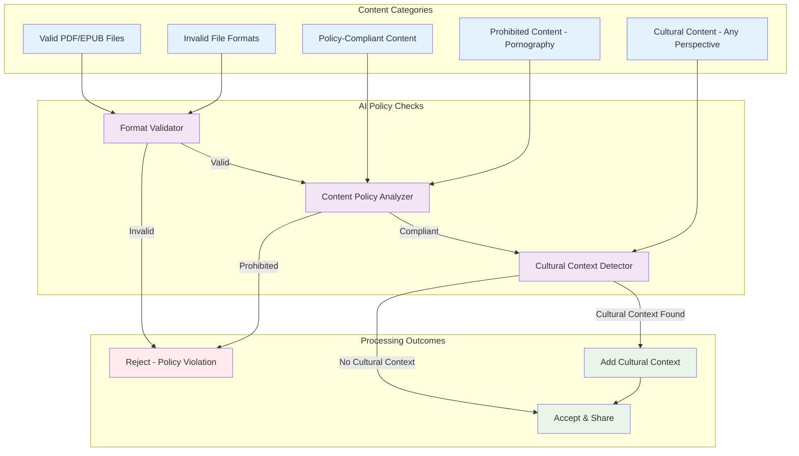
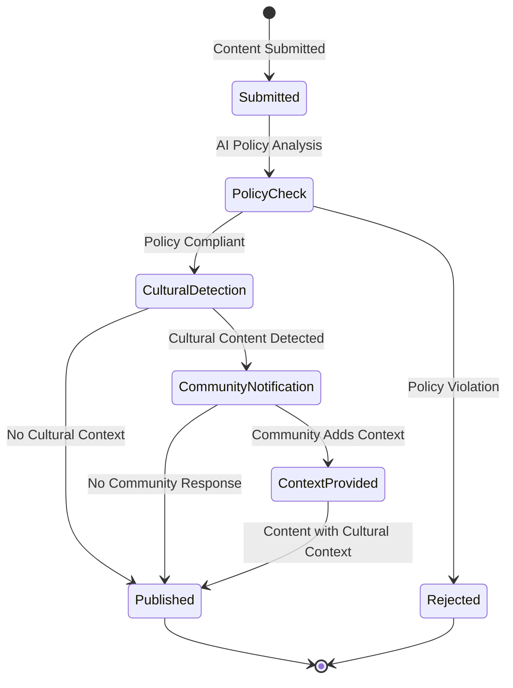

# AlLibrary Cultural Protection Workflow

## Overview

This document illustrates the cultural sensitivity and content policy mechanisms built into AlLibrary, supporting the **"multiple faces of truth"** philosophy. The system operates in a **fully decentralized manner** with **AI-powered automatic analysis** that only enforces basic technical and content policies (file format validation and prohibited content detection), while preserving cultural context and attribution. **No content is blocked based on cultural perspectives or community votes** - the system respects diverse viewpoints and cultural interpretations.

## Cultural Content Classification Workflow



## Automatic Analysis on Download



## Sacred Content Protection Protocol



## Community Governance Structure



## Content Policy Enforcement Matrix



## Cultural Protection Features

### **Automatic Detection Systems**

#### **AI-Powered Content Policy Enforcement**

- **Local Processing**: All analysis performed on user's device (no central servers)
- **Format Validation**: Ensures only PDF and EPUB files are accepted
- **Content Policy Check**: Detects and blocks pornography and prohibited content
- **Cultural Context Detection**: Identifies cultural content for attribution (not blocking)
- **Real-time Analysis**: Instant validation on both upload and download

#### **Language and Script Detection**

- Automatic identification of indigenous languages
- Script recognition for various writing systems
- Cultural symbol and pattern recognition
- Context-aware keyword detection

#### **Content Analysis**

- Religious and spiritual content identification
- Ceremonial and ritual material detection
- Traditional knowledge pattern recognition
- Sacred site and location references

#### **Metadata Enrichment**

- Automatic cultural tagging
- Community origin identification
- Traditional knowledge classification
- Cultural context preservation

#### **Multiple Faces of Truth Philosophy**

- **No Content Blocking**: Cultural perspectives and interpretations are never blocked
- **Context Preservation**: Cultural context and attribution are preserved and displayed
- **Diverse Viewpoints**: System supports multiple cultural interpretations of the same content
- **Community Information**: Communities can provide context but cannot deny access
- **Educational Approach**: Users learn about cultural significance without restriction

### **Community Integration Features**

#### **Cultural Context Workflow**



#### **Community Information System**

- Optional notifications to relevant communities about cultural content
- Communities can provide educational context and attribution
- Multiple communities can offer different perspectives on the same content
- Cultural information is displayed to users for educational purposes
- **No blocking or restriction powers** - communities inform, don't control

#### **Attribution and Context Preservation**

- Automatic detection and preservation of cultural significance
- Community-provided context and attribution displayed alongside content
- Multiple cultural perspectives can coexist for the same content
- Educational information about cultural importance and proper usage
- Respectful presentation without access restrictions

### **Technical Implementation**

#### **Content Policy Configuration**

```yaml
Content Policy Enforcement:
  Format Validation:
    Allowed Types: ["PDF", "EPUB"]
    Max File Size: "500MB"
    Validation: "Local AI analysis"

  Prohibited Content Detection:
    Categories: ["Pornography", "Explicit Sexual Content", "Malware"]
    Detection Method: "AI content analysis"
    Action: "Reject with explanation"

  Cultural Context Detection:
    Purpose: "Educational and attribution only"
    Action: "Add context, never block"
    Community Role: "Provide information, not control"
```

#### **Cultural Context Metadata Schema**

```yaml
Cultural Context Metadata:
  detected_cultural_elements: Array[String]
  origin_community: String (optional)
  cultural_significance: String (educational)
  attribution_information: Object
    community_attribution: String
    individual_attribution: String
    traditional_acknowledgment: String
  educational_context: Object
    cultural_background: String
    significance_explanation: String
    respectful_usage_notes: String
  multiple_perspectives: Array[Object]
    perspective_source: String
    cultural_viewpoint: String
    additional_context: String
```

### **Ethical Guidelines and Best Practices**

#### **Content Sharing Ethics - Multiple Faces of Truth**

1. **Open Access Philosophy**: All perspectives and cultural interpretations are welcome
2. **Educational Attribution**: Provide proper context and attribution for cultural content
3. **Multiple Perspectives**: Support different viewpoints on the same cultural content
4. **Respectful Presentation**: Present cultural information respectfully without restricting access
5. **Community Information**: Communities provide context and education, not access control
6. **Technical Policy Only**: AI enforces only format validation and prohibited content policies

#### **User Education and Training**

- Cultural sensitivity training for all users
- Community-specific guidelines and protocols
- Regular updates on cultural protection features
- Best practices for cross-cultural interaction
- Resources for learning about different cultures

#### **Ongoing Community Engagement**

- Regular community consultations
- Feedback mechanisms for improving protections
- Community-driven feature development
- Cultural advisory board participation
- Collaborative policy development
