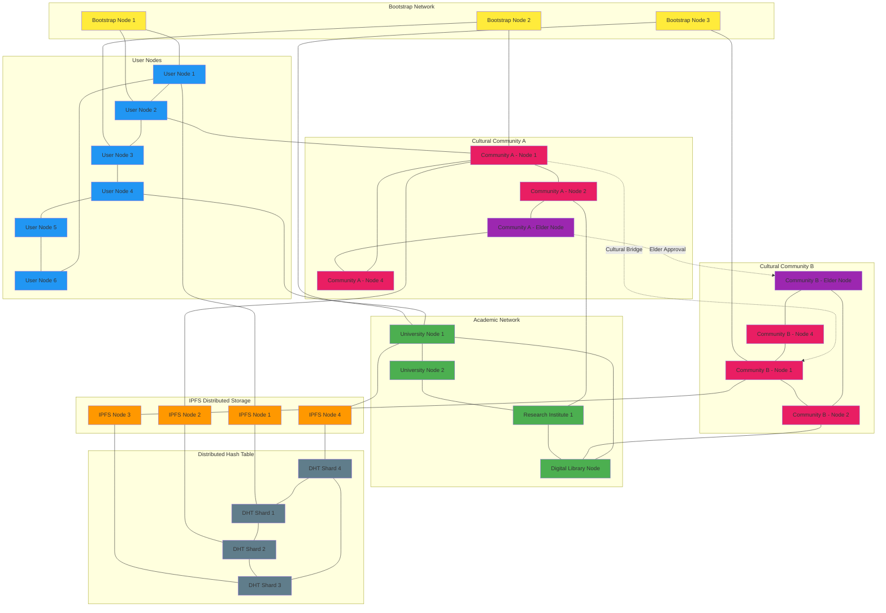
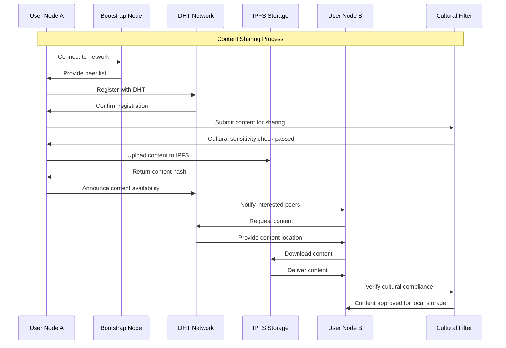
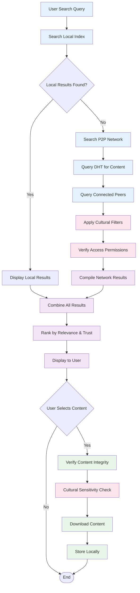
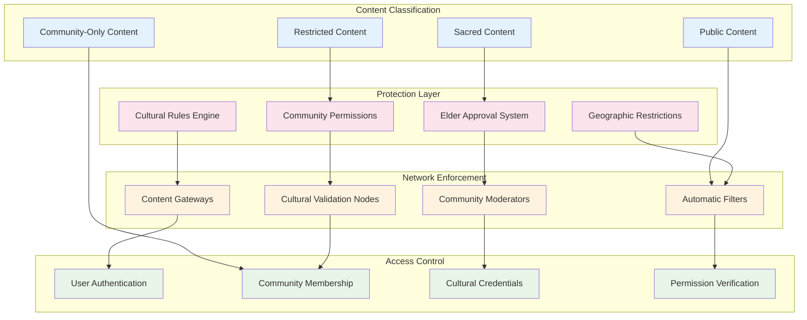

# AlLibrary P2P Network Architecture

## Overview

This diagram illustrates the peer-to-peer network architecture of AlLibrary, showing how nodes connect, communicate, and share content in a decentralized manner while maintaining cultural sensitivity and security.

## Network Topology



## Network Communication Flow



## Content Discovery Process



## Cultural Protection Network



## Network Resilience and Scalability

### **Self-Healing Network**

```mermaid
graph LR
    NodeFailure[Node Failure Detected] --> FailureAnalysis[Analyze Failure Impact]
    FailureAnalysis --> ContentRecovery[Recover Lost Content]
    ContentRecovery --> PeerReconnection[Reconnect to Network]
    PeerReconnection --> NetworkStabilization[Stabilize Network]
    NetworkStabilization --> HealthCheck[Network Health Check]
    HealthCheck --> Normal[Normal Operation]
```



### **Scalability Mechanisms**

- **Distributed Hash Tables**: Efficient content location without central index
- **Content Replication**: Automatic replication based on popularity and cultural importance
- **Load Balancing**: Distribute network load across available nodes
- **Regional Clustering**: Geographic clustering to reduce latency
- **Cultural Clustering**: Community-based clustering for cultural content

### **Network Security Features**

- **Peer Authentication**: Cryptographic verification of peer identity
- **Content Verification**: Hash-based integrity checking
- **Sybil Resistance**: Proof-of-work or stake-based peer validation
- **DDoS Protection**: Rate limiting and traffic analysis
- **Cultural Validation**: Community-based content moderation

## Technical Implementation Details

### **libp2p Integration**

```yaml
Network Protocol Stack:
  Transport: TCP, WebSocket, QUIC
  Security: TLS 1.3, Noise Protocol
  Multiplexing: yamux, mplex
  Peer Discovery: mDNS, DHT, Bootstrap
  Content Routing: Kademlia DHT
  Pubsub: GossipSub for content announcements
```

### **IPFS Integration**

```yaml
Content Storage:
  Addressing: Content-addressed with SHA-256
  Replication: Configurable redundancy levels
  Pinning: Priority-based content persistence
  Garbage Collection: Automatic cleanup of unpopular content
  Cultural Pinning: Community-funded persistent storage
```

### **Cultural Network Features**

```yaml
Cultural Protection:
  Content Classification: Automatic and manual tagging
  Access Control: Multi-level permission system
  Community Validation: Peer review and elder approval
  Geographic Restrictions: IP-based and user-declared location
  Temporal Restrictions: Time-based access for ceremonial content
  Attribution: Mandatory attribution for cultural content
```
