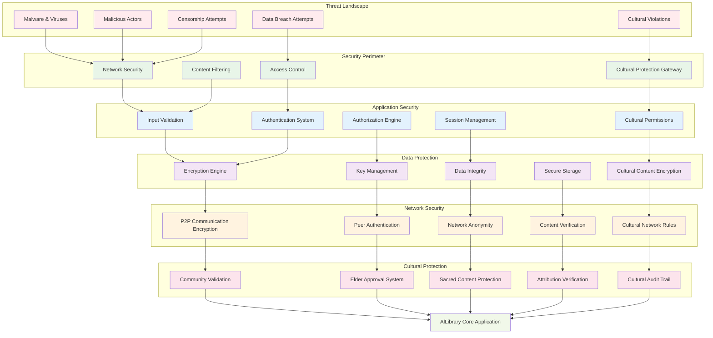
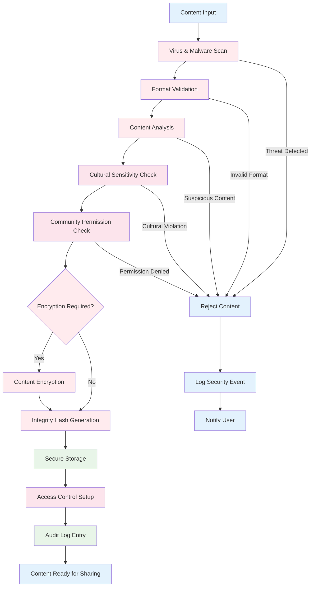
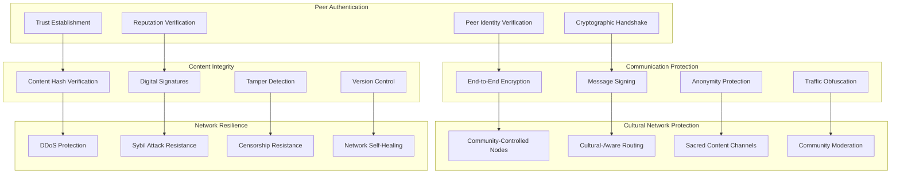

# AlLibrary Security Architecture Diagram

## Overview

This diagram illustrates the comprehensive security architecture of AlLibrary, showing multiple layers of protection for both technical security and cultural sensitivity.

## Multi-Layer Security Architecture

## Content Security Pipeline

## P2P Network Security Model

## Security Threat Model

### **Technical Threats**

#### **High Priority Threats**

1. **Malware Distribution**

   - **Risk**: Infected documents spreading through network
   - **Mitigation**: Multi-layer virus scanning, content sandboxing
   - **Detection**: Real-time scanning, behavioral analysis

2. **Man-in-the-Middle Attacks**

   - **Risk**: Interception of P2P communications
   - **Mitigation**: End-to-end encryption, peer authentication
   - **Detection**: Certificate validation, anomaly detection

3. **Content Tampering**
   - **Risk**: Documents modified during transmission
   - **Mitigation**: Cryptographic hashes, digital signatures
   - **Detection**: Integrity verification, version tracking

#### **Medium Priority Threats**

1. **Sybil Attacks**

   - **Risk**: Fake peers overwhelming network
   - **Mitigation**: Reputation systems, proof-of-work
   - **Detection**: Behavioral analysis, network topology monitoring

2. **Data Exfiltration**
   - **Risk**: Unauthorized access to sensitive content
   - **Mitigation**: Access controls, encryption
   - **Detection**: Audit logging, access pattern analysis

### **Cultural Threats**

#### **High Priority Cultural Threats**

1. **Sacred Content Misuse**

   - **Risk**: Sacred materials accessed inappropriately
   - **Mitigation**: Community-controlled encryption, elder approval
   - **Detection**: Cultural audit trails, community reporting

2. **Cultural Appropriation**

   - **Risk**: Cultural content used without permission
   - **Mitigation**: Attribution requirements, community permissions
   - **Detection**: Community moderation, automated flagging

3. **Context Loss**
   - **Risk**: Cultural content shared without proper context
   - **Mitigation**: Mandatory cultural metadata, context preservation
   - **Detection**: Completeness checking, community validation

## Security Implementation Details

### **Encryption Standards**

- **Content Encryption**: AES-256-GCM for content
- **Key Exchange**: ECDH with P-384 curve
- **Digital Signatures**: EdDSA with Ed25519
- **Hash Functions**: SHA-3 for integrity verification

### **Authentication Mechanisms**

- **Peer Authentication**: libp2p identity verification
- **Content Authentication**: Digital signatures with timestamps
- **Community Authentication**: Multi-signature schemes for cultural content
- **User Authentication**: Local biometric or password-based

### **Access Control Model**

- **Role-Based Access**: User, Community Member, Elder, Administrator
- **Attribute-Based Access**: Cultural sensitivity levels, geographic restrictions
- **Time-Based Access**: Ceremonial timing, seasonal restrictions
- **Community-Based Access**: Community membership validation

### **Audit and Monitoring**

- **Security Event Logging**: All security-relevant events logged
- **Cultural Access Logging**: Cultural content access tracked
- **Network Monitoring**: P2P network health and security monitoring
- **Compliance Reporting**: Regular security and cultural compliance reports
