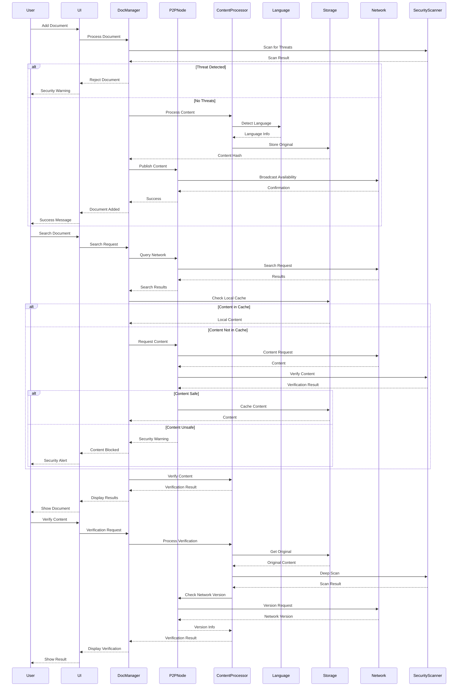

```mermaid
sequenceDiagram
    participant User
    participant UI
    participant DocManager
    participant P2PNode
    participant ContentProcessor
    participant Language
    participant Storage
    participant Network
    participant SecurityScanner

    %% Document Sharing Process
    User->>UI: Add Document
    UI->>DocManager: Process Document
    DocManager->>SecurityScanner: Scan for Threats
    SecurityScanner-->>DocManager: Scan Result
    alt Threat Detected
        DocManager-->>UI: Reject Document
        UI-->>User: Security Warning
    else No Threats
        DocManager->>ContentProcessor: Process Content
        ContentProcessor->>Language: Detect Language
        Language-->>ContentProcessor: Language Info
        ContentProcessor->>Storage: Store Original
        Storage-->>DocManager: Content Hash
        DocManager->>P2PNode: Publish Content
        P2PNode->>Network: Broadcast Availability
        Network-->>P2PNode: Confirmation
        P2PNode-->>DocManager: Success
        DocManager-->>UI: Document Added
        UI-->>User: Success Message
    end

    %% Document Retrieval Process
    User->>UI: Search Document
    UI->>DocManager: Search Request
    DocManager->>P2PNode: Query Network
    P2PNode->>Network: Search Request
    Network-->>P2PNode: Results
    P2PNode-->>DocManager: Search Results
    DocManager->>Storage: Check Local Cache
    alt Content in Cache
        Storage-->>DocManager: Local Content
    else Content Not in Cache
        DocManager->>P2PNode: Request Content
        P2PNode->>Network: Content Request
        Network-->>P2PNode: Content
        P2PNode->>SecurityScanner: Verify Content
        SecurityScanner-->>P2PNode: Verification Result
        alt Content Safe
            P2PNode->>Storage: Cache Content
            Storage-->>DocManager: Content
        else Content Unsafe
            P2PNode-->>DocManager: Security Warning
            DocManager-->>UI: Content Blocked
            UI-->>User: Security Alert
        end
    end
    DocManager->>ContentProcessor: Verify Content
    ContentProcessor-->>DocManager: Verification Result
    DocManager-->>UI: Display Results
    UI-->>User: Show Document

    %% Content Verification Process
    User->>UI: Verify Content
    UI->>DocManager: Verification Request
    DocManager->>ContentProcessor: Process Verification
    ContentProcessor->>Storage: Get Original
    Storage-->>ContentProcessor: Original Content
    ContentProcessor->>SecurityScanner: Deep Scan
    SecurityScanner-->>ContentProcessor: Scan Result
    ContentProcessor->>P2PNode: Check Network Version
    P2PNode->>Network: Version Request
    Network-->>P2PNode: Network Version
    P2PNode-->>ContentProcessor: Version Info
    ContentProcessor-->>DocManager: Verification Result
    DocManager-->>UI: Display Verification
    UI-->>User: Show Result
```
