# AlLibrary System Architecture Diagram

## Overview

This diagram illustrates the complete AlLibrary system architecture, showing how all components interact to create a decentralized, culturally-sensitive document sharing platform.

```mermaid
graph TB
    %% User Interface Layer
    subgraph "Frontend Layer"
        UI[SolidJS Web Interface]
        Mobile[Progressive Web App]
        Desktop[Tauri Desktop App]
    end

    %% Application Layer
    subgraph "Application Layer"
        Router[SolidJS Router]
        StateManager[Global State Management]
        ComponentLibrary[Reusable Components]
        ThemeSystem[Cultural Theme System]
    end

    %% Service Layer
    subgraph "Core Services"
        DocumentService[Document Management Service]
        SearchService[Search & Discovery Service]
        P2PService[P2P Network Service]
        SecurityService[Security & Verification Service]
        CulturalService[Cultural Protection Service]
        StorageService[Storage Management Service]
    end

    %% Backend Layer
    subgraph "Rust Backend"
        TauriCore[Tauri v2 Core]
        DatabaseManager[SQLite Database Manager]
        FileManager[File System Manager]
        CryptoEngine[Encryption Engine]
        NetworkEngine[libp2p Network Engine]
        IPFSClient[IPFS Client]
    end

    %% Data Layer
    subgraph "Data Storage"
        LocalDB[(SQLite Database)]
        LocalFiles[Local File Storage]
        IPFSNetwork[IPFS Distributed Storage]
        DHT[Distributed Hash Table]
    end

    %% External Systems
    subgraph "P2P Network"
        Peers[Other AlLibrary Peers]
        BootstrapNodes[Bootstrap Nodes]
        ContentNodes[Content Provider Nodes]
    end

    %% Cultural Protection
    subgraph "Cultural Safeguards"
        CulturalRules[Cultural Protection Rules]
        CommunityGuidelines[Community Guidelines]
        SensitivityFilters[Content Sensitivity Filters]
        CulturalAdvisors[Cultural Advisory Input]
    end

    %% Connections
    UI --> Router
    Mobile --> Router
    Desktop --> Router
    Router --> StateManager
    StateManager --> ComponentLibrary
    ComponentLibrary --> ThemeSystem

    Router --> DocumentService
    Router --> SearchService
    Router --> P2PService
    Router --> SecurityService
    Router --> CulturalService

    DocumentService --> TauriCore
    SearchService --> TauriCore
    P2PService --> NetworkEngine
    SecurityService --> CryptoEngine
    CulturalService --> CulturalRules
    StorageService --> DatabaseManager

    TauriCore --> DatabaseManager
    TauriCore --> FileManager
    DatabaseManager --> LocalDB
    FileManager --> LocalFiles
    NetworkEngine --> IPFSClient
    IPFSClient --> IPFSNetwork
    NetworkEngine --> DHT

    NetworkEngine --> Peers
    NetworkEngine --> BootstrapNodes
    Peers --> ContentNodes

    CulturalService --> CommunityGuidelines
    CulturalService --> SensitivityFilters
    CulturalRules --> CulturalAdvisors

    %% Styling
    classDef frontend fill:#e1f5fe
    classDef backend fill:#f3e5f5
    classDef storage fill:#e8f5e8
    classDef network fill:#fff3e0
    classDef cultural fill:#fce4ec

    class UI,Mobile,Desktop,Router,StateManager,ComponentLibrary,ThemeSystem frontend
    class TauriCore,DatabaseManager,FileManager,CryptoEngine,NetworkEngine,IPFSClient backend
    class LocalDB,LocalFiles,IPFSNetwork,DHT storage
    class Peers,BootstrapNodes,ContentNodes network
    class CulturalRules,CommunityGuidelines,SensitivityFilters,CulturalAdvisors cultural
```

## Architecture Principles

### **Layered Architecture**

- **Frontend Layer**: User interface components built with SolidJS
- **Application Layer**: Business logic and state management
- **Service Layer**: Core application services
- **Backend Layer**: Rust-based system operations
- **Data Layer**: Local and distributed storage

### **Cultural-First Design**

- Cultural protection integrated at every layer
- Community guidelines enforced throughout system
- Sensitivity filters applied to all content operations
- Cultural advisory input channels built-in

### **Decentralized Architecture**

- No central servers required
- P2P network enables direct peer communication
- IPFS provides distributed content storage
- DHT enables content discovery without central index

### **Security by Design**

- End-to-end encryption for all content
- Content verification and integrity checking
- Secure peer authentication and authorization
- Cultural content protection mechanisms

## Component Responsibilities

### **Frontend Components**

- **SolidJS Interface**: Reactive web-based user interface
- **Progressive Web App**: Mobile-optimized experience
- **Tauri Desktop**: Native desktop application wrapper

### **Core Services**

- **Document Service**: Handle document import, export, and management
- **Search Service**: Full-text search and content discovery
- **P2P Service**: Peer-to-peer networking and communication
- **Security Service**: Encryption, verification, and access control
- **Cultural Service**: Cultural sensitivity and protection features

### **Backend Systems**

- **Tauri Core**: Bridge between frontend and system operations
- **Database Manager**: SQLite operations and data persistence
- **Crypto Engine**: Encryption, hashing, and security operations
- **Network Engine**: libp2p networking and peer management
- **IPFS Client**: Distributed storage and content addressing

### **Data Management**

- **Local Database**: Document metadata, user preferences, cache
- **Local Storage**: Temporary files, thumbnails, offline content
- **IPFS Network**: Distributed document storage and sharing
- **DHT**: Peer discovery and content routing information
