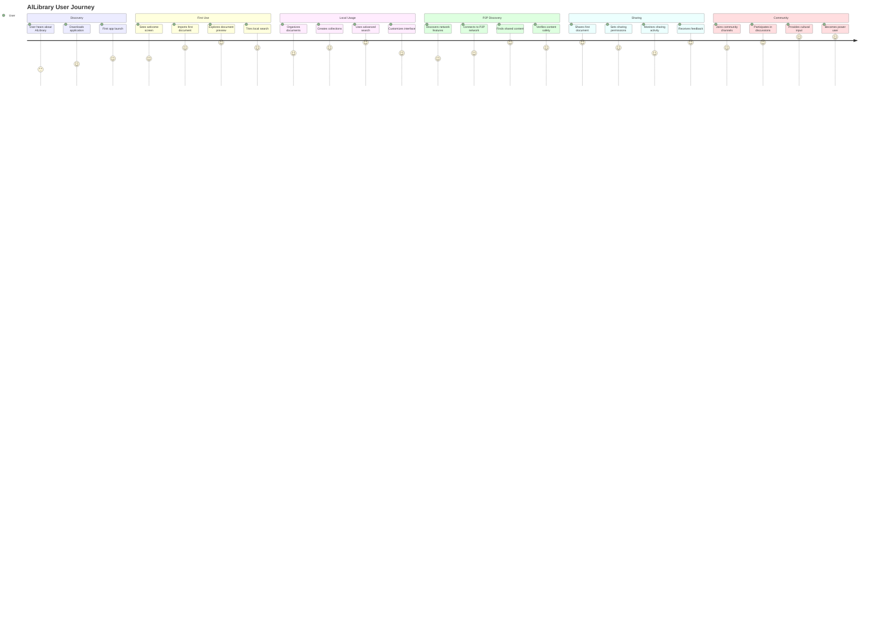
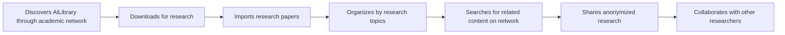
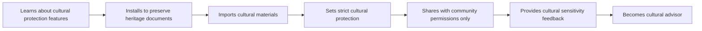
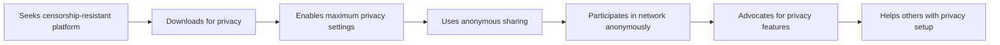

# AlLibrary User Journey Diagram

## Overview

This diagram illustrates the complete user journey through AlLibrary, from initial discovery to advanced P2P document sharing and community participation.

## Detailed User Flow Diagram

```mermaid
flowchart TD
    Start([User Downloads AlLibrary]) --> Install[Install Application]
    Install --> FirstLaunch[First Launch]
    FirstLaunch --> Welcome[Welcome Screen]
    Welcome --> Tutorial{Take Tutorial?}

    Tutorial -->|Yes| GuidedTour[Guided Feature Tour]
    Tutorial -->|No| MainInterface[Main Interface]
    GuidedTour --> MainInterface

    MainInterface --> LocalActions{Choose Action}

    %% Local Document Management
    LocalActions -->|Import| ImportDoc[Import Documents]
    LocalActions -->|Browse| BrowseLocal[Browse Local Documents]
    LocalActions -->|Search| SearchLocal[Search Local Content]
    LocalActions -->|Organize| OrganizeLocal[Create Collections]

    ImportDoc --> DocumentPreview[Preview Documents]
    BrowseLocal --> DocumentPreview
    SearchLocal --> DocumentPreview
    OrganizeLocal --> DocumentPreview

    DocumentPreview --> LocalSatisfied{Satisfied with Local Features?}
    LocalSatisfied -->|No| LocalActions
    LocalSatisfied -->|Yes| ExploreP2P[Explore P2P Features]

    %% P2P Network Features
    ExploreP2P --> NetworkConnect[Connect to Network]
    NetworkConnect --> NetworkStatus{Connection Successful?}
    NetworkStatus -->|No| TryAgain[Check Connection & Retry]
    TryAgain --> NetworkConnect
    NetworkStatus -->|Yes| DiscoverContent[Discover Shared Content]

    DiscoverContent --> ContentBrowse[Browse Available Content]
    ContentBrowse --> ContentVerify[Verify Content Safety]
    ContentVerify --> ContentDownload[Download Content]
    ContentDownload --> ShareOwn{Want to Share Own Content?}

    %% Content Sharing
    ShareOwn -->|Yes| SelectToShare[Select Documents to Share]
    ShareOwn -->|No| CommunityParticipation
    SelectToShare --> SetPermissions[Set Sharing Permissions]
    SetPermissions --> CulturalCheck[Cultural Sensitivity Check]
    CulturalCheck --> PublishContent[Publish to Network]
    PublishContent --> MonitorSharing[Monitor Sharing Activity]

    %% Community Participation
    MonitorSharing --> CommunityParticipation[Join Community]
    CommunityParticipation --> CommunityActions{Community Activities}

    CommunityActions -->|Discuss| JoinDiscussions[Join Discussions]
    CommunityActions -->|Contribute| ProvideInput[Provide Cultural Input]
    CommunityActions -->|Help| HelpOthers[Help Other Users]
    CommunityActions -->|Feedback| ProvideFeedback[Provide Development Feedback]

    JoinDiscussions --> PowerUser[Become Power User]
    ProvideInput --> PowerUser
    HelpOthers --> PowerUser
    ProvideFeedback --> PowerUser

    PowerUser --> AdvancedFeatures[Use Advanced Features]
    AdvancedFeatures --> End([Ongoing Usage])

    %% Styling
    classDef userAction fill:#e3f2fd
    classDef systemAction fill:#f3e5f5
    classDef decision fill:#fff3e0
    classDef community fill:#e8f5e8

    class ImportDoc,BrowseLocal,SearchLocal,OrganizeLocal,SelectToShare userAction
    class DocumentPreview,NetworkConnect,DiscoverContent,ContentVerify systemAction
    class Tutorial,LocalSatisfied,NetworkStatus,ShareOwn,CommunityActions decision
    class CommunityParticipation,JoinDiscussions,ProvideInput,HelpOthers,ProvideFeedback community
```

## User Personas and Journey Variations

### 1. **The Academic Researcher**

### 2. **The Cultural Preservationist**

### 3. **The Privacy-Conscious User**

## Key Journey Metrics

### **Onboarding Success Metrics**

- **First Import Rate**: % of users who import documents within first session
- **Feature Discovery**: % of users who try search, collections, and preview within first week
- **Tutorial Completion**: % of users who complete guided tour
- **Retention Rate**: % of users who return after first use

### **P2P Adoption Metrics**

- **Network Connection Rate**: % of users who successfully connect to P2P network
- **Content Discovery**: % of users who browse and download shared content
- **Sharing Adoption**: % of users who share their own content
- **Community Participation**: % of users who join community discussions

### **Cultural Engagement Metrics**

- **Cultural Feature Usage**: % of users who interact with cultural protection features
- **Community Input**: % of users who provide cultural sensitivity feedback
- **Advisory Participation**: % of users who become cultural advisors
- **Cultural Content Sharing**: % of culturally sensitive content shared with proper protections
