# AlLibrary: A Non-Technical Project Overview

## What is AlLibrary?

AlLibrary is a **free, community-driven application** that allows people to share and discover documents (PDFs and eBooks) while respecting cultural sensitivities and maintaining privacy. Think of it as a **digital library that belongs to everyone**, where each user becomes a caretaker of shared knowledge.

## The Big Picture

```mermaid
graph TB
    Users[📱 Users Around the World] --> App[💻 AlLibrary App]
    App --> LocalLibrary[📚 Your Personal Library]
    App --> Network[🌐 Community Network]
    Network --> CulturalProtection[🛡️ Cultural Protection]
    Network --> GlobalLibrary[📖 Global Shared Library]

    LocalLibrary --> Benefits1[✅ Organize Your Documents]
    LocalLibrary --> Benefits2[✅ Search Your Collection]
    LocalLibrary --> Benefits3[✅ Access Anywhere]

    GlobalLibrary --> Benefits4[✅ Discover New Content]
    GlobalLibrary --> Benefits5[✅ Share Knowledge]
    GlobalLibrary --> Benefits6[✅ Connect with Others]

    CulturalProtection --> Benefits7[✅ Respect Sacred Content]
    CulturalProtection --> Benefits8[✅ Community Guidelines]
    CulturalProtection --> Benefits9[✅ Ethical Sharing]

    %% Styling
    classDef user fill:#e3f2fd
    classDef app fill:#f3e5f5
    classDef feature fill:#e8f5e8
    classDef benefit fill:#fff3e0

    class Users user
    class App,LocalLibrary,Network,CulturalProtection,GlobalLibrary app
    class Benefits1,Benefits2,Benefits3,Benefits4,Benefits5,Benefits6,Benefits7,Benefits8,Benefits9 benefit
```

## Who Is This For?

### **📚 Students & Researchers**

- Organize research papers and academic materials
- Discover relevant academic content from other researchers
- Share findings with the academic community
- Access materials from anywhere

### **🏛️ Cultural Communities**

- Preserve and share cultural heritage documents
- Control access to sacred or sensitive materials
- Maintain cultural context and attribution
- Connect with other cultural preservationists

### **🔒 Privacy-Conscious Individuals**

- Share documents without corporate surveillance
- Maintain control over personal information
- Resist censorship and information control
- Support decentralized knowledge sharing

### **📖 Knowledge Enthusiasts**

- Build personal digital libraries
- Discover new books and documents
- Share interesting finds with others
- Participate in learning communities

## How Does It Work? (Simple Explanation)

### **Step 1: Your Personal Library**

```mermaid
flowchart LR
    A[📁 Your Documents] --> B[📲 Import to AlLibrary]
    B --> C[🔍 Search & Organize]
    C --> D[📱 Access from Any Device]
```

You start by importing your own documents (PDFs, eBooks) into AlLibrary. The app helps you organize them, search through them, and access them from any device.

### **Step 2: Connect to the Community**

```mermaid
flowchart LR
    A[👤 Your AlLibrary] --> B[🌐 Connect to Network]
    B --> C[👥 Discover Others' Shared Content]
    C --> D[📖 Download Interesting Documents]
```

When you're ready, you can connect to the community network to discover documents that others have chosen to share.

### **Step 3: Share Your Knowledge**

```mermaid
flowchart LR
    A[📚 Your Documents] --> B[✅ Choose What to Share]
    B --> C[🛡️ Set Protection Level]
    C --> D[🌐 Share with Community]
```

You can choose to share some of your documents with others, setting appropriate protection levels to respect cultural sensitivities.

## Key Features Explained

### **🏠 Local-First Approach**

- **Your data stays on your device** by default
- Works perfectly even without internet connection
- You control what gets shared and with whom
- No central company owns your information

### **🌐 Peer-to-Peer Sharing**

- **Direct sharing between users** without central servers
- More resilient against censorship and shutdowns
- Faster downloads from nearby users
- Community-owned and operated

### **🛡️ Cultural Protection**

- **Respect for indigenous and cultural content**
- Community-controlled access to sensitive materials
- Elder approval systems for sacred content
- Proper attribution and context preservation

### **🔒 Privacy & Security**

- **Strong encryption** protects your content
- Anonymous sharing options available
- No tracking or surveillance
- Open-source code for transparency

## The User Journey

### **Phase 1: Getting Started (Week 1)**

### **Phase 2: Active Use (Month 1)**

- Regularly import and organize new documents
- Search both local and community content
- Download interesting shared materials
- Begin sharing some of your own content

### **Phase 3: Community Member (Month 2+)**

- Actively participate in community discussions
- Provide feedback on shared content
- Help newcomers get started
- Contribute to cultural protection guidelines

## Real-World Benefits

### **For Individuals**

- **Save Money**: Free alternative to expensive document management tools
- **Stay Organized**: Keep all your documents searchable and accessible
- **Discover Knowledge**: Find relevant content shared by others
- **Maintain Privacy**: No corporate data collection or advertising

### **For Communities**

- **Preserve Culture**: Safely share cultural heritage materials
- **Control Access**: Maintain authority over sensitive content
- **Build Connections**: Connect with similar communities worldwide
- **Educate Others**: Share knowledge while respecting traditions

### **For Society**

- **Fight Censorship**: Resist attempts to control information
- **Democratize Knowledge**: Make information freely available
- **Support Diversity**: Protect and celebrate cultural differences
- **Promote Learning**: Enable global knowledge sharing

## Safety and Protection

### **Technical Safety**

- **Virus Scanning**: All documents checked for malware
- **Content Verification**: Integrity checking prevents tampering
- **Secure Connections**: Encrypted communication between users
- **Regular Updates**: Continuous security improvements

### **Cultural Safety**

- **Community Guidelines**: Clear rules for respectful sharing
- **Sensitivity Filters**: Automatic detection of potentially sensitive content
- **Elder Approval**: Traditional authority structures respected
- **Cultural Education**: Users learn about appropriate sharing practices

### **Privacy Protection**

- **Local Storage**: Your data stays on your devices
- **Anonymous Options**: Share without revealing identity
- **No Tracking**: No collection of personal information
- **User Control**: You decide what to share and with whom

## Getting Involved

### **As a User**

1. **Download and Try**: Start with organizing your own documents
2. **Explore Carefully**: Gradually try community features
3. **Share Thoughtfully**: Only share content you have rights to
4. **Respect Others**: Follow community guidelines and cultural sensitivity

### **As a Community Member**

1. **Provide Feedback**: Help improve cultural protection features
2. **Educate Others**: Share knowledge about appropriate use
3. **Report Issues**: Help maintain community standards
4. **Suggest Improvements**: Contribute ideas for new features

### **As a Developer**

1. **Use the Code**: AlLibrary is open-source and free to modify
2. **Report Bugs**: Help identify and fix problems
3. **Contribute Features**: Add new capabilities to the platform
4. **Translate**: Help make AlLibrary available in more languages

## Frequently Asked Questions

### **"Is this legal?"**

Yes! AlLibrary is designed for sharing content you have legal rights to share. It includes features to help users respect copyright, cultural rights, and privacy laws.

### **"How is this different from other file sharing?"**

AlLibrary focuses specifically on documents, includes cultural protection features, operates on peer-to-peer principles, and prioritizes user privacy and community control.

### **"What if someone shares inappropriate content?"**

The community can report problematic content, cultural protection features help prevent inappropriate sharing, and communities can moderate content relevant to their culture.

### **"Do I need technical knowledge to use it?"**

No! AlLibrary is designed to be easy to use for anyone. The interface is intuitive, and community members are available to help newcomers.

### **"How much does it cost?"**

AlLibrary is completely free! It's an open-source project with no subscription fees, advertising, or hidden costs.

## The Vision

AlLibrary envisions a world where:

- **Knowledge flows freely** while respecting cultural boundaries
- **Communities control** their own cultural heritage
- **Individuals maintain privacy** while participating in global knowledge sharing
- **Technology serves people** rather than corporate interests
- **Diverse perspectives** are preserved and celebrated

This is more than just a document sharing app—it's a movement toward **community-controlled, culturally-sensitive, privacy-respecting knowledge sharing**.
