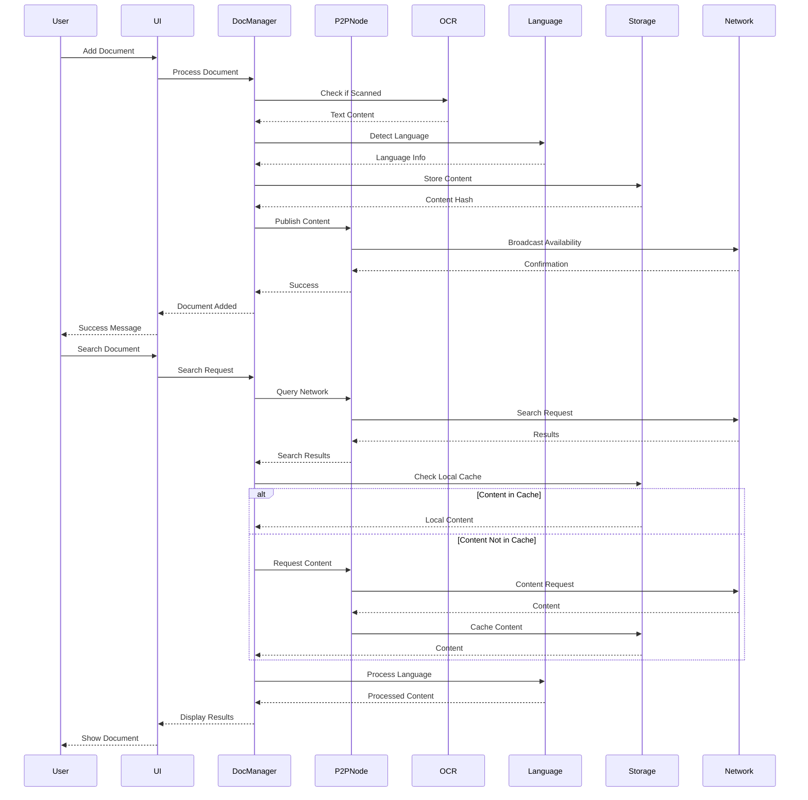

```mermaid
sequenceDiagram
    participant User
    participant UI
    participant DocManager
    participant P2PNode
    participant OCR
    participant Language
    participant Storage
    participant Network

    %% Document Sharing Process
    User->>UI: Add Document
    UI->>DocManager: Process Document
    DocManager->>OCR: Check if Scanned
    OCR-->>DocManager: Text Content
    DocManager->>Language: Detect Language
    Language-->>DocManager: Language Info
    DocManager->>Storage: Store Content
    Storage-->>DocManager: Content Hash
    DocManager->>P2PNode: Publish Content
    P2PNode->>Network: Broadcast Availability
    Network-->>P2PNode: Confirmation
    P2PNode-->>DocManager: Success
    DocManager-->>UI: Document Added
    UI-->>User: Success Message

    %% Document Retrieval Process
    User->>UI: Search Document
    UI->>DocManager: Search Request
    DocManager->>P2PNode: Query Network
    P2PNode->>Network: Search Request
    Network-->>P2PNode: Results
    P2PNode-->>DocManager: Search Results
    DocManager->>Storage: Check Local Cache
    alt Content in Cache
        Storage-->>DocManager: Local Content
    else Content Not in Cache
        DocManager->>P2PNode: Request Content
        P2PNode->>Network: Content Request
        Network-->>P2PNode: Content
        P2PNode->>Storage: Cache Content
        Storage-->>DocManager: Content
    end
    DocManager->>Language: Process Language
    Language-->>DocManager: Processed Content
    DocManager-->>UI: Display Results
    UI-->>User: Show Document
```
