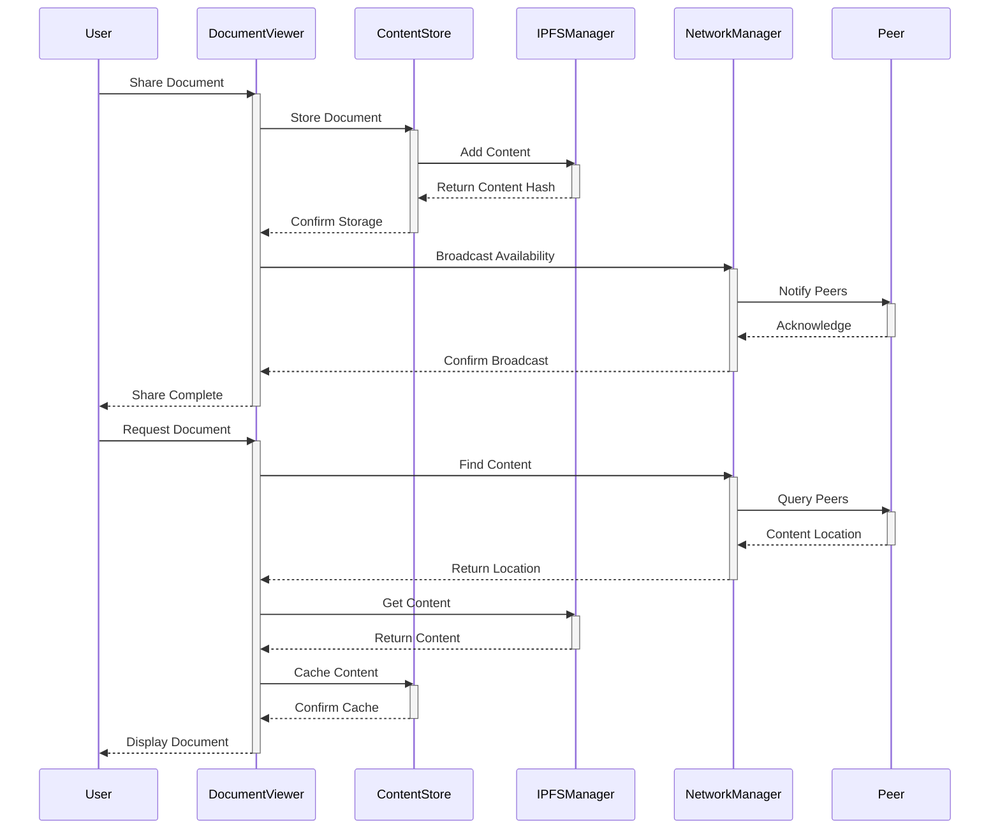

```mermaid
sequenceDiagram
    %% Document Sharing Sequence
    participant User
    participant Viewer as DocumentViewer
    participant Store as ContentStore
    participant IPFS as IPFSManager
    participant Network as NetworkManager
    participant Peer as Peer

    %% Document Sharing
    User->>Viewer: Share Document
    activate Viewer
    Viewer->>Store: Store Document
    activate Store
    Store->>IPFS: Add Content
    activate IPFS
    IPFS-->>Store: Return Content Hash
    deactivate IPFS
    Store-->>Viewer: Confirm Storage
    deactivate Store
    Viewer->>Network: Broadcast Availability
    activate Network
    Network->>Peer: Notify Peers
    activate Peer
    Peer-->>Network: Acknowledge
    deactivate Peer
    Network-->>Viewer: Confirm Broadcast
    deactivate Network
    Viewer-->>User: Share Complete
    deactivate Viewer

    %% Document Retrieval
    User->>Viewer: Request Document
    activate Viewer
    Viewer->>Network: Find Content
    activate Network
    Network->>Peer: Query Peers
    activate Peer
    Peer-->>Network: Content Location
    deactivate Peer
    Network-->>Viewer: Return Location
    deactivate Network
    Viewer->>IPFS: Get Content
    activate IPFS
    IPFS-->>Viewer: Return Content
    deactivate IPFS
    Viewer->>Store: Cache Content
    activate Store
    Store-->>Viewer: Confirm Cache
    deactivate Store
    Viewer-->>User: Display Document
    deactivate Viewer
```
