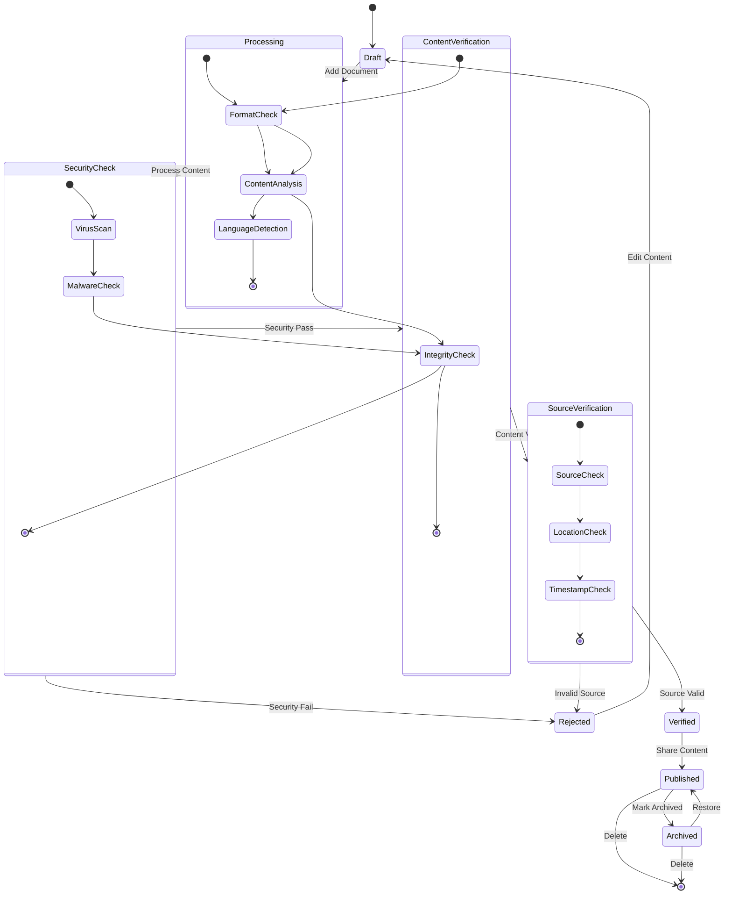

```mermaid
stateDiagram-v2
    [*] --> Draft
    Draft --> Processing: Add Document
    Processing --> SecurityCheck: Process Content
    SecurityCheck --> ContentVerification: Security Pass
    SecurityCheck --> Rejected: Security Fail
    ContentVerification --> SourceVerification: Content Valid
    SourceVerification --> Verified: Source Valid
    SourceVerification --> Rejected: Invalid Source
    Verified --> Published: Share Content
    Published --> Archived: Mark Archived
    Archived --> Published: Restore
    Rejected --> Draft: Edit Content
    Published --> [*]: Delete
    Archived --> [*]: Delete

    state SecurityCheck {
        [*] --> VirusScan
        VirusScan --> MalwareCheck
        MalwareCheck --> IntegrityCheck
        IntegrityCheck --> [*]
    }

    state ContentVerification {
        [*] --> FormatCheck
        FormatCheck --> ContentAnalysis
        ContentAnalysis --> IntegrityCheck
        IntegrityCheck --> [*]
    }

    state SourceVerification {
        [*] --> SourceCheck
        SourceCheck --> LocationCheck
        LocationCheck --> TimestampCheck
        TimestampCheck --> [*]
    }

    state Processing {
        [*] --> FormatCheck
        FormatCheck --> ContentAnalysis
        ContentAnalysis --> LanguageDetection
        LanguageDetection --> [*]
    }
```
