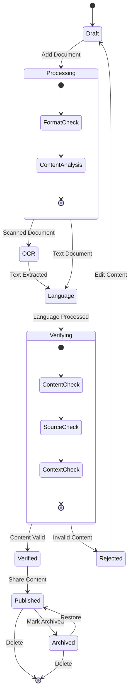

```mermaid
stateDiagram-v2
    [*] --> Draft
    Draft --> Processing: Add Document
    Processing --> OCR: Scanned Document
    Processing --> Language: Text Document
    OCR --> Language: Text Extracted
    Language --> Verifying: Language Processed
    Verifying --> Verified: Content Valid
    Verifying --> Rejected: Invalid Content
    Verified --> Published: Share Content
    Published --> Archived: Mark Archived
    Archived --> Published: Restore
    Rejected --> Draft: Edit Content
    Published --> [*]: Delete
    Archived --> [*]: Delete

    state Verifying {
        [*] --> ContentCheck
        ContentCheck --> SourceCheck
        SourceCheck --> ContextCheck
        ContextCheck --> [*]
    }

    state Processing {
        [*] --> FormatCheck
        FormatCheck --> ContentAnalysis
        ContentAnalysis --> [*]
    }
```
