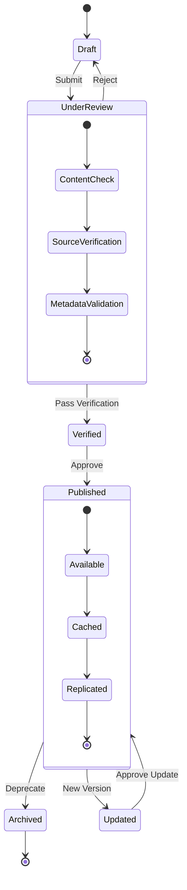

```mermaid
stateDiagram-v2
    [*] --> Draft
    Draft --> UnderReview: Submit
    UnderReview --> Verified: Pass Verification
    UnderReview --> Draft: Reject
    Verified --> Published: Approve
    Published --> Archived: Deprecate
    Published --> Updated: New Version
    Updated --> Published: Approve Update
    Archived --> [*]

    state UnderReview {
        [*] --> ContentCheck
        ContentCheck --> SourceVerification
        SourceVerification --> MetadataValidation
        MetadataValidation --> [*]
    }

    state Published {
        [*] --> Available
        Available --> Cached
        Cached --> Replicated
        Replicated --> [*]
    }
```
