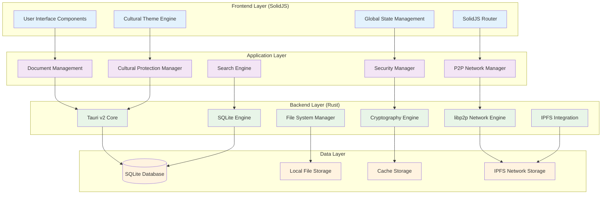

# AlLibrary Technical Specifications Overview

## Architecture Overview

AlLibrary is built using a modern, cross-platform technology stack that prioritizes performance, security, and cultural sensitivity. The application follows a layered architecture pattern with clear separation of concerns.



## Technology Stack

### **Frontend Technologies**

- **Framework**: SolidJS v1.8+
- **Language**: TypeScript v5.0+
- **Styling**: CSS3 with CSS Custom Properties
- **Build Tool**: Vite v4.0+
- **State Management**: SolidJS Stores
- **Routing**: @solidjs/router

### **Backend Technologies**

- **Runtime**: Tauri v2.0+
- **Language**: Rust v1.70+
- **Database**: SQLite v3.42+
- **P2P Networking**: libp2p v0.52+
- **File Storage**: IPFS (js-ipfs or go-ipfs)
- **Encryption**: Various Rust crates (see security section)

### **Development Tools**

- **Package Manager**: pnpm v8.0+
- **Testing**: Vitest (frontend), cargo test (backend)
- **Linting**: ESLint (frontend), clippy (backend)
- **Formatting**: Prettier (frontend), rustfmt (backend)
- **CI/CD**: GitHub Actions

## Core System Specifications

### **Document Management System**

#### **Supported Formats**

```yaml
Supported Document Types:
  PDF:
    versions: ["1.4", "1.5", "1.6", "1.7", "2.0"]
    max_size: "500MB"
    features: ["text_extraction", "metadata_extraction", "thumbnail_generation"]

  EPUB:
    versions: ["2.0.1", "3.0", "3.1", "3.2"]
    max_size: "100MB"
    features: ["text_extraction", "metadata_extraction", "cover_extraction"]
```

#### **Metadata Schema**

```yaml
Document Metadata:
  core:
    id: UUID v4
    title: String (max 500 chars)
    author: String (max 200 chars)
    created_at: DateTime (ISO 8601)
    modified_at: DateTime (ISO 8601)
    file_size: Integer (bytes)
    file_hash: String (SHA-256)
    mime_type: String

  content:
    page_count: Integer (PDF only)
    chapter_count: Integer (EPUB only)
    text_content: String (extracted text)
    language: String (ISO 639-1)
    tags: Array[String]

  cultural:
    sensitivity_level: Enum["public", "restricted", "sacred", "forbidden"]
    origin_community: String
    cultural_context: Object
    attribution_required: Boolean

  sharing:
    is_shared: Boolean
    share_permissions: Object
    download_count: Integer
    last_accessed: DateTime
```

### **Search Engine Specifications**

#### **Search Capabilities**

- **Full-text search** with stemming and fuzzy matching
- **Metadata search** across all document properties
- **Tag-based search** with boolean operators
- **Cultural sensitivity filtering**
- **Relevance ranking** using TF-IDF scoring
- **Search result caching** for performance

#### **Search Index Structure**

```yaml
Search Index:
  text_index:
    engine: "tantivy" # Rust full-text search
    features: ["stemming", "stop_words", "fuzzy_matching"]
    languages: ["en", "es", "fr", "de", "pt", "zh", "ja", "ar"] # extensible

  metadata_index:
    engine: "SQLite FTS5"
    indexed_fields: ["title", "author", "tags", "cultural_context"]

  vector_index: # Future semantic search
    engine: "hnswlib"
    dimensions: 384
    model: "sentence-transformers/all-MiniLM-L6-v2"
```

### **P2P Network Specifications**

#### **Network Protocol Stack**

```yaml
libp2p Configuration:
  transports:
    - TCP with TLS 1.3
    - WebSocket with TLS
    - QUIC (experimental)

  multiplexing:
    - yamux (primary)
    - mplex (fallback)

  encryption:
    - Noise Protocol (XX pattern)
    - TLS 1.3 for WebSocket

  peer_discovery:
    - mDNS for local network
    - Kademlia DHT for global network
    - Bootstrap nodes for initial connection

  content_routing:
    - Kademlia DHT for content addressing
    - GossipSub for content announcements
    - Bitswap protocol for content exchange
```

#### **Network Topology**

- **Hybrid DHT**: Combines Kademlia DHT with cultural clustering
- **Bootstrap Nodes**: 3-5 community-operated bootstrap nodes
- **Content Replication**: Configurable replication factor (default: 3)
- **Network Resilience**: Self-healing with automatic peer reconnection

### **Security Specifications**

#### **Cryptographic Standards**

```yaml
Encryption:
  symmetric:
    algorithm: "AES-256-GCM"
    key_derivation: "Argon2id"

  asymmetric:
    algorithm: "Ed25519" # Digital signatures
    key_exchange: "X25519" # ECDH

  hashing:
    content: "SHA-256"
    passwords: "Argon2id"

  random_generation:
    source: "OsRng" # OS cryptographically secure RNG
    entropy: "256 bits minimum"
```

#### **Security Features**

- **Content Integrity**: SHA-256 hashing for all documents
- **Peer Authentication**: Ed25519 digital signatures
- **Traffic Encryption**: End-to-end encryption for all network communication
- **Local Data Protection**: Optional local database encryption
- **Cultural Content Protection**: Multi-layer encryption for sacred content

### **Cultural Protection System**

#### **Content Classification Engine**

```yaml
Cultural Analysis:
  language_detection:
    library: "whatlang-rs"
    supported_languages: 184
    confidence_threshold: 0.8

  keyword_detection:
    cultural_keywords: "community-maintained database"
    pattern_matching: "regex and NLP-based"
    sensitivity_scoring: "0.0-1.0 scale"

  community_integration:
    notification_system: "real-time community alerts"
    approval_workflows: "multi-stage community review"
    elder_approval: "cryptographic signature verification"
```

#### **Access Control System**

```yaml
Permission System:
  access_levels:
    - public: "unrestricted access"
    - community: "community membership required"
    - restricted: "explicit permission required"
    - sacred: "elder approval required"
    - forbidden: "no access allowed"

  permission_inheritance:
    model: "role-based with community hierarchy"
    override_permissions: "elder override capabilities"

  audit_logging:
    scope: "all cultural content access"
    retention: "indefinite for cultural content"
    anonymization: "configurable privacy levels"
```

## Database Design

### **SQLite Schema**

```sql
-- Core Documents Table
CREATE TABLE documents (
    id TEXT PRIMARY KEY,
    title TEXT NOT NULL,
    author TEXT,
    file_path TEXT NOT NULL,
    file_size INTEGER NOT NULL,
    file_hash TEXT NOT NULL UNIQUE,
    mime_type TEXT NOT NULL,
    created_at DATETIME DEFAULT CURRENT_TIMESTAMP,
    modified_at DATETIME DEFAULT CURRENT_TIMESTAMP,
    is_shared BOOLEAN DEFAULT FALSE,
    cultural_sensitivity TEXT DEFAULT 'public'
);

-- Document Content for Search
CREATE TABLE document_content (
    document_id TEXT PRIMARY KEY,
    extracted_text TEXT,
    language TEXT,
    page_count INTEGER,
    chapter_count INTEGER,
    FOREIGN KEY (document_id) REFERENCES documents(id)
);

-- Cultural Protection Data
CREATE TABLE cultural_metadata (
    document_id TEXT PRIMARY KEY,
    origin_community TEXT,
    cultural_context TEXT, -- JSON
    attribution_requirements TEXT, -- JSON
    access_permissions TEXT, -- JSON
    review_status TEXT DEFAULT 'pending',
    elder_approved BOOLEAN DEFAULT FALSE,
    FOREIGN KEY (document_id) REFERENCES documents(id)
);

-- Collections/Folders
CREATE TABLE collections (
    id TEXT PRIMARY KEY,
    name TEXT NOT NULL,
    description TEXT,
    created_at DATETIME DEFAULT CURRENT_TIMESTAMP,
    color TEXT DEFAULT '#3498db'
);

-- Many-to-many relationship for documents in collections
CREATE TABLE document_collections (
    document_id TEXT,
    collection_id TEXT,
    added_at DATETIME DEFAULT CURRENT_TIMESTAMP,
    PRIMARY KEY (document_id, collection_id),
    FOREIGN KEY (document_id) REFERENCES documents(id),
    FOREIGN KEY (collection_id) REFERENCES collections(id)
);

-- Tags system
CREATE TABLE tags (
    id TEXT PRIMARY KEY,
    name TEXT NOT NULL UNIQUE,
    color TEXT DEFAULT '#95a5a6'
);

CREATE TABLE document_tags (
    document_id TEXT,
    tag_id TEXT,
    PRIMARY KEY (document_id, tag_id),
    FOREIGN KEY (document_id) REFERENCES documents(id),
    FOREIGN KEY (tag_id) REFERENCES tags(id)
);

-- P2P Network Data
CREATE TABLE peers (
    peer_id TEXT PRIMARY KEY,
    last_seen DATETIME,
    reputation_score REAL DEFAULT 0.5,
    cultural_communities TEXT, -- JSON array
    is_bootstrap BOOLEAN DEFAULT FALSE
);

-- Shared Content Tracking
CREATE TABLE shared_content (
    content_hash TEXT PRIMARY KEY,
    document_id TEXT,
    shared_at DATETIME DEFAULT CURRENT_TIMESTAMP,
    download_count INTEGER DEFAULT 0,
    peer_feedback TEXT, -- JSON
    FOREIGN KEY (document_id) REFERENCES documents(id)
);

-- Cultural Community Management
CREATE TABLE cultural_communities (
    id TEXT PRIMARY KEY,
    name TEXT NOT NULL,
    description TEXT,
    elder_public_keys TEXT, -- JSON array of public keys
    community_guidelines TEXT,
    contact_info TEXT -- JSON
);

-- Full-text search indexes
CREATE VIRTUAL TABLE documents_fts USING fts5(
    title, author, extracted_text, tags,
    content=document_content, content_rowid=document_id
);
```

## Performance Specifications

### **System Requirements**

#### **Minimum Requirements**

- **OS**: Windows 10, macOS 10.15, Linux (Ubuntu 18.04+)
- **RAM**: 4GB minimum, 8GB recommended
- **Storage**: 1GB for application, additional space for documents
- **Network**: Broadband internet for P2P features

#### **Performance Targets**

- **Application Startup**: <3 seconds cold start
- **Document Import**: <1 second for documents <10MB
- **Search Response**: <200ms for local searches
- **P2P Connection**: <5 seconds to connect to network
- **Document Download**: Depends on network conditions

### **Optimization Strategies**

- **Lazy Loading**: Load UI components and data on demand
- **Virtual Scrolling**: Handle large document lists efficiently
- **Background Processing**: Use web workers for heavy operations
- **Caching**: Aggressive caching of search results and thumbnails
- **Compression**: Compress data for network transmission

## Deployment and Distribution

### **Build Configuration**

```yaml
Tauri Configuration:
  targets:
    - x86_64-pc-windows-msvc
    - x86_64-apple-darwin
    - aarch64-apple-darwin
    - x86_64-unknown-linux-gnu

  bundle:
    - msi # Windows
    - dmg # macOS
    - deb # Linux Debian/Ubuntu
    - appimage # Linux Universal

  updater:
    enabled: true
    endpoints: ["https://github.com/allibrary/releases"]
    public_key: "embedded_in_binary"
```

### **Release Strategy**

- **Alpha**: Internal testing (Weeks 1-8)
- **Beta**: Community testing (Weeks 9-12)
- **Release Candidate**: Final testing (Week 13-14)
- **Stable Release**: Public release (Week 15+)

### **Auto-Update System**

- **Update Mechanism**: Tauri's built-in updater
- **Update Frequency**: Check daily, install on user approval
- **Rollback Capability**: Automatic rollback on critical failures
- **Cultural Content Migration**: Careful handling of cultural data during updates

## Testing Strategy

### **Testing Framework**

```yaml
Frontend Testing:
  unit_tests: "Vitest"
  integration_tests: "Vitest + Testing Library"
  e2e_tests: "Playwright"

Backend Testing:
  unit_tests: "cargo test"
  integration_tests: "cargo test with test databases"
  performance_tests: "criterion.rs"

Cultural Testing:
  sensitivity_tests: "community-driven test cases"
  accessibility_tests: "cultural accessibility standards"
  ethics_review: "ongoing community ethics review"
```

### **Quality Assurance**

- **Code Coverage**: >80% for critical paths
- **Performance Testing**: Regular benchmarking
- **Security Auditing**: Regular security reviews
- **Cultural Validation**: Community-driven testing
- **Accessibility Testing**: WCAG 2.1 compliance

This comprehensive technical specification provides a solid foundation for implementing AlLibrary while maintaining the project's core values of cultural sensitivity, privacy protection, and decentralized knowledge sharing.
